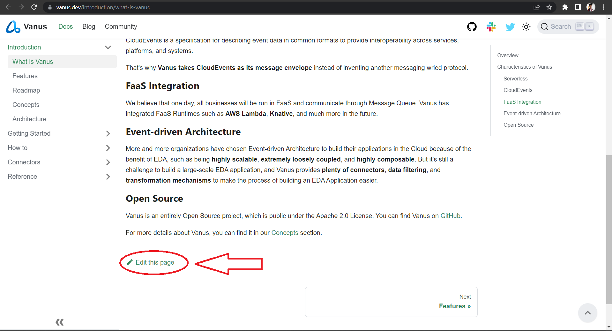

# Vanus Documentation

Welcome to Vanus documentation!👋

[Vanus](https://github.com/linkall-labs/vanus/) is an open-source, cloud-native, Serverless message queue for building EDA applications with Ease.

This repository contains all assets required to build the [Vanus documentation website](https://docs.linkall.com).

## Website

The Vanus documentation website is built using [Docusaurus 2](https://docusaurus.io/).

### Run locally
**npm**
1. `npm install`
2. `npm start`
3. [A browser window](http://localhost:3000/) will open up, pointing to the docs.

**yarn**
1. `yarn install`
2. `yarn start`
3. [A browser window](http://localhost:3000/) will open up, pointing to the docs.

## Contributing

Thank you for your interest in contributing!

If you want to contribute to the documentation, you can
open an issue or use the `Edit this page` pencil icon on the bottom of each page of
the website.

### Code of Conduct

Before starting your contribution, you should take a moment to read the [Vanus code of conduct](CODE_OF_CONDUCT.md).

### Contributing guide

Read our [contributing guide](CONTRIBUTING.md) to learn about how to contribute to Vanus documentation.

## Community

We have a few channels for contact:

- [Slack](https://join.slack.com/t/vanusworkspace/shared_invite/zt-1jilbbfo2-NxiFG0VOo8ABGCCNaeNfcA)
- [@Vanus_dev](https://twitter.com/Vanus_dev) on Twitter
- [GitHub Issues](https://github.com/linkall-labs/docs/issues)
