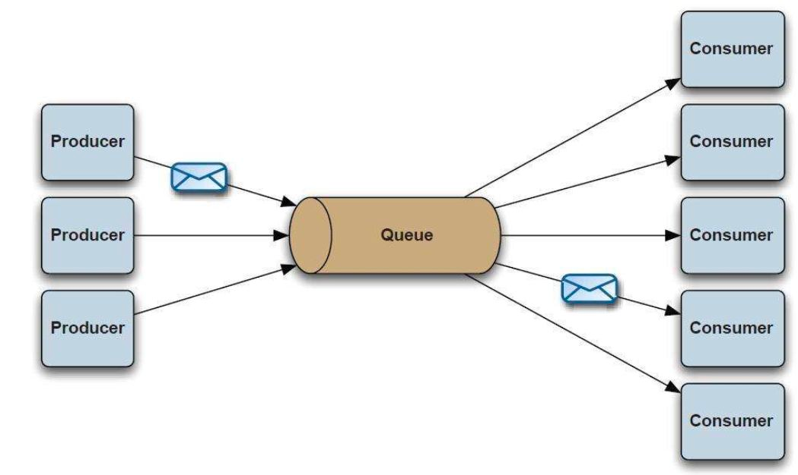

# The Past, Present and Future of Message Queue 1

**Abstract**：
This article recreates the message system's history from its birth to the present in a narrative form based on a thread of the development of the Internet. Since 1983, message systems have experienced different historical tough times. Their use modes, function features, product forms and application scenarios have changed a lot. The author chose five representative products from different eras and described the historical background of their generation. Focusing on the core problems that had been solved, the author attempted to analyze the key factors of their success. Finally, the author made three predictions about the serverless era and pointed out the core sore points of the current messaging system in tackling the serverless scenarios, and concluded the key capabilities of future messaging products.

<!--truncate-->

## Ⅰ. In the Past: Message Queue Before the Open Source Era

The story started with an Indian young man. In 1983, Vivek Ranadive [1], a 26-year-old engineer from Mumbai, decided to start his own information technology company after graduating from MIT. At that time, the development of software was very inefficient compared to hardware. Inspired by the computer bus, Vivek designed a software computer bus called The Information Bus (TIB), which ushered in a software era for message queues and opened a new global market with billions of dollars a year.

In 1985, Vivek received seed capital from Teknekron Corp and then Teknekron Software Systems Inc. (TSS) was born, specializing in the commercialization of TIB. TIB mainly served the financial industry and solved the data exchange issues between securities trading software. The widespread use of TIBs was an enormous success in the 1980s, when the financial trading industry in the United States had a lot of customers. Teknekron was acquired by Reuters Group in 1993 [3], and in 1997 Reuters set up TIBCO Software [4] for independent operation of TIB software solutions independently. In 2014, TIBCO Software was officially privatized through a USD4.3 billion acquisition by Vista Equity Partners [5].

TIB’s success was noticed by Big Blue — IBM, whose clients are also predominantly from the financial industry. IBM started developing message queues in 1990, and the products — IBM WebSphere MQ [6,7] came out three years later. After years of development, IBM MQ has turned out to be a great, globally competitive business message system [8,9]. According to a Gartner report [10], in 2020, IBM MQ still had an annual global revenue of nearly USD1 billion, accounting for nearly one-third of the global message-oriented middleware market share.

## II. In the Past: The Open Source Era

The success of commercialized MQ made it occupy the communication application market of large enterprises, but the high price was prohibitive for small and medium-sized enterprises. At the same time, the providers of commercialized MQs established a closed product ecosystem that did not communicate with each other to maintain competition barriers. As a result, many large enterprises were using products from multiple MQ providers simultaneously but could not break through the barriers between them. For example, if an application had already subscribed to TIBCO MQ messages, it would be difficult to consume messages from IBM MQ. These products used different APIs and protocols, and of course, could not be combined into a single computer bus. To solve this problem, the Java Message Service (JMS) came into being in 1998 [11,12].

JMS is to MQ what JDBC is to databases. It attempts to break barriers to solve interoperability problems by providing common Java APIs that hide the actual interfaces provided by individual MQ product providers. Technically, Java applications need only to program for JMS API and choose suitable MQ drivers. JMS would take care of the rest. JMS does solve the problem of interoperability between MQ to some extent, but when the application communication infrastructure adapts to different MQs, it requires code to glue together many different MQ interfaces, which makes JMS applications vulnerable and less available. It was obvious that the market was in urgent need of an MQ that has native support for JMS protocols.

Against this background, ActiveMQ [13] was created in 2003, which became the first open source message queue product that supports JMS protocols natively. Fully enabling JMS, it addressed the problem of adaptation stability. It was favored by many enterprises. Moreover, as ActiveMQ is an open source product, it grew extremely popular among small and medium-sized enterprises given the high price of the business versions of MQs. In 2005, Damarillo and his partners founded LogicBlaze [14] company based on the ActiveMQ project, which was acquired by IONA two years later [15].

JMS has a serious drawback that is it can only be applied in Java applications. Programs developed in other languages are unable to use JMS to exchange information. In this context, the real savior AMQP appeared. Advanced Message Queuing Protocol (AMQP) [16] was initiated by John O'Hara in 2003 where JPMorgan Chase led Cisco, IONA, Red Hat, iMatix and other companies to establish the AMQP working group for solving the problem of message interaction between different financial platforms. AMQP in nature is a protocol, more specifically a Binary Wire-Level Protocol, which is essentially different from JMS: AMQP does not qualify from the API layer but directly defines the data format exchanged over the network. This makes AMQP providers naturally cross-platform, meaning that we can use the Java AMQP provider and meanwhile a Python producer and a Ruby consumer. From this point of view, AMQP can be analogized to HTTP as it embraces all implementation languages. As long as everyone sends request messages according to the corresponding data format, clients in different languages can link with servers in different languages. AMQP has a broader scope than JMS does.

It was clear that the market needed a message queue product that can fully implement the AMQP protocol. Rabbit Technologies was co-founded by Alexis and Matthias in 2007 [17]. In the same year, the company launched RabbitMQ, the first message queue product that fully implements AMQP protocol. In 2010, the company was acquired by VMware [18]. RabbitMQ is developed in Erlang programming language with exceptional performance and low latency in the microsecond range. Because of its full support for AMQP, it is more open and able to support more applications for integrated access than commercial products such as IBM MQ and ActiveMQ which implemented JMS. In addition, compared with other contemporary products of AMQP implementation such as Apache Qpid [19], RabbitMQ's multi-language client and technical documents are more standardized and sounder, and its open source community is more active [20][21]. This made RabbitMQ increasingly an ideal choice for message exchange in small, medium, and even large enterprises. In fact, RabbitMQ is still one of the most successful open source message queues in the world to this day.

*Architecture Diagram of RabbitMQ [22]*

RabbitMQ is not perfect and is too complex to implement precisely because of its perfect support AMQP protocol. This also results in its low throughput.

## Ⅲ. At Present: The Big Data Era

Enterprises have produced more and more data ever since the birth of the Internet. In 2010, the arrival of the mobile Internet made the Internet, a super entrance, fully accessible and popular. In that year, there were 1.97 billion Internet users in the world, accounting for 28.7% of the global population [23]. Therefore, Internet enterprises had to deal with more data. As a global social networking site with more than 90 million members in 2010 [24], LinkedIn needed to analyze the behaviors of Internet users through a large number of logs every day for product optimization and advertisement serving. The basic paradigm of big data analytics, Lamdba [25,26], collects data from many systems through data acquisition components and then gathers it to big data platforms such as Spark or Hadoop. User behavior log data is obtained through distributed acquisition program. How to transfer massive log data to Hadoop which can realize the batch analysis of a large amount of data became a key issue [27]. LinkedIn used to transfer logs via ActiveMQ in the data integration scenario, but the performance problems of ActiveMQ laid bare against the big data integration scenario. Despite its complete message mechanism, flexible configuration methods and secure message delivery assurance, it was incapable for LinkedIn’s massive data transfer [28]. The big data integration scenario requires rapid transfer of massive log data to the big data platforms, which does not require complex configuration and the support of AMQP protocol. High-throughput transmission products were the most needed, which was not achievable by AcitveMQ.

Against this backdrop, at the end of 2009, LinkedIn planned to develop a new generation of message queue product called Kafka [29,30], to solve problems such as massive website activity tracking events, application monitoring indicators [31], and transmission of data from databases to the big data analysis platforms. According to the Kafka founder Jay Kreps, Kafka was initially designed to meet three major requirements [32]: hundreds of MB/sec/server of data throughput, all data persistent and distributed storage of data. The biggest challenge was to enable high throughput and message persistence at the same time. This was a dilemma because typically, if a program needs high throughput, it will put data directly to memory rather than a disk as memory is faster to read. If data is required to be persistent, it will be stored on a disk which will be read very slowly. Considering this problem, after studying the special data storage and transmission mode of the message queue, based on the in-depth and original ideas [33] on the log, the Jay Kreps team presented a clever design scheme [34] which took full advantage of the characteristics of the operating system software and hardware. The data would be written in the form of a log to the disk in sequence and the log data was read also in sequence. Due to the special structure of the hard disk, writing disks sequentially could achieve write speeds of higher than 100MB/s, even higher than random writing memory. Kafka reads data in sequential order, and since the operating system has a Page Cache mechanism, sequential disk reading can also achieve approximate performance as memory reading. In this way, Kafka writes messages to disk and reaches read and write speeds close to those of the memory, which is the secret of Kafka's high throughput. On top of that, Kafka also adopts three technologies: batch sending, data compression and zero-copy [35], which greatly improves the throughput of Kafka while guaranteeing message persistence. For details on high-performance read and write ability in Kafka, see [36]. The graph below sketches the data storage method of Kafka. It divides a topic into several partitions, and the producers will write data to the partitions in a certain order when they send data. However, Kafka does not realize some message features, such as transactional message, delayed message, and dead letter queue.

Based on these design concepts, Kafka achieves remarkably high throughput and data persistence on disk. Below is a comparison between Kafka's performance and those of ActiveMQ and RabbitMQ, the most popular message queues then, after Kafka was launched on LinkedIn [38]. It is shown that Kafka has an advantage four times better than the other two messaging systems regarding throughput of produced and consumed messages.

Kafka became open source in late 2010 and was donated to the Apache Foundation [39] by LinkedIn in July 2011. On October 23, 2012, Apache Kafka became a top open source project. As it solves common and key problems in big data integration scenarios with its unique design method, after becoming open source, Kafka is widely used in big data analysis scenarios [40] by Silicon Valley Internet companies such as Twitter, Netflix, and Uber.

On November 1, 2014, founding members of Kafka announced their departure from LinkedIn and founded Confluent [41], which is committed to the open source and commercialization of Kafka products. Benchmark, LinkedIn, and other companies invested USD6.9 million in it. After the establishment of Confluent, to solve the problem of big data analysis in a more comprehensive way, Kafka launched two ecological components, Kafka Connect [42] and KsqlDB in 2016 and 2017, which earned it a status as the de facto data transmission standard in the big data field. Kafka Connect is used to better integrate Kafka with surrounding products. For example, users can better extract change data from MySQL to the Kafka system through MySQL Source Connector and more easily write data from Kafka to Hadoop through Hadoop Sink Connector. Kafka KsqlDB is designed to process data transmitted by Kafka. For example, the process of big data transmission usually needs data filtering, deduplication and other ETL operations, and with the help of Kafka, KsqlDB can well complete these processes. The following figure shows the ecological architecture of Kafka after adding two big data components. For detailed analysis, please refer to [43].

## References

1.	[TIBCO Staff. A Look Back: Vivek Ranadivé and TIBCO.TIBCO Blog. January 25, 2013.](https://www.tibco.com/blog/2013/01/25/a-look-back-vivek-ranadive-and-tibco/)
2.	[Vivek Ranadivé. Wikipedia.](https://en.wikipedia.org/wiki/Vivek_Ranadiv%C3%A9)
3.	[Lawrence M. Fisher. Reuters Is Buying Teknekron. The New York Times. December 18, 1993.](https://www.nytimes.com/1993/12/18/business/company-news-reuters-is-buying-teknekron.html)
4.	[TIBCO Software. Wikipedia.](Https://en.wikipedia.org/wiki/TIBCO_Software)
5.	[LAURA LORENZETT.TIBCO Software goes private with $4.3 billion Vista Equity purchase, FORTURN. September 30, 2014.](https://fortune.com/2014/09/29/tibco-software-goes-private-with-4-3-billion-vista-equity-purchase/)
6.	[Introduction to IBM WebSphere MQ. IBM Website. May 27,2022.](https://www.ibm.com/docs/en/ibm-mq/7.5?topic=mq-introduction-websphere)
7.	[IBM MQ. Wikipedia.](https://en.wikipedia.org/wiki/IBM_MQ)
8.	[Compare Amazon MQ. Apache Kafka, Google Cloud Pub/Sub, and IBM MQ. g2.com.](https://www.g2.com/compare/amazon-mq-vs-apache-kafka-vs-google-cloud-pub-sub-vs-ibm-mq)
9.	[IBM MQ. IBM Product Website.](https://www.ibm.com/products/mq)
10.	[Application Infrastructure and Middleware Market Share Worldwide 2019-2020.Gartner.2021.](https://vanus.dev)
11.	[Jakarta Messaging. Wikipedia.](https://en.wikipedia.org/wiki/Jakarta_Messaging#cite_note-jms-101-spec-4)
12.	[Mark Hapner, Rich Burridge, Rahul Sharma. Java Message Service, October5,1998.](https://web.archive.org/web/20001010161718/http://www.java.sun.com/products/jms/jms-101-spec.pdf)
13.	[Apache ActiveMQ. Wikipedia.](https://en.wikipedia.org/wiki/Apache_ActiveMQ#cite_note-support-16)
14.	[Martin LaMonica. Investors to commercialize open source. CNET. May 20, 2005.](https://www.cnet.com/tech/tech-industry/investors-to-commercialize-open-source/)
15.	[Stefan Tilkov,Floyd Marinescu. IONA acquires LogicBlaze, supporters of ActiveMQ and Service Mix ESB. InfoQ. APR 10, 2007.](https://www.infoq.com/news/2007/04/iona-buys-logicblaze/)
16.	[Advanced Message Queuing Protocol. Wikipedia.](https://en.wikipedia.org/wiki/Advanced_Message_Queuing_Protocol)
17.	[RabbitMQ. Wikipedia.](https://en.wikipedia.org/wiki/RabbitMQ)
18.	[Acquisitions. VMware Website.](https://www.vmware.com/company/acquisitions.html)
19.	[Apache Qpid. Qpid Website.](https://qpid.apache.org)
20.	[RabbitMQ VS Apache Qpid.libhunt.](https://www.libhunt.com/compare-rabbitmq-server-vs-qpid)
21.	[Rabbit MQ vs Apache QPID - picking your AMQP broker. batey.info.](http://www.batey.info/)
22.	[LOVISA JOHANSSON (September 23, 2019), Part 1: RabbitMQ for beginners - What is RabbitMQ? ,CloudAMQP Blog.](https://www.cloudamqp.com/blog/part1-rabbitmq-for-beginners-what-is-rabbitmq.html)
23.	[INTERNET GROWTH STATISTICS.internetworldstats.com.](https://www.internetworldstats.com/emarketing.htm)
24.	[Numbers of LinkedIn members from 1st quarter 2009 to 3rd quarter 2016. statista.com. October 2016.](https://www.statista.com/statistics/274050/quarterly-numbers-of-linkedin-members/)
25.	[Big data architecture style. microsoft.com.](https://docs.microsoft.com/en-us/azure/architecture/guide/architecture-styles/big-data)
26.	[Lambda architecture. Wikipedia.](https://en.wikipedia.org/wiki/Lambda_architecture)
27.	[Jay Kreps. The Evolution of Apache Kafka: From In-House Infrastructure to Managed Cloud Service. YouTube. Feb 25,2022.](https://www.youtube.com/watch?v=SQX6nGS5RcA)
28.	[Tanvir Ahmed. Kafka's origin story at LinkedIn. LinkedIn. Oct 20,2019.](https://www.linkedin.com/pulse/kafkas-origin-story-linkedin-tanvir-ahmed/.)
29.	[Daniel Gutierrez .A Brief History of Kafka, LinkedIn’s Messaging Platform.insidebigdata.com. April 28, 2016.](https://insidebigdata.com/2016/04/28/a-brief-history-of-kafka-linkedins-messaging-platform/)
30.	[Jay Kreps on the Last 10 Years of Apache Kafka and Event Streaming.confluent website.](https://vanus.dev)
31.	[Apache Kafka.hadoopadmin.co.](http://www.hadoopadmin.co.in/hadoop-developer/kafka/)
32.	[Jay Kreps. Apache Kafka and Real-Time Data Integration.YouTobe. June26, 2016.](https://www.youtube.com/watch?v=aJuo_bLSW6s)
33.	[Jay Kreps. The Log: What every software engineer should know about real-time data's unifying abstraction. LinkedIn. December 16. 2013.](https://engineering.linkedin.com/distributed-systems/log-what-every-software-engineer-should-know-about-real-time-datas-unifying)
34.	[Ken Goodhope, Joel Koshy, Jay Kreps, Neha Narkhede, Richard Park, Jun Rao, Victor Yang Ye. Building LinkedIn’s Real-time Activity Data Pipeline. Computer Science.2012.](http://sites.computer.org/debull/A12june/pipeline.pdf)
35.	[Zero-copy. Wikipedia.](https://en.wikipedia.org/wiki/Zero-copy)
36.	[Talk about Kafka: why is Kafka so fast? developpaper.com. Oct 10, 2021.](https://developpaper.com/talk-about-kafka-why-is-kafka-so-fast/)
37.	[Kafka 3.2 Documentation. Kafka Website.](https://kafka.apache.org/documentation/#introduction)
38.	[Jay Kreps, Neha Narkhede, and Jun Rao. Kafka: a distributed messaging system for log processing. ACM SIGMOD Workshop on Networking Meets Databases, page 6, 2011.](https://engineering.linkedin.com/content/engineering/en-us/blog/authors/j/jay-kreps)
39.	[Neha Narkhede. First Apache release for Kafka is out! LinkedIn Engineering. January 6, 2012.](https://engineering.linkedin.com/kafka/first-apache-release-kafka-out)
40.	[Jun Rao, Jay Kreps. Apache Kafka Users. Apache Kafka website. July 25,2106.](https://cwiki.apache.org/confluence/display/KAFKA/Powered+By)
41.	[Jay Kreps. Announcing Confluent, a Company for Apache Kafka and Realtime Data. Confluent Blog. NOV 1, 2014.](https://www.confluent.io/blog/announcing-confluent-a-company-for-apache-kafka-and-real-time-data/)
42. [Open Source Kafka Connect Adds More than a Dozen Connectors. Confluent Blog.April 22, 2016.](https://www.confluent.io/press-release/open-source-kafka-connect-adds-more-than-a-dozen-connectors/)
43. [Navdeep Sharma.Understanding the EcoSystem of Apache Kafka.medium.Aug 9, 2019.](https://medium.com/@navdeepsharma/the-ecosystem-of-apache-kafka-6087b621d16f)
