# How to Receive GitHub notifications on Twitter

As a GitHub and OSS enthusiast, have you ever experienced missing some of your important GitHub emails because tons of unread emails waiting in your mailbox . Or you wanna receive a custom notification when someone stars your repo but GitHub can never send such notifications to you.

Now, problem solved! You can receive custom event notifications directly in your Twitter account without checking your email by using a **Serverless Message Queue — Vanus**.

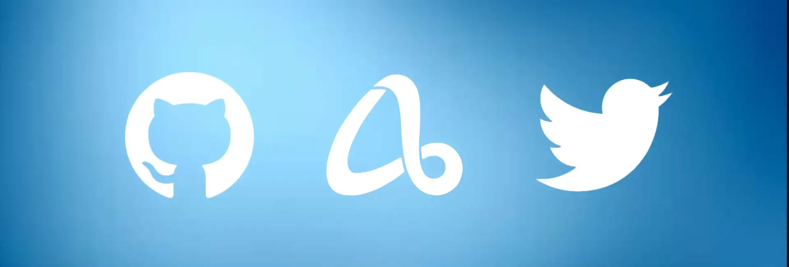

<!--truncate-->

To achieve that we need one program to receive GitHub events and transform them into custom notifications we want and another Program to receive transformed notifications and send them to our Twitter account.

Luckily, Vanus has already provided many **out-of-the-box Connectors** that enable you to integrate with popular services or applications without writing any codes.

**Here is how we can do this within 5 mins.**

1. Go to [Vanus Playground](https://play.linkall.com) (an online K8s playground)

2. Click “Launch Terminal” to prepare an interactive K8s environment(Use your GitHub account to sign in).


3. Wait for preparing the K8s environment (usually less than 1 min). The terminal is ready when you see something like this:


4. Install Vanus

```shell
kubectl apply -f https://vanus.s3.us-west-2.amazonaws.com/releases/v0.4.0/vanus.yaml
```

5. Install vsctl (the command line tool)

```shell
curl -O https://vsctl.s3.us-west-2.amazonaws.com/releases/v0.4.0/linux-amd64/vsctl
chmod ug+x vsctl
mv vsctl /usr/local/bin
```

6. Set the endpoint for vsctl

```shell
export VANUS_GATEWAY=192.168.49.2:30001
```

7. Click the “GitHub-Twitter Scenario”

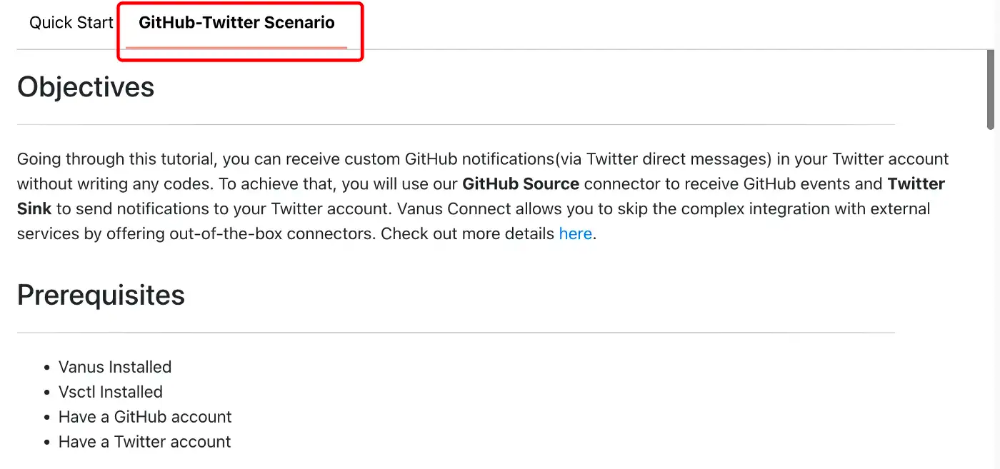

8. Create an Eventbus to store your events

```shell
vsctl eventbus create --name github-twitter-scenario
```

9. Run the GitHub Source

```shell
cd ~/github-twitter-scenario
docker run --network=host -v $(pwd)/config.json:/vance/config/config.json  --rm vancehub/source-github > a.log &
```

10. Go to your repository and create a Webhook

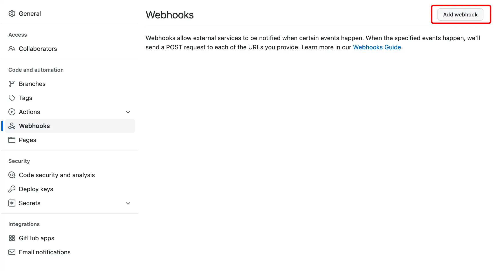

11. Follow the tutorial to set the configuration for your webhook.

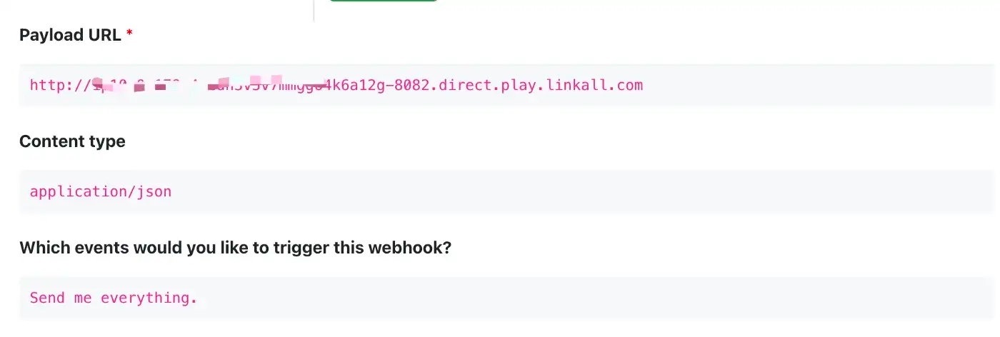

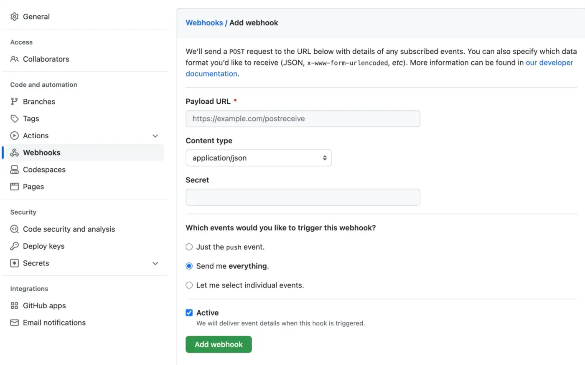

12. Click the button “Enter your Twitter Username” to specify your Twitter account.

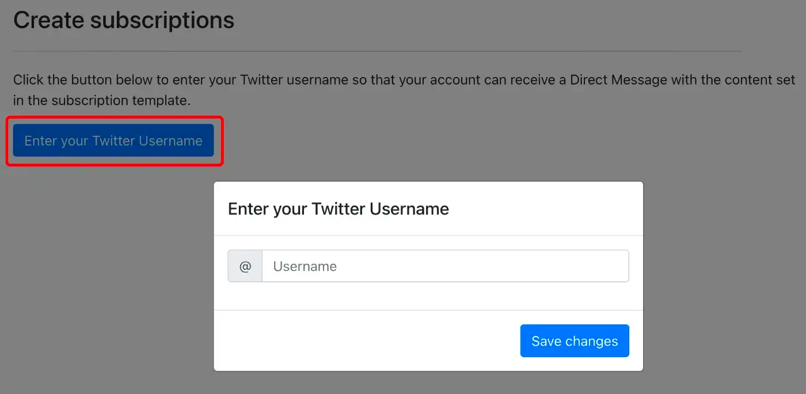

13. Copy and execute commands to create two subscriptions. Remember to check if the command contains your Twitter username.

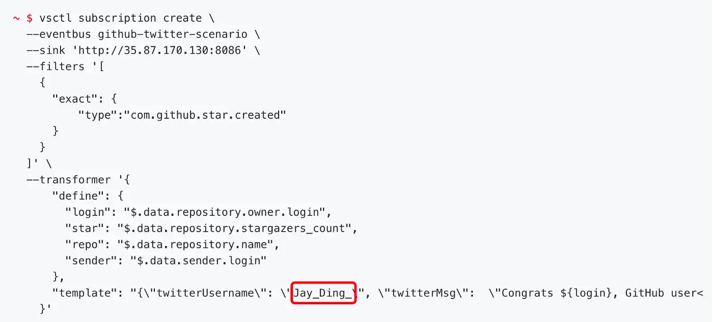

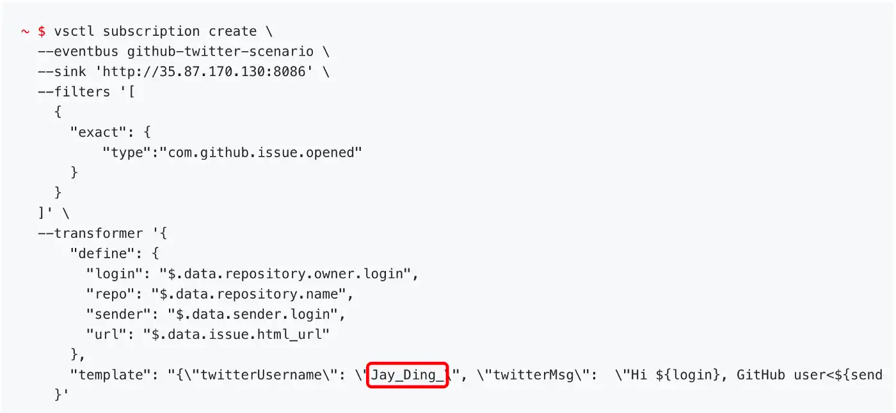

14. Follow Twitter account <@VanusNotify>, so VanusNotify service can send DM to you.

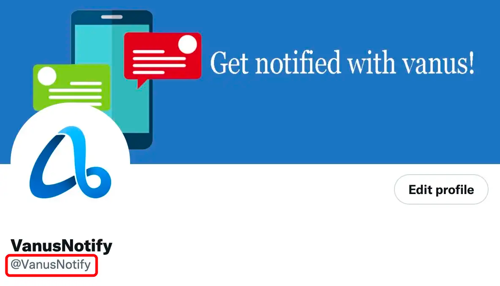

15. Finally, star your repository and check your Twitter messages, it should be a message like:

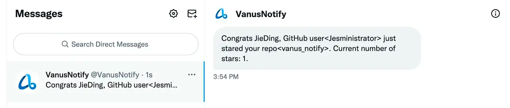

16. Open an issue in your repository and check your Twitter messages, it should be a message like:

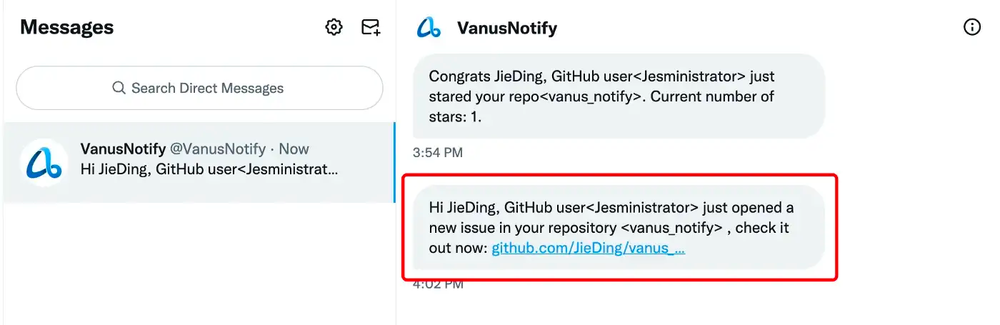

Now, you’ve successfully received GitHub notifications in your Twitter account. Actually, you can receive any outside services in anywhere with Vanus and its’ filter and transformer. Learn more about Vanus [here](https://github.com/linkall-labs/vanus).

**Vanus is an open-source, cloud-native, Serverless message queue for building EDA applications with Ease.**

Try it and have fun with Vanus, guys.