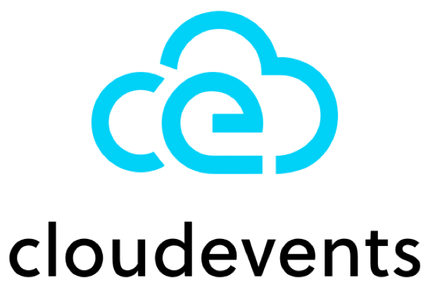

# How to Build An Event-Driven Architecture in Serverless Computing

The architecture of web applications has changed a lot as the infrastructure evolves. Over the last decade, with the trend of migrating 
infrastructure from private data centers to a public cloud, increasing number of monolithic architectures have
been replaced by microservice architectures.

Considering apps may not share the same computational space when it comes to the cloud, it's inevitable that local function invocations in monolithic apps
have been replaced by other remote communication protocols, like REST APIs or RPC calls.

Such synchronous request-response pattern generally works well, but sometimes it doesn't. For example, in a chain of synchronous 
requests and responses, service A calls service B, service B calls service C, and calls go on. If each service needs 500ms to handle its business and
there are 5 services in the chain, then you have to set the timeout of service A as 2500ms, while the service B needs 2000ms and
500ms for the last service in the chain.

In this article, we will introduce an alternative communication pattern (**Event Driven Architecture**) to build your microservices.
Then we'll dive into the concepts of event-driven architecture and how you can better build it in the next generation cloud computing - **Serverless computing**.

<!--truncate-->

## EDA Overview

From the name event-driven architecture we can clearly see that an `event` is the core element of the architecture.
So, what exactly an event is?

Generally speaking, an event indicates a state change of a system or a notification. A user registered an account on your website, someone
stars your GitHub repo, the battery of your device is too low and generates a notification, or a user updates his billing address in your system.
All these events exist no matter if you use them to trigger your services or not.

### Producer and Consumer

The instance who generates an event is called a producer. On the other side, A consumer receives the event and acts upon it.
In an event-driven architecture, producers won't directly send an event to a consumer (otherwise that will be a request-response pattern). 
Instead, to functionally decouple producers and consumers, we **import an intermediary** so that producers can send events without
any knowledge about the consumer, meanwhile consumers are completely unaware of who will send events to them. 

### Event Broker

As a pivotal element of EDA, an event broker is the intermediary who receives published events and routing events to interested consumers.

There are two categories of event brokers based on how they store events:

- **Queue-based brokers**: Queue-based brokers generally create queues for each consumer, and deliver messages to right
queues. Published messages are stored in queues and are typically removed once delivered to subscribed consumers. Examples
include Apache ActiveMQ and RabbitMQ.
- **Log-based brokers**: Log-based brokers store events into append-only logs. Consumers do not remove messages from the log, 
and the broker will not remove them once they are delivered. Instead, various retention policies define when messages will
be deleted. Before that, consumers can re-consume any messages from a previous time point. Apache Kafka is a good example of
such brokers.

There are also two categories of event brokers based on how messages are delivered to consumers:

- **Pull-model brokers**: the consumer proactively pulls messages from the broker, optionally requesting a maximum 
batch size to help optimize message throughput.
- **Push-model brokers**: the broker delivers messages proactively over a network connection to the consumers.

**Choose a suitable event broker is essential for building an event-driven architecture**.

## Challenges of Building an Event-Driven Architecture

Using EDA seems attractive and may help you build an asynchronous communication in your system. However, there are still
many considerations when evaluating EDA in real business systems, especially in Serverless computing.

### Events are everywhere, but lack of consistency

Although we can keep consistent to all event formats in our services, external event producers may describe events differently.
Some producers prefer adding `Time` to an event record, while others tend to add `metadata` to an event. 
The lack of a common way of describing events means developers are constantly re-learning how to consume events.
This also limits integrations between inner systems and external services.

### Pull-based delivery is not suitable for building EDA in Serverless computing

Pull-based message brokers like Apache Kafka worked well in long-run situations. However, when it comes to Serverless computing,
you don't want each of your services to be polling new events all the time. Instead, a better approach will be your
services can be triggered by an event sent from the event broker.

### Topic partitioning strategy limits scalability

Log-based brokers like Apache Kafka use partitioning of topics to support scale out. Each partition is only accessed by a single consumer per subscriber group.
The subscriber group can have no more consumers than there are partitions. And number of partitions is not recommended to be changed dynamically after the topic is created.
So, even if Serverless platform horizontally scales your consumers out, only consumers with the same number of partitions can obtain messages from the broker. Other scaled
instances can never work.

## How to solve challenges above

**Try out this open-source message queue - [Vanus](https://github.com/linkall-labs/vanus)**. It adopts [CloudEvents](https://cloudevents.io/) to solve the inconsistency of events across platforms. 

> CloudEvents is a specification for describing event data in common formats to provide interoperability across services, platforms and systems.
It has been approved as an incubator project in Cloud Native Computing Foundation (CNCF) on Oct 24, 2019.



To skip the complex integration with external services, Vanus provides plenty of **out-of-the-box [connectors](https://github.com/linkall-labs/vanus-connect)** so that you can have faster integrations with no codes.

To avoid consumers work as long run apps, Vanus adopts push-delivery-mode to proactively send events to consumers via HTTP requests. Unlike pull-based message queues (Kafka), Vanus consumers
don't need to maintain the connection with the broker to obtain messages. They can be down all the time until events coming to pull them up.
Such feature naturally fits the Serverless "pay-as-you-go" philosophy.

Also, there is no partitioning strategy to limit consumers' scalability. Vanus consumer works as an HTTP server waiting to
receive events from the broker, which allows consumers to be scaled out at any scale, as long as load balancing and request routing are
provided (such things are basis in K8s or any other Serverless platform). Since Vanus is designed to natively run on kubernetes,
Vanus consumers can seamlessly scale out with K8s HPA.

## What's more with Vanus

In addition to solving above challenges, Vanus is also a **subscription-based** message queue with **built-in event processing capabilities**.
By creating a subscription, you can specify which events (by adding filters) and what kind of events (by adding transformers) consumers are interested in.

Here is an example to demonstrate how a subscription works. Assuming a team needs to be notified on Slack when some certain
GitHub events happen (like someone started their repo or someone left a comment in issues). Now they can configure a 
GitHub Webhook to send all repo's events to Vanus. 

By configuring a filter, we can specify that, among all GitHub events, we only need a certain type event (here is the star created type):
```shell
--filters '[
    {
      "exact": {
          "type":"com.github.star.created"
      }
    }
  ]'
```
By configuring a transformer, we can transform original GitHub events to a specific format which is required by the downstream consumer - Slack:
```shell
--transformer '{
      "define": {
        "star_count": "$.data.repository.stargazers_count",
        "repo": "$.data.repository.name",
        "sender": "$.data.sender.login"
      },
      "template": "{\"slackMsg\":  \"GitHub user<${sender}> just stared your repo<${repo}>. Current number of stars: ${star_count}.\"}"
    }' 
```

With such subscription, everytime someone stars that repo, their slack will receive a notification:
```shell
GitHub user<XXX> just stared your repo<XXX>. Current number of stars: XXX.
```

## Summary

> It’s been predicted by Gartner that Serverless computing will be the future of cloud computing. EDA as an increasingly common and valuable pattern, complements 
request-response communication patterns to minimize coupling, enable asynchronicity and add flexibility. 

However, challenges to build an event-driven architecture in Serverless computing are even more than there are in microservices.

The event broker is pivotal to the design and implementation of an EDA in Serverless computing. Choose a suitable event broker is essential for building an event-driven architecture.
**[Vanus](https://github.com/linkall-labs/vanus) is an open-source, cloud-native, subscription-based message queue for building EDA applications in Serverless with Ease.**

**Not familiar with Vanus yet? Go to our online playground to experience it now: https://play.linkall.com!**