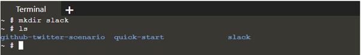
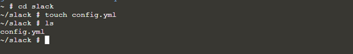
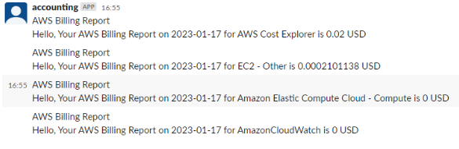

# How to use Vanus to receive AWS Billing reports on Slack

# Introduction
As a developer or company, have you ever felt the need to have just another simpler way of monitoring your AWS Billings aside from Email notifications? Well, in this article, I will show you you can easily use Vanus and two connectors (AWS Billing Source & Slack Sink) to receive your AWS Billing reports on a Slack channel. This is made possible using Vanus Connect.

Vanus Connect is a set of producers and consumers to provide interoperability across services, systems, and platforms.


Vanus Connect has two kinds of connectors; Source connector and Sink Connector. The Source Connector obtains data from an underlying data producer (e.g. AWS Billing) and delivers the data to its target after the data has been transformed into CloudEvents. The Sink Connector receives the events with CloudEvent formats, processes the events, and sends them downstream to a consumer(e.g. Slack)


# AWS Billing Source
The AWS Billing Source Connector uses AWS Cost Explorer API to pull billing data from the previous day. The AWS Billing source requires a “target URL” to which it will send the CloudEvents. In this demo, we will be using Vanus Gateway to receive these CloudEvents. You will also need programmatic access credentials (access_key_id & secret_access_key) from your AWS account.

# Slack Sink
The Slack sink connector handles incoming CloudEvents in a way that extracts the data part of the original event and delivers these extracted data to Slack channels. To set up Slack sink correctly, you need to create a [Slack App](https://api.slack.com/apps/new) and the app should have **chat:write** and **chat:write.public** permission

# Setting Up AWS Billing Source & Slack Sink using Vanus Connect
In this demo, we will be using the [Vanus Playground](https://play.linkall.com/); A cloud Kubernetes environment.
We will create the Slack sink connector first. The reason behind this is that the Source connector can only try to send CloudEvents 3 times only. If there is no Sink to receive the event, the operation fails.

To begin, we will install Vanus with the command:

```shell
kubectl apply -f https://vanus.s3.us-west-2.amazonaws.com/releases/v0.4.0/vanus.yaml
```

Confirm that you have it installed:

```shell
kubectl get po -n vanus
```

You should see something like this:

```shell
vanus-controller-0               1/1     Running   0          96s
vanus-controller-1               1/1     Running   0          72s
vanus-controller-2               1/1     Running   0          69s
vanus-gateway-8677fc868f-rmjt9   1/1     Running   0          97s
vanus-store-0                    1/1     Running   0          96s
vanus-store-1                    1/1     Running   0          68s
vanus-store-2                    1/1     Running   0          68s
vanus-timer-5cd59c5bf-hmprp      1/1     Running   0          97s
vanus-timer-5cd59c5bf-pqkd5      1/1     Running   0          97s
vanus-trigger-7685d6cc69-8jgsl   1/1     Running   0          97s
```

Next, we will install vsctl, the command line tool for Vanus

```shell
curl -O https://vsctl.s3.us-west-2.amazonaws.com/releases/v0.4.0/linux-amd64/vsctl
chmod ug+x vsctl
mv vsctl /usr/local/bin
```

Vsctl needs a gateway URL to communicate with Vanus. Get the URL from the service called vanus-gateway.  To do this, we have to export the IP address as an Environmental Variable

```shell
export VANUS_GATEWAY=192.168.49.2:30001
```

# Setting Up Slack Sink
Now, let’s create a directory for our Slack Sink. To do this, use

```shell
mkdir slack
```

Our directory name is called slack, you can call it what you want. Next, we will move to that directory and create our config.yml file

```shell
cd slack
```



Inside the slack directory, create a file called config.yml
```shell
touch config.yml 
```


To set up Slack sink, we will need to set up our Slack App first and obtain the necessary credentials to receive our Billing report. To set up our Slack App, we will follow these steps:

Create a slack channel where you want to receive the billing
Create [Slack App](https://api.slack.com/apps/new). The App should have at least **chat:write** and **chat:write.public** permission
Create an App from scratch
Select the App name and Slack Workspace
Add permissions; **chat:write** and **chat:write.public**
Install OAuth tokens to your workspace
Copy the token which we will use in our **config.yml** file


Now, open the file with your text editor, for this, I will be using vim text editor
**vi config.yml** and paste the following code. Ensure you replace the default, app_name, default_channel, and token with yours.

```shell
apiVersion: v1
kind: Service
metadata:
  name: sink-slack
  namespace: vanus
spec:
  selector:
    app: sink-slack
  type: ClusterIP
  ports:
    - port: 8080
      name: sink-slack
---
apiVersion: v1
kind: ConfigMap
metadata:
  name: sink-slack
  namespace: vanus
data:
  config.yml: |-
    default: "input_default_name"
    slack:
      - app_name: "input_app_name"
        token: "input_your_token_here"
        default_channel: "#input_default_channel"
      

---
apiVersion: apps/v1
kind: Deployment
metadata:
  name: sink-slack
  namespace: vanus
  labels:
    app: sink-slack
spec:
  selector:
    matchLabels:
      app: sink-slack
  replicas: 1
  template:
    metadata:
      labels:
        app: sink-slack
    spec:
      containers:
        - name: sink-slack
          #          For China mainland
          #          image: linkall.tencentcloudcr.com/vanus/connector/sink-slack:latest
          image: public.ecr.aws/vanus/connector/sink-slack:latest
          resources:
            requests:
              memory: "128Mi"
              cpu: "100m"
            limits:
              memory: "512Mi"
              cpu: "500m"
          imagePullPolicy: Always
          ports:
            - name: http
              containerPort: 8080
          volumeMounts:
            - name: config
              mountPath: /vance/config
      volumes:
        - name: config
          configMap:
            name: sink-slack
```

NOTE: The default and app name **MUST** be the same.

Now, run **kubectl apply -f config.yml** to set up the Slack Sink


Verify Slack sink is running
```shell
kubectl get pods -n vanus
```


We want to export our slack sink as an environmental variable so we can easily use it later on
```shell
export SLACK_SINK=$(kubectl get pods -n vanus | grep slack | awk '{ print $1 }')
```

# Setting Up AWS Billing Source
Just as we set up our Slack sink in a directory, we will also create a directory for our AWS Billing
```shell
mkdir billing
```

Change to the new directory and create two files; config.yml and secret.yml. The config.yml will take the configuration of our billing reports such as our target URL and the secret.yml will contain the access key and secret key obtained from your AWS console (IAM - Programmatic access)


Before updating our config.yml and secret.yml file. We need to create an [Eventbus](https://www.vanus.dev/introduction/concepts). An Eventbus represents a group of pipelines that receive and dispatch events. To create the eventbus,
```shell 
vsctl eventbus create --name billing
```

Here, for simplicity, I have named the eventbus **billing**

Our target URL is the URL where we want to send cloud events to. For this, we will use our Vanus Gateway (192.168.49.2:30001). The target URL follows a specific pattern which is 

```shell
http://<ip_address>:<port>/gateway/<eventbus>
```

Use vim editor to update our config.yml file. Add to the file this line of code:
```shell
"target": "http://192.168.49.2:30001/gateway/billing"
```

Next, we create our secret.yml file
We need our access key and secret key for this. Open your secret.yml file with vim text editor and paste this code

```shell
"access_key_id": "xxxxxx"
"secret_access_key": "xxxxxx"
```

Replace the "xxxxxx" with your credentials obtained from your AWS account.

Just before we run our config.yml and secret.yml to receive our billing report on our Slack channel, we need first to create a [subscription](https://www.vanus.dev/introduction/concepts) which will help us [transform](https://www.vanus.dev/introduction/concepts) the data coming from the AWS Billing report source to data that can be accepted by our Slack sink

Move out of your current directory and be on the root directory, use **cd ..**

# Creating a Subscription
To create a subscription, paste this line of code

```shell
vsctl subscription create \
  --eventbus billing \
  --sink 'http://sink-slack:8080' \
  --transformer '{
      "define": {
		"source" : "$.source",
        "dataDate": "$.data.date",
		"dataService": "$.data.service",
		"dataAmt": "$.data.amount",
        "dataUnit": "$.data.unit"
      },
      "template": "{\"subject\": \"AWS Billing Report\",\"message\":\"Hello, Your AWS Billing Report on ${dataDate} for ${dataService} is ${dataAmt} ${dataUnit}\"}"
    }'
```


You should see some outputs like the one above. Now we have created a subscription for our Slack sink and also have transformed our data to be compatible with our Slack sink. We can now send CloudEvents from our AWS Billing Source and we will receive the output on our Slack Sink.

To do that, move back to our AWS Billing directory with cd and run this code:

```shell
nohup docker run --network=host --rm -v ${PWD}:/vance/config -v ${PWD}:/vance/secret public.ecr.aws/vanus/connector/source-aws-billing > billing.log &
```

The above code will run a docker command to launch your config and secret file and output your response to a billing.log file

To see the output of your billing.log use
**cat billing.log**

Finally, you can check your Slack App to see the Billing report



Conclusion

In this article, we have been able to successfully receive our AWS Billing reports on our Slack Channel. This will help you as a developer or Company to have just another simpler way of receiving AWS Billing reports.

