# How to receive the entries of a MySQL database to a Slack channel in real-time
Often, the sales team or marketing needs database information about buyers, members, or users, demanding IT to provide such information.

Today I will show you how we can automatically and safely take the data entries in real-time from a MySQL database, transform the messages in a way that makes sense to the team, and send them directly to a Slack channel without needing physical input each time.

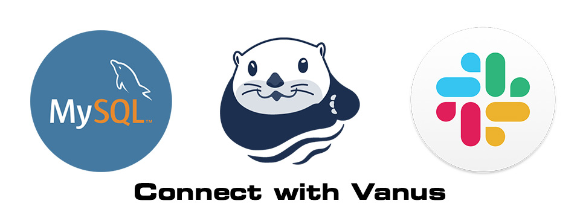

<!--truncate-->

To achieve that, we need one program to receive database events and transform them into custom messages and another to receive transformed messages and send them to our Slack channel.

Luckily, Vanus has already provided many ***out-of-the-box Connectors*** that enable you to integrate with popular services or applications without writing code.

***Prerequisites***
- Have MySQL Server 8.0, 5.7, or 5.6.
- Have a Slack account.

Here is how to do this in only 10 mins.
1. Go to Vanus [Playground](https://play.linkall.com) (an online K8s playground)

2. Click “Continue with GitHub” to prepare an interactive K8s environment(Use your GitHub account to sign in).
3. Wait for the preparation of the K8s environment (usually less than 1 min). The terminal is ready when you see something like this:

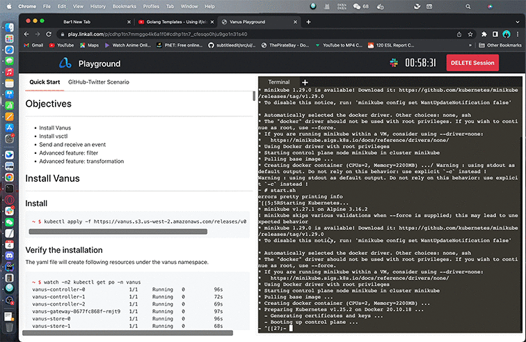

4. Install Vanus

```shell
kubectl apply -f https://download.linkall.com/all-in-one/v0.6.0.yml
```

5. Install vsctl (the command line tool)

```shell
curl -O https://download.linkall.com/vsctl/latest/linux-amd64/vsctl
chmod ug+x vsctl
mv vsctl /usr/local/bin
```
6. Set the endpoint for vsctl

```shell
export VANUS_GATEWAY=192.168.49.2:30001
```

7. Create an Eventbus to store your events

```shell
vsctl eventbus create --name mysql-to-slack
```

8. Enable binary logging if you have disabled it (MySQL default Enabled)

9. Create a new USER and grant roles 

    Choose a unique password for the user.
```shell
CREATE USER 'vanus'@'%' IDENTIFIED WITH mysql_native_password BY 'PASSWORD';
GRANT SELECT, RELOAD, SHOW DATABASES, REPLICATION SLAVE, REPLICATION CLIENT ON *.* TO 'vanus'@'%';
```

10. Create the config file for MySQL in the Playground

    Change MYSQL_HOST, MYSQL PORT, PASSWORD, DATABASE_NAME, and TABLE_NAME.

```shell
cat << EOF > mysql/config.yml
target: http://192.168.49.2:30001/gateway/mysql-to-slack # Vanus in Playground
name: "quick_start"
db:
  host: "MYSQL_HOST" # IP address of MySQL server
  port: MYSQL PORT # port address of MySQL server
  username: "vanus" # Username 
  password: "PASSWORD" # Password previously set
database_include: [ "<DATABASE_NAME>" ] # The name of your database
# format is vanus_test.tableName
table_include: [ "TABLE_NAME" ] # The name of your Table

store:
  type: FILE
  pathname: "/vanus-connect/data/offset.dat"

db_history_file: "/vanus-connect/data/history.dat"
EOF
```
11. Run MySQL Source in the background

```shell
docker run -it --rm --network=host \
  -v ${PWD}/mysql:/vanus-connect/config \
  -v ${PWD}:/vanus-connect/data \
  --name source-mysql public.ecr.aws/vanus/connector/source-mysql &
```

12. Create an app on Slack. [Slack Website](https://api.slack.com)

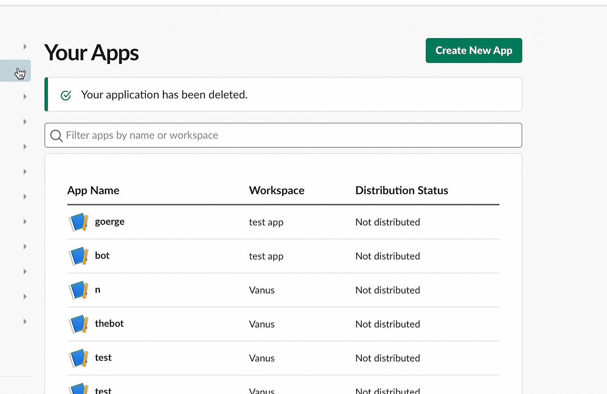

13. Click 'create new app' and from scratch

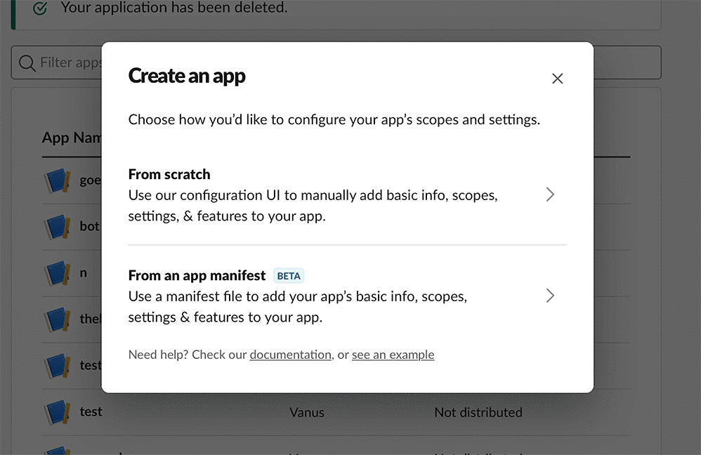

14. Set the bot name as "Vanus-MySQL"
15. Chose your workspace

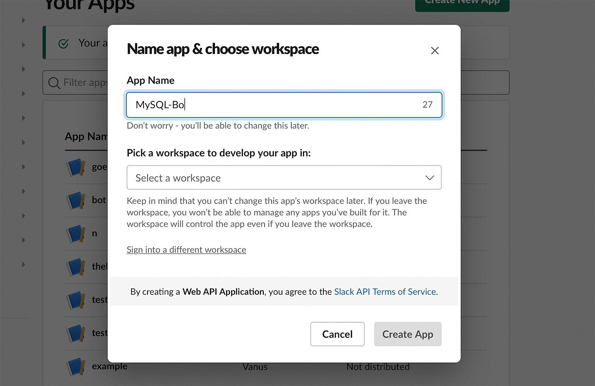

16. Click on permissions in the central menu.

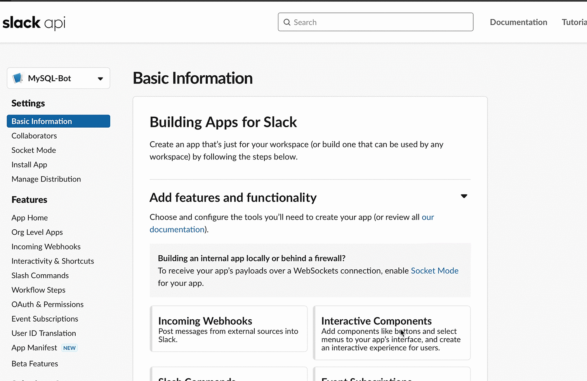

17. Set bot permissions  'Add OAuth Scope' chat:write and chat:write.public.

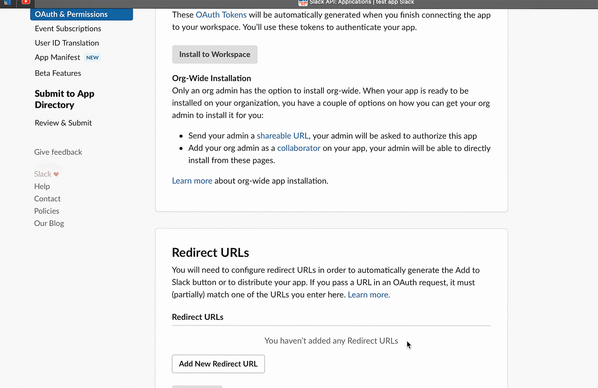

18. Install the bot to your workspace.

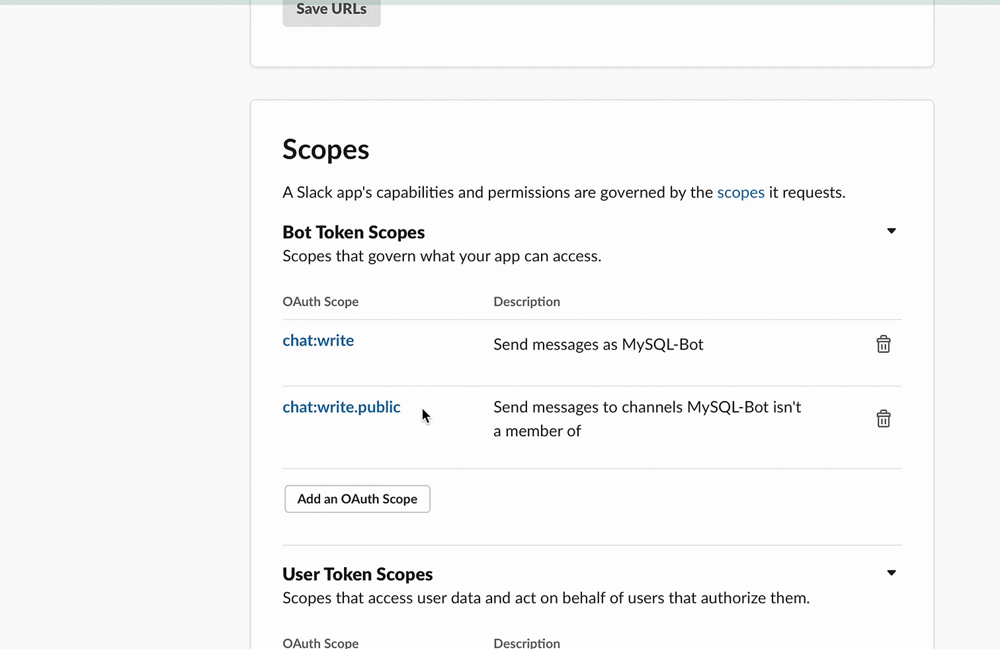

19. Keep your Bot User OAuth Token in OAuth & Permissions.

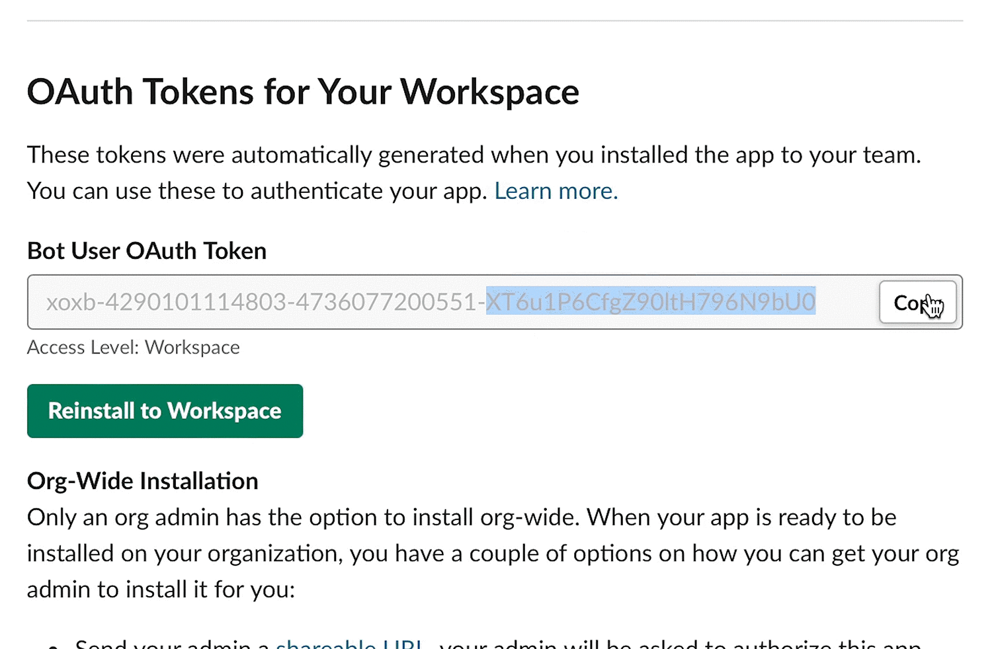

20. Create a yml file named slack-sink.yml in the playground with the following command:

```shell
cat << EOF > slack-sink.yml
apiVersion: v1
kind: Service
metadata:
  name: sink-slack
  namespace: vanus
spec:
  selector:
    app: sink-slack
  type: ClusterIP
  ports:
    - port: 8080
      name: sink-slack
---
apiVersion: v1
kind: ConfigMap
metadata:
  name: sink-slack
  namespace: vanus
data:
  config.yml: |-
    default: "test-app1"
    slack:
      - app_name: "test-app1"
        token: "xoxb-429"
        default_channel: "#general"

---
apiVersion: apps/v1
kind: Deployment
metadata:
  name: sink-slack
  namespace: vanus
  labels:
    app: sink-slack
spec:
  selector:
    matchLabels:
      app: sink-slack
  replicas: 1
  template:
    metadata:
      labels:
        app: sink-slack
    spec:
      containers:
        - name: sink-slack
          image: public.ecr.aws/vanus/connector/sink-slack
          resources:
            requests:
              memory: "128Mi"
              cpu: "100m"
            limits:
              memory: "512Mi"
              cpu: "500m"
          imagePullPolicy: Always
          ports:
            - name: http
              containerPort: 8080
          volumeMounts:
            - name: config
              mountPath: /vanus-connect/config
      volumes:
        - name: config
          configMap:
            name: sink-slack
EOF
```

21. Update the settings: `Channel` and `token`

```shell
vi slack-sink.yml
```
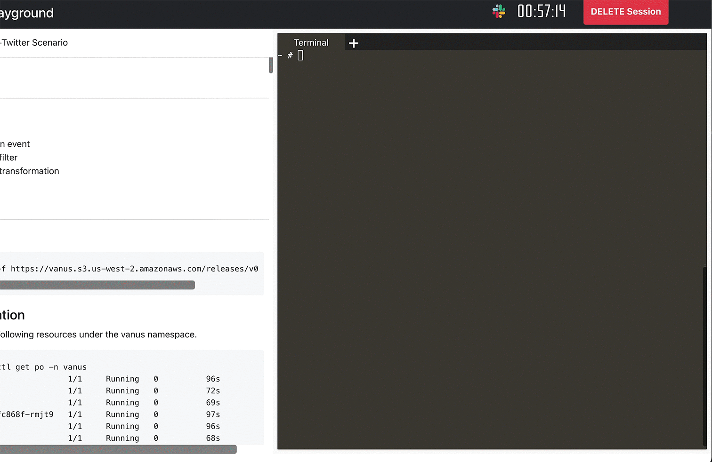

22. Run slack sink in kubernetes.

```shell
kubectl apply -f slack-sink.yml
```

23. Create a subscription.

    You can define your variable according to your own table structure or follow my structure below.
    For example, username will be defined this way -> "user": "$.data.username", note that you need to add data. before your column.

```mysql
# My structure ->
CREATE database Name;
CREATE TABLE IF NOT EXISTS dataBaseName.tableName
(
  `id` int NOT NULL,
  `username` varchar(100) NOT NULL,
  `email` varchar(100) NOT NULL,
  `password` varchar(100) NOT NULL,
`subscription_plan` varchar(100) NOT NULL,
`phone_number` varchar(100) NOT NULL,

  PRIMARY KEY (`id`)
) ENGINE=InnoDB;
```

```shell
# Create a subscription ->
vsctl subscription create --name mysql-sub \
  --eventbus mysql-to-slack \
  --sink 'http://sink-slack:8080' \
  --transformer '{
      "define": { 
        "username": "$.data.username",
        "email": "$.data.email",
        "subscription_plan": "$.data.subscription_plan",
        "phone_number": "$.data.phone_number"
      },
      "template": "{\"subject\":\"sales team\",\"message\":\"Hi Sales team, We have a new user <${username}>, Email: <${email}>, Subscription plan: <${subscription_plan}>, Phone Number: ${phone_number}.\"}"
    }'
```
23. Let's test everything by making an entry in MySQL.

```mysql
INSERT into DATABASE.TABLE values(1,"jess","mypassword","Email@jesica.com","sub 1 month","434 555 1232");
```

**result:**
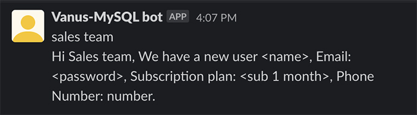