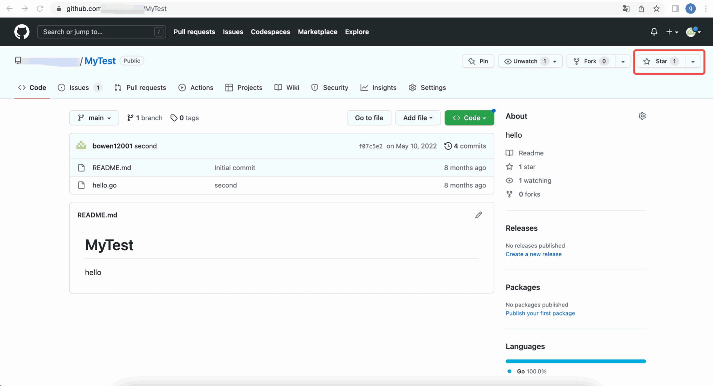
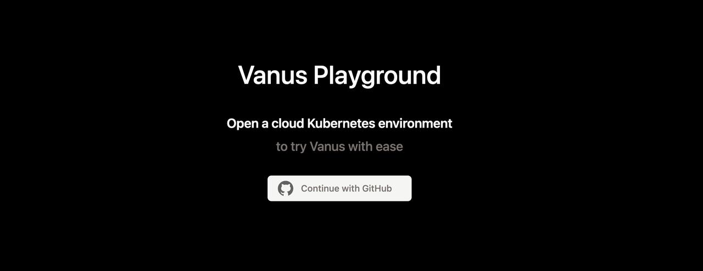
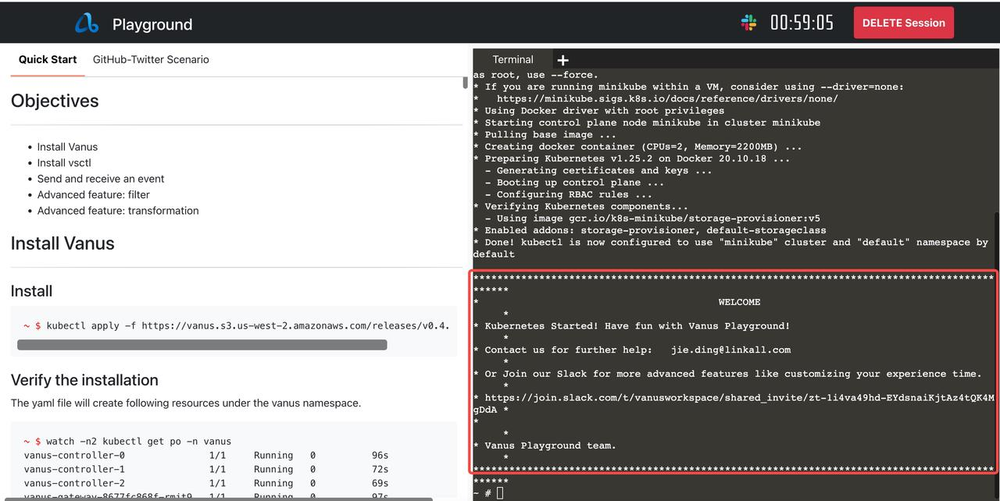
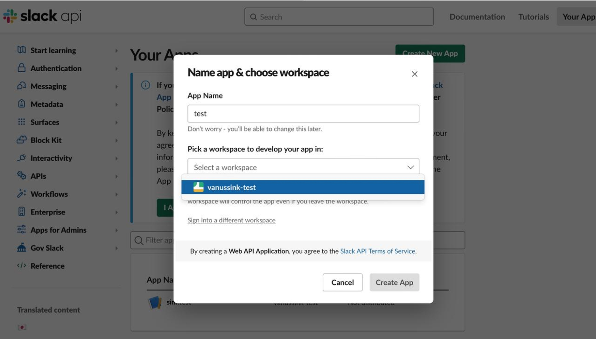
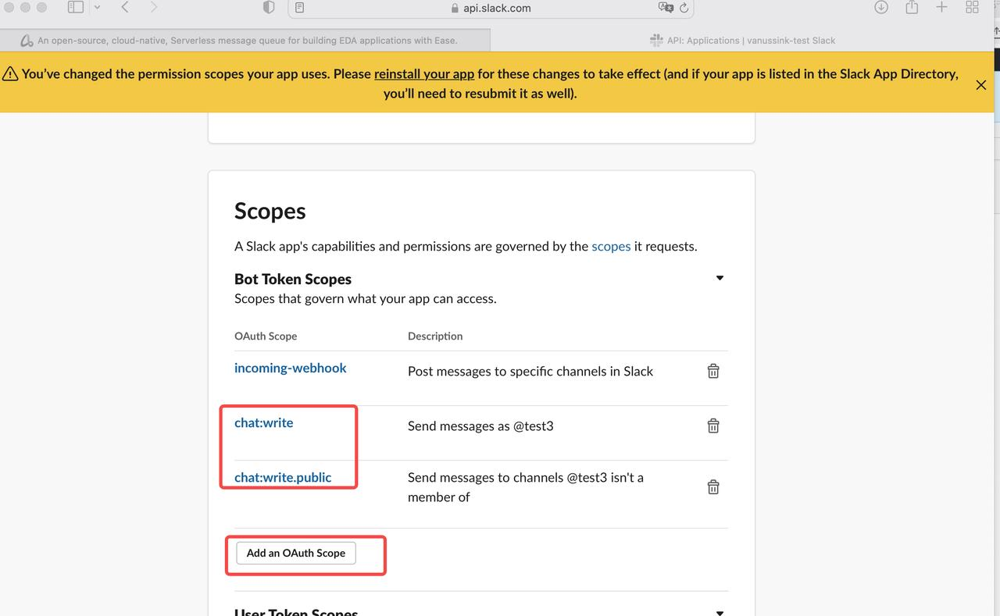
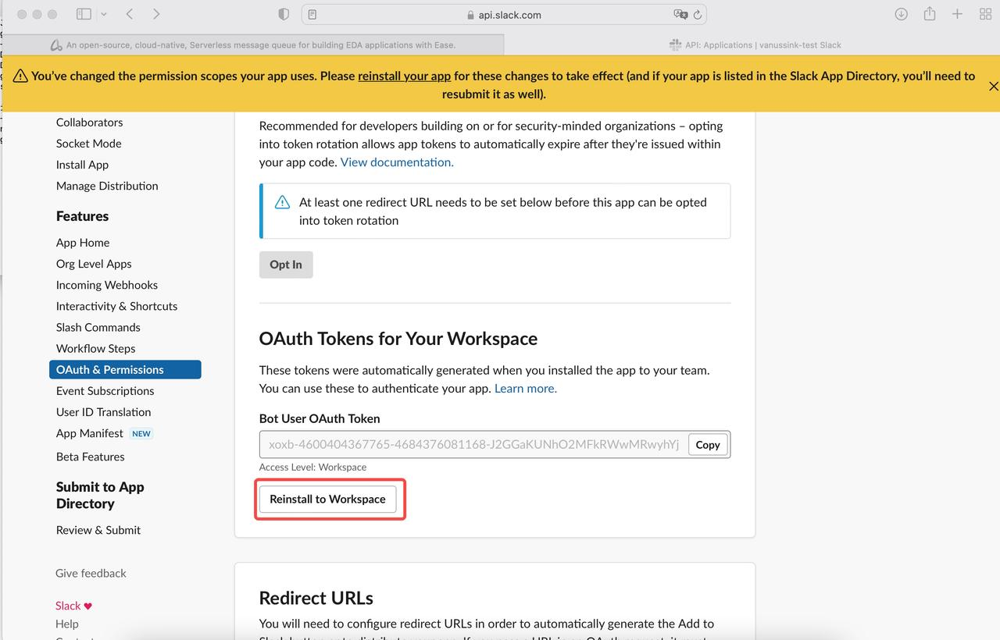
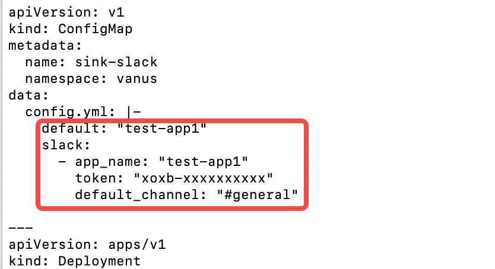
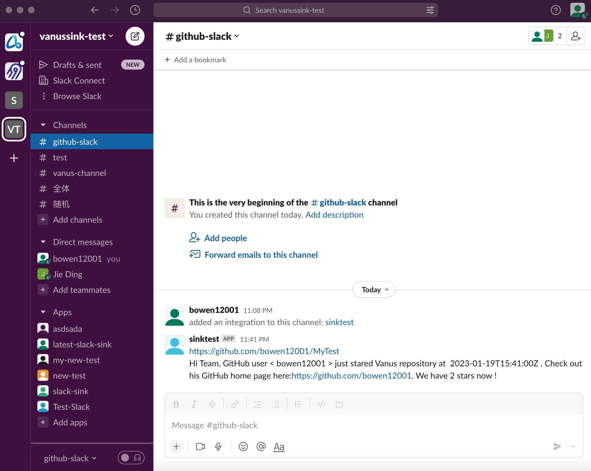

## Build a notification system that pushes any GitHub event to Slack in 5 minutes

If you have an open-source project on GitHub, you definitely need to know who is attracted to your project in real-time. For example, whether someone has starred the project or submitted an Issue or a PR. How can we get the status of open-source projects in real-time? It is obviously not a good way to keep checking the GitHub page.

 This article will help open-source enthusiasts deliver any Github events to Slack through Vanus in real-time. In this way, developers can know the status of open source projects in real-time without logging in to GitHub, so that developers can quickly respond to the following GitHub events:

This article will show how to do this in 5 minutes on Playground with Vanus and Vanus Connect， the results are shown below:




## Table of Contents

- What is GitHub
  - About GitHub
  - What GitHub events
  - Why need GitHub events
  - How to get github events
- What is Slack?
- How to Connect GitHub to Slack?
  - [Step 1: Deploying Vanus in the playground](# Step 1: Deploying Vanus in the playground)
  - [Step 2: Deploy the GitHub source connector](# Step 2: Deploy the GitHub source connector)
  - [Step 3: Creating a Slack app](# Step 3: Creating a Slack app)
  - [Step 4: Deploy the slack sink connector on Kubernetes](# Step 4: Deploy the slack sink connector on kubernetes)
- Test result
- [Summarize](# Summarize)

## What is GitHub
### About GitHub

GitHub is an online software development platform. It's used for storing, tracking, and collaborating on software projects. It makes it easy for developers to share code files and collaborate with fellow developers on open-source projects. GitHub also serves as a social networking site where developers can openly network, collaborate, and pitch their work.

Since its founding in 2008, GitHub has acquired millions of users and established itself as a go-to platform for collaborative software projects. This free service comes with several helpful features for sharing code and working with others in real-time

### What is GitHub events

When developers operate on GitHub, events will be generated, such as submitting Issue, submitting and PR, Commit code, etc. Common GitHub event  types are as follows:

- Issue event： Create, delete, closed, as signed, unsigned, labeled, unlabeled, etc.
- PR event， Create, delete, closed, merged, edited, review requested, commit, etc.
- Comments event, PR comments, issue comments, commit comments.
- Stars event: A star is created or deleted from the repository.
- Version releases event:  Release created, edited, published, unpublished, or deleted.
- Wiki events: Wiki page updated.
- The team adds: Team added or modified on a repository.
- Discussions event:  created, edited, pinned, unpinned, locked, unlocked, transferred, answered, etc.
- Labels event: Label created, edited, or deleted.
- Milestone event: Milestone created, closed, opened, edited, or deleted.
- Code scanning alerts: Code Scanning alerts are created, fixed in a branch, or closed.

### Why need GitHub events

GitHub events provide an easy way to keep track of your GitHub repository without monitoring its status manually. They’re basically a notification system that offers a high level of customizability.

Through github events, you can learn a lot in real time, such as who starred the project, who submitted the PR, and whether a new version was released. At the same time, GitHub events can also trigger some operations, such as compiling code, automatic deployment, security checks, and so on.

## What is Slack
<!--truncate-->
Slack is an all-purpose communication platform and collaboration hub. It includes instant messaging, voice and video calls, and a suite of tools to help groups share information and work together.

A Slack workspace is your team's home, similar to a dashboard.A Slack workspace is your team's home, similar to a dashboard.Slack Channels are shared group chat rooms for members of a workspace. Users can communicate with the entire team or certain team members in various channels.

## How to Connect GitHub to Slack?

### Prerequisites：

- Playground： An online k8s environment where Vanus can be deployed.
- GitHub： Your open-source repository
- slack： A working slack account

### Step 1: Deploying Vanus in the playground

1 Enter the login page and click the Continue with Github button to log in with the GitHub account



2  Wait for the automatic deployment of Kubernetes to complete, about 30 sec.



3 Deploy Vanus to the terminal on the right side of the web page

```Shell
kubectl apply -f https://vanus.s3.us-west-2.amazonaws.com/releases/v0.4.0/vanus.yaml
```

 Verify: watch -n2 kubectl get po -n Vanus，

```Plain
 $ watch -n2 kubectl get po -n vanus
vanus-controller-0               1/1     Running   0          96s
vanus-controller-1               1/1     Running   0          72s
vanus-controller-2               1/1     Running   0          69s
vanus-gateway-8677fc868f-rmjt9   1/1     Running   0          97s
vanus-store-0                    1/1     Running   0          96s
vanus-store-1                    1/1     Running   0          68s
vanus-store-2                    1/1     Running   0          68s
vanus-timer-5cd59c5bf-hmprp      1/1     Running   0          97s
vanus-timer-5cd59c5bf-pqkd5      1/1     Running   0          97s
vanus-trigger-7685d6cc69-8jgsl   1/1     Running   0          97s
```

4 Install vsctl (the command line tool)

```Plain
curl -O https://vsctl.s3.us-west-2.amazonaws.com/releases/v0.4.0/linux-amd64/vsctl
chmod ug+x vsctl
mv vsctl /usr/local/bin
```

5  Set the endpoint for vsctl to access vanus

```Plain
export VANUS_GATEWAY=192.168.49.2:30001
```

6 Create eventbus

```Plain
$ vsctl eventbus create  github-slack
+----------------+-------------+
|     RESULT     |   EVENTBUS  |
+----------------+-------------+
| Create Success | github-slack|
+----------------+-------------+
```

### Step 2: Deploy the GitHub source connector

1 Create webhook in GitHub repo

 **Payload URL** *

```
http://ip10-1-53-4-cfie9skinko0oisrvrq0-8082.direct.play.linkall.com
```

**Content type**

```
application/json
```

**Which events would you like to trigger this webhook?**

```
Send me everything.
```

2 Set config file

 Create config.yml in any directory, the content is as follows

```Plain
{
  "v_target": "http://192.168.49.2:30001/gateway/github-slack",
  "v_port": "8082"
}
```

3 Deploy the GitHub source connector and run the following command in the same directory:

```Plain
docker run --network=host -v $(pwd)/config.json:/vance/config/config.json  --rm vancehub/source-github > a.log &
```

### Step 3: Creating a Slack app

1 Create a slack app

First, log in to slack, and click Create New APP,then select From Scrath, and fill in the App Name, select the corresponding Workspace



2 Setting permissions

Select  **[OAuth & Permissions](https://api.slack.com/apps/A04L5D8QJ0Y/oauth?)** **,**  click Add an OAuth Scope in the Bot Token Scopes section of the Scope tab, and add chat:write and chat:write.public two types of permissions



Reinstall to Workspace



The slack app is created

### Step 4: Deploy the slack sink connector on kubernetes

1 Create config.yml in any directory, the content is as follows

```Plain
curl -O https://scenario-utils.s3.us-west-2.amazonaws.com/sink-slack.yaml 
```
2 Open sink-slack.yml, replace values of default , app_name, token, default_channel with yours.



3 Deploy the slack sink connector

```Plain
 kubectl apply -f sink-slack.yaml
```

##  Test Result

Through the deployment of the above four parts, the components required to push github events to the notification system of slack have been deployed. The system can push arbitrary GitHub events to slack. And GitHub events can be filtered and processed through the filter and transformer capabilities of vanus.

- Through a filter, developers can filter out other events and only post the GitHub events they are interested in.
- Developers can process GitHub events through a transformer, extract key information from GitHub events, and arrange them according to their own needs.

​    Create a vanus subscription and set a filter or transformer in the subscription to achieve the above requirements. This article provides an example of event delivery for readers' reference.

   Get the event of Github star and post it to slack

   Create a subscription in vanus, and set up a transformer to extract and edit key information.

```Plain
vsctl subscription create  \
--eventbus github-slack  \
  --sink 'http://sink-slack:8080'   \
  --transformer '{
      "define": {
         "user":"$.data.sender.login",
         "time":"$.data.repository.updated_at",
         "homepage":"$.data.sender.html_url",
        "stargazers_count": "$.data.repository.stargazers_count",
        "repo": "$.data.repository.html_url"
      },
      "template": "{\"subject\": \"${repo}\",\"message\":\"Hi Team, GitHub user < ${user} > just stared Vanus repository at  ${time} . Check out his GitHub home page here:${homepage}. We have ${stargazers_count} stars now !\"}"
    }'
```

Explain：

• Line 1: Create a subscription via vsctl.

• Line 2: Set which eventbus event the subscription handles.

• Line 3: The sink parameter is the destination address to deliver the GitHub event processed by vanus.

• Line 4: Declare to create a transformer, which extracts the user name from the GitHub event, clicks on the star time, the current number of stars, the operation type, and other variables, edits it into a sentence, and delivers it to slack.

• Line 6: Declare user, and get the username of the dot star from the GitHub event.

• Line 7: Declare time, and get the time of clicking star from the GitHub event.

• Line 8:Declare the homepage, and get the GitHub home page address of the developer who clicked star from the GitHub event.

• Line 12: Edit the specific content of the delivery: Hi Team, GitHub user < xxx > just stared the Vanus repository at 2023-0x-xxTxx:18:03Z . Check out his GitHub home page here: [https://github.com/x](https://github.com/Valbonne)xxx . We have xxx stars now!

 Result：



## Summarize:

This article describes how to build a notification system that pushes any GitHub event to slack through Vanus. And an example is given: get the event of Github star, extract the key information of the event through vanus, and re-edit the information and post it to slack. Developers can also refer to examples to obtain and process any github events, such as issue events, comments events, wiki update events, and so on. Through the construction of this system, developers can perceive real-time status changes in GitHub repo in real time.

