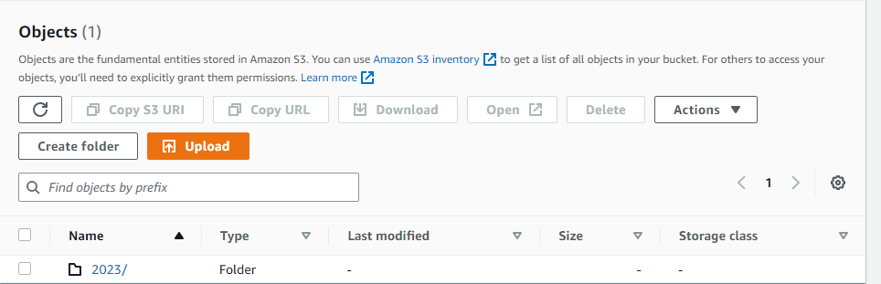
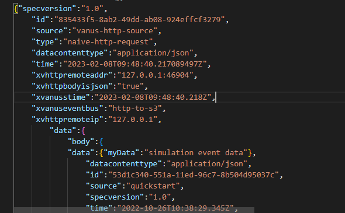

## Table of Contents

- [Introduction](#introduction)
  - [What is Amazon S3?](#what-is-amazon-s3)
  - [What is HTTP Request?](#what-is-http-request)
- [Pre-requisite](#pre-requisite)
- [How to Log HTTP Requests to S3 Bucket](#how-to-log-http-requests-to-s3-bucket)
  - [Step 1: Deploy Vanus on the Playground](#step-1-deploy-vanus-on-the-playground)
  - [Step 2: Make directory for S3 Sink Connector and Create Config file](#step-2-make-directory-for-s3-sink-connector-and-create-config-file)
  - [Step 3: Make directory for HTTP Source Connector and Create Config file](#step-3-make-directory-for-http-source-connector-and-create-config-file)
  - [Step 4: Create Subscription](#step-4-create-subscription)
  - [Step 5: Make a request using CURL](#step-5-make-a-request-using-curl)
- [Check out the result](#check-out-the-result)
- [Conclusion](#conclusion)

## Introduction

Storing Logs on your web server may seem pretty okay for Low traffic websites like a personal blog but what about an e-commerce website which is a good example of a website that can receive millions of requests in a day? Storing such a high volume of logs may lead to more resources being needed to handle such logs. Also, if there is an issue with the server, the log files cannot be accessed. So then, what can we do? Before we begin, I will explain some terminologies to us.

- ### What is Amazon S3?

  Amazon Simple Storage Service (Amazon S3) provides is an object storage service that provides performance, security, and scalability that are unmatched in the market. For a variety of use cases, including data lakes, websites, mobile applications, backup and restore, archives, business applications, IoT devices, and big data analytics, customers of all sizes and sectors may use Amazon S3 to store and preserve any quantity of data. To meet your unique business, organizational, and compliance needs, Amazon S3 offers management options that allow you to optimize, organize, and configure access to your data.

- ### What is HTTP Request?

  A client sends an HTTP request to a named host on a server. Accessing a server resource is the purpose of the request.

  The client uses parts of a URL (Uniform Resource Locator), which contains the information required to access the resource, to submit the request. URLs are explained by looking at their constituent parts.

  The following components are found in a properly constructed HTTP request:
  A line for requests. A number of header fields or HTTP headers. A message body, if required.

  In this tutorial, I will show you how you can use Vanus connect to build a highly available and persistent log stream from HTTP requests made to your web server and store them in Amazon S3 bucket.

## Pre-requisite

- Have a container runtime (i.e., docker).
- An Amazon S3 bucket.
- AWS IAM Access Key.
- AWS permissions for the IAM user:
  - s3:PutObject

Now, l will show you a step-by-step guide on how to build your own persistent log stream.

## How to Log HTTP Requests to S3 Bucket

For this tutorial, we will be using the Vanus Playground; An online Kubernetes environment.

### Step 1: Deploy Vanus on the Playground

- Go to [Vanus Playground](https://play.linkall.com), and click “Continue with GitHub”.


- Wait for preparing the K8s environment (usually less than 1 min). The terminal is ready when you see something like:


- Install Vanus by typing following command:

```shell
kubectl apply -f https://download.linkall.com/all-in-one/v0.6.0.yml
```

- Verify if Vanus is deployed successfully:

```shell
 $ watch -n2 kubectl get po -n vanus
vanus-controller-0               1/1     Running   0          96s
vanus-controller-1               1/1     Running   0          72s
vanus-controller-2               1/1     Running   0          69s
vanus-gateway-8677fc868f-rmjt9   1/1     Running   0          97s
vanus-store-0                    1/1     Running   0          96s
vanus-store-1                    1/1     Running   0          68s
vanus-store-2                    1/1     Running   0          68s
vanus-timer-5cd59c5bf-hmprp      1/1     Running   0          97s
vanus-timer-5cd59c5bf-pqkd5      1/1     Running   0          97s
vanus-trigger-7685d6cc69-8jgsl   1/1     Running   0          97s
```

- Install vsctl (the command line tool).

```shell
curl -O https://download.linkall.com/vsctl/latest/linux-amd64/vsctl
chmod ug+x vsctl
mv vsctl /usr/local/bin
```

- Set the endpoint for vsctl.

```shell
export VANUS_GATEWAY=192.168.49.2:30001
```

- Create an Eventbus to store your events.

```shell
vsctl eventbus create --name http-s3
+----------------+------------------+
|     RESULT     |      EVENTBUS    |
+----------------+------------------+
| Create Success | http-s3          |
+----------------+------------------+
```

### Step 2: Make directory for S3 Sink Connector and Create Config file

- Make S3 Sink Directory

```shell
mkdir s3-sink
```

- Create Config file

```shell
cat << EOF > config.yml
port: 8080
aws:
  access_key_id: your_access_key
  secret_access_key: your_secret_key
region: "your_region"
bucket: "your_bucket_name"
scheduled_interval: 10
EOF
```

- Use**docker run** to run the S3 sink config.yml file

```shell
docker run -it --rm \
  -p 8082:8080 \
  -v ${PWD}:/vanus-connect/config \
  --name sink-aws-s3 public.ecr.aws/vanus/connector/sink-aws-s3 &
```

**Note: I ran this in the Background of my terminal, if you wish to see the outputs, remove the ampersand (&) at the end**

### Step 3: Make directory for HTTP Source Connector and Create Config file

- Make HTTP Source Directory

```shell
mkdir http-source
```

- Create Config file

```shell
cat << EOF > config.yml
target: http://192.168.49.2:30002/gateway/http-to-s3
port: 31081
EOF
```

- Use **docker run** to run the HTTP Source config.yml file

```shell
docker run -it --rm --network=host \
  -v ${PWD}:/vanus-connect/config \
  --name source-http public.ecr.aws/vanus/connector/source-http &
```

**Note: I ran this in the Background of my terminal, if you wish to see the outputs, remove the ampersand (&) at the end**

### Step 4: Create Subscription

- The Subscription is a relationship established between a Sink and an Eventbus. The Subscription reflects the Sink's interest in receiving events and describes the method for how to deliver those events. To create a subcription, use

```shell
vsctl subscription create --name http \
  --eventbus http-to-s3 \
  --sink 'http://ip10-1-39-4-cecpi79ajm80o97dfdug-8082.direct.play.linkall.com'
```

### Step 5: Make a request using CURL

-

```shell
curl --location --request POST 'localhost:31081' \
--header 'Content-Type: application/cloudevents+json' \
--data-raw '{
     "id": "53d1c340-551a-11ed-96c7-8b504d95037c",
    "source": "quickstart",
    "specversion": "1.0",
    "type": "quickstart",
    "datacontenttype": "application/json",
    "time": "2022-10-26T10:38:29.345Z",
    "data": {
        "myData": "Hello S3 Bucket!"
    }
}'
```

## Check out the result

Check your S3 bucket, you will see a folder containing files have been uploaded



We can now see that our S3 bucket was able to pull the request when we used CURL. The S3 sink supports partitioning; files can be pulled on an hourly or daily basis.

We can inspect our file and see the data received by our S3 bucket.


## Conclusion

In this tutorial, I have shown how you how you can use Vanus connect to build a highly available and persistent log stream from HTTP requests made to your website and store them in Amazon S3 bucket.
