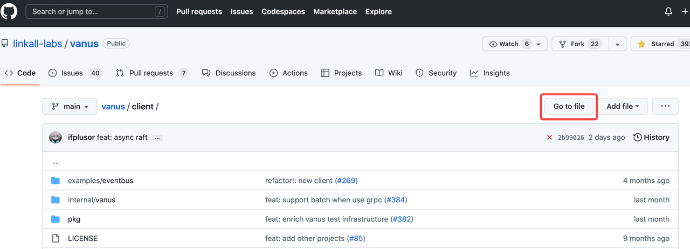
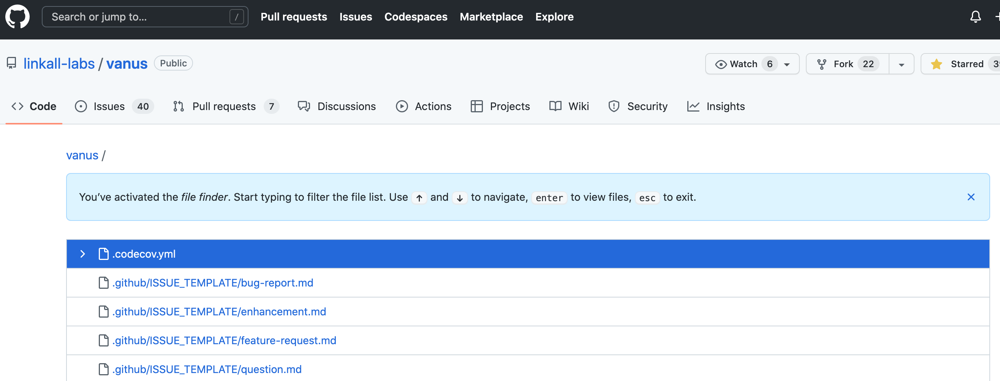
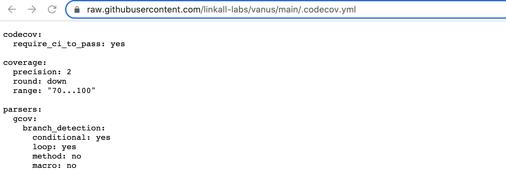
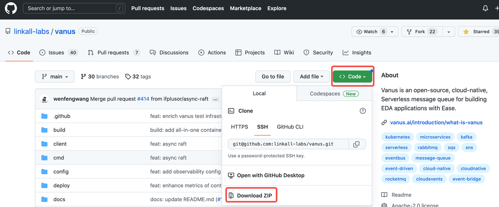

#  How to download from GitHub

GitHub is a robust platform that enables developers to manage their software development projects efficiently, collaborates with others, and maintain a complete history of changes and versions. 

If you are new to using GitHub and Git, learning how to download open-source code from GitHub is an excellent place to start. This blog will talk about how to download files from GitHub.

<!--truncate-->

## Table of Contents

- What is GitHub?

- How to download a file from GitHub?

  - Step 1: Find the file you want to download on GitHub
  - Step 2: Open the file in the browser
  - Step 3: Download the contents of the file to the local

- How to Download a GitHub Repository?

  - Step 1: Find the GitHub repository
  - Step 2: Click "Download ZIP"

- How to download a release from GitHub？

  - Step 1: Find the GitHub repository you need to download
  - Step 2: Find the Assets section
  - Step 3: Download a release from GitHub

- Automate GitHub with Vanus

  

## What is GitHub?

GitHub is a web-based platform that provides hosting and collaboration services for Git version control repositories.

GitHub has a vast collection of open-source projects and a robust developer community, making it a crucial tool for modern software development.

## How to download a file from GitHub?

To download a file from GitHub, you can follow these steps:

### Step 1: Find the file you want to download on GitHub

- Go to the GitHub repository that contains the file you want to download.
- Navigate to the file you want to download, and click **Go to file** to view its contents.

### Step 2: Open the file in the browser

-  Click the file you want to download. This will open the file in GitHub.

- Click on the **Raw** button to open the raw code in your browser.
  - 

### Step 3: Download the contents of the file to the local

- Select **Save Link As** (or equivalent option) to download the file to your local machine.

## How to Download a GitHub Repository？

If you want to download the files of a repository and not clone it, you can download the repository as a zip archive from GitHub. Here's how:

### Step 1: Find the GitHub repository

- Go to the GitHub repository that you want to download.
- On the main repository page, click the green **Code** button.

### Step 2: Click "Download ZIP"

The repository will be downloaded as a zip archive, which you can extract to access the files.

**Note:** Keep in mind that downloading a repository as a zip archive will not include the Git history, so you won't be able to view the changes made to the files over time.  You'll need to clone the repository if you need to access the Git history.

**How to clone github repository** will be introduced in another blog.

## How to download a release from GitHub？

Repositories can put out releases that are packaged versions of the project. You can download a release from GitHub in the following ways:

### Step 1: Find the GitHub repository you need to download

- Go to the repository on GitHub where the release was published.
- Click on the "Releases" tab.

### Step 2: Find the Assets section

- After clicking, you will see a page listing the versions from newest to oldest. 
- Find the **Assets** section under the version you want to download. Click on the file under this section to download it.

### Step 3: Download a release from GitHub

- Click on the "Download" button associated with the desired release.

- The release will be downloaded as a **ZIP** archive, which you can extract to access the files.

  

## **Automate GitHub with Vanus**

Vanus lets you connect GitHub to multiple applications so that you can automate more of your Git process. For example, as long as there is a new event in your repository, such as someone clicking a star or leaving a message on your issue or PR, you can receive a notification on Twitter or Slack in real-time, and the content of the notification can also be set by yourself.

The following tutorial can teach you how to implement how to receive GitHub notifications:

[How to Receive GitHub notifications on Twitter](https://www.vanus.ai/blog/2022/12/26/github-twitter-blog)

[Build a notification system that pushes any Github event to Slack in 5 minutes](https://www.vanus.ai/blog/2023/02/05/github-slack)

**Vanus is an open-source, cloud-native, Serverless** **message queue** **for building** **EDA** **applications with Ease.** Try it and have fun with [Vanus](https://www.vanus.ai/).