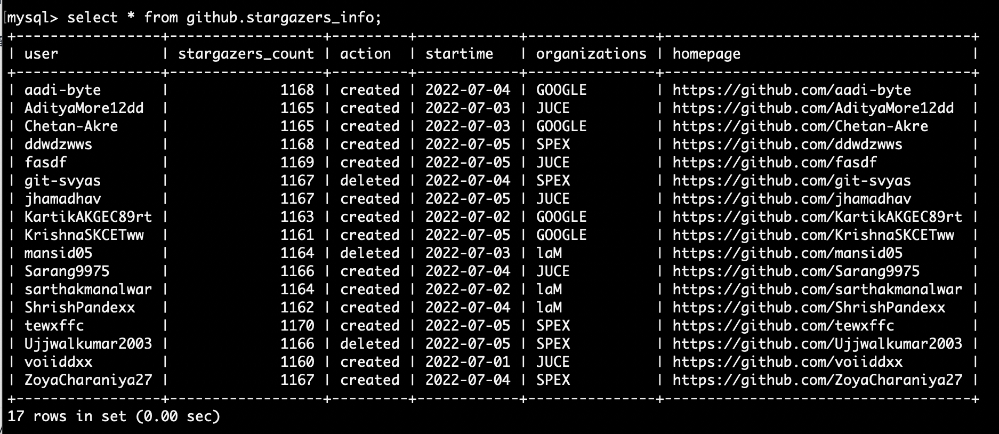
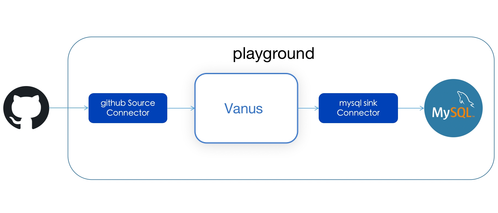
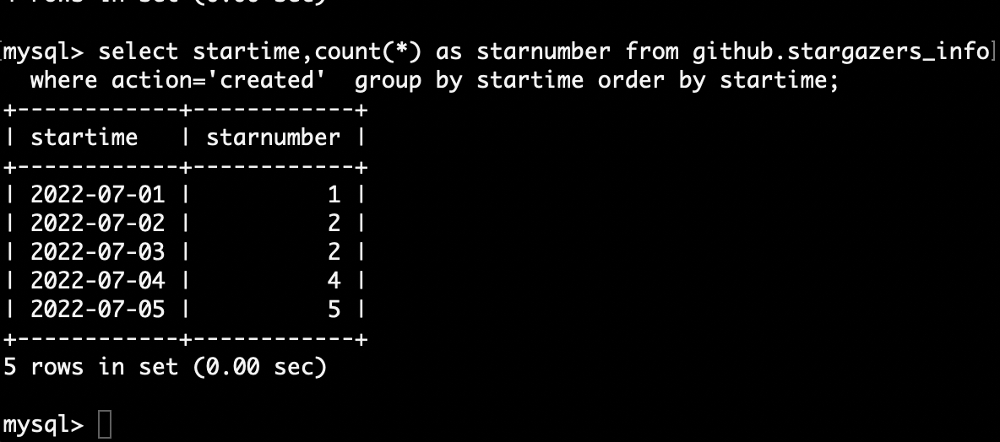
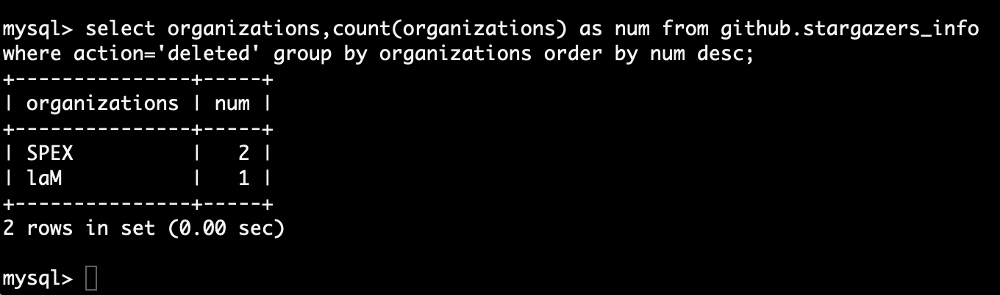

## How to store and analyze GitHub data in MySQL

If you are running an open-source project, I believe you must be interested in the following questions: 

* Has your project received more and more attention recently? 

* What organizations are having developers leaving your project at an accelerated rate？

* Which organizations of developers are being attracted to your project?

* What strategy should be adopted to attract more contributors?

Analyzing GitHub data can not only answer the above questions. And it can help you gain insight into important trends in more open-source projects. For example, it can help open source operators gain real-time insight into the trends of project developers, the latest trends of contributors, which organizations pay attention to your project, and so on.

This blog will use Vanus to build a data pipeline from GitHub to MySQL, so as to help developers store GitHub data in MySQL in real time. At the same time, some examples are given to help developers analyze GitHub data to gain insight into trends. The results are shown below:




## Table of Contents

- [What is GitHub](#What-is-GitHub)
  - [About GitHub](#About-GitHub)
  - [What are GitHub events](#What-are-GitHub-events)
- [What is MySQL](#What-is-MySQL)
- [How to Connect GitHub to MySQL](#How-to-Connect-GitHub-to-MySQL)
  - [Prerequisites](#Prerequisites)
  - [Step 1: Deploying Vanus in the playground](#Step-1-Deploying-Vanus-in-the-playground)
  - [Step 2: Deploy the GitHub source connector](#Step-2-Deploy-the-GitHub-source-connector)
  - [Step 3:Deploy MySQL on Docker](#Step-3-Deploy-MySQL-on-Docker)
  - [Step 4: Deploy the MySQL sink connector](#Step-4-Deploy-the-MySQL-sink-connector )
- [Store Github star events to MySQL](#Store-Github-star-events-to-MySQL)
- [Analyze GitHub data](#Analyze-GitHub-data)
- [Conclusion](#Conclusion)

## What is GitHub
### About GitHub

GitHub is an online software development platform. It's used for storing, tracking, and collaborating on software projects. It makes it easy for developers to share code files and collaborate with fellow developers on open-source projects. GitHub also serves as a social networking site where developers can openly network, collaborate, and pitch their work.

Since its founding in 2008, GitHub has acquired millions of users and established itself as a go-to platform for collaborative software projects. This free service comes with several helpful features for sharing code and working with others in real-time

### What are GitHub events

When developers operate on GitHub, events will be generated, such as submitting Issue, submitting and PR, Commit code, etc. Common GitHub event  types are as follows:

- Issue event： Create, delete, closed, as signed, unsigned, labeled, unlabeled, etc.
- PR event， Create, delete, closed, merged, edited, review requested, commit, etc.
- Comments event, PR comments, issue comments, commit comments.
- Stars event: A star is created or deleted from the repository.
- Version releases event:  Release created, edited, published, unpublished, or deleted.
- Wiki events: Wiki page updated.
- The team adds: Team added or modified on a repository.
- Discussions event:  created, edited, pinned, unpinned, locked, unlocked, transferred, answered, etc.
- Labels event: Label created, edited, or deleted.
- Milestone event: Milestone created, closed, opened, edited, or deleted.
- Code scanning alerts: Code Scanning alerts are created, fixed in a branch, or closed.


## What is MySQL

MySQL is a popular open-source relational database management system (RDBMS) used for storing and retrieving data in a structured manner. It was developed and is maintained by the Swedish company MySQL AB. MySQL is used by many websites and applications to store their data and is a popular choice due to its ease of use, fast performance, and reliability. It is based on the Structured Query Language (SQL), which is the standard language for managing relational databases. MySQL is compatible with various operating systems, including Windows, Linux, and macOS, and is often used in combination with other technologies such as PHP, Python, and Java to build dynamic, data-driven web applications.

## How to Connect GitHub to MySQL

The schematic diagram of system deployment is as follows：



### Prerequisites

- Playground： An online k8s environment where Vanus can be deployed.

- GitHub： Your open-source repository

  

### Step 1: Deploying Vanus in the playground

1 Enter the login page and click the Continue with Github button to log in with the GitHub account


2  Wait for the automatic deployment of Kubernetes to complete, about the 30s.


3 Deploy Vanus to the terminal on the right side of the web page

```Shell
kubectl apply -f https://vanus.s3.us-west-2.amazonaws.com/releases/v0.4.0/vanus.yaml
```

 Verify: watch -n2 kubectl get po -n Vanus，

```Plain
 $ kubectl get po -n vanus
vanus-controller-0               1/1     Running   0          96s
vanus-controller-1               1/1     Running   0          72s
vanus-controller-2               1/1     Running   0          69s
vanus-gateway-8677fc868f-rmjt9   1/1     Running   0          97s
vanus-store-0                    1/1     Running   0          96s
vanus-store-1                    1/1     Running   0          68s
vanus-store-2                    1/1     Running   0          68s
vanus-timer-5cd59c5bf-hmprp      1/1     Running   0          97s
vanus-timer-5cd59c5bf-pqkd5      1/1     Running   0          97s
vanus-trigger-7685d6cc69-8jgsl   1/1     Running   0          97s
```

4 Install vsctl (the command line tool)

```Plain
curl -O https://vsctl.s3.us-west-2.amazonaws.com/releases/v0.4.0/linux-amd64/vsctl
chmod ug+x vsctl
mv vsctl /usr/local/bin
```

5  Set the endpoint for vsctl to access Vanus

```Plain
export VANUS_GATEWAY=192.168.49.2:30001
```

6 Create eventbus

```Plain
$ vsctl eventbus create  GitHub-MySQL
+----------------+-------------+
|     RESULT     |   EVENTBUS  |
+----------------+-------------+
| Create Success | github-slack|
+----------------+-------------+
```


### Step 2: Deploy the GitHub source connector

1 Create webhook in GitHub repo


 **Payload URL** *

```
http://ip10-1-53-4-cfie9skinko0oisrvrq0-8082.direct.play.linkall.com
```

This is the address of the GitHub source connector that can be accessed by the public network provided by playground. GitHub can directly push events to the GitHub source connetor provided by Vanus through this address. If developers need to deploy in their own environment, they need to provide an address that can be accessed by the public network.

**Content type**

```
application/json
```

**Which events would you like to trigger this webhook?**

```
Send me everything.
```

2 Set config file

 Create config.yml in any directory, the content is as follows

```Plain
{
  "v_target": "http://192.168.49.2:30001/gateway/GitHub-MySQL",
  "v_port": "8082"
}
```

3 Deploy the GitHub source connector and run the following command in the same directory:

```Plain
docker run --network=host -v $(pwd)/config.json:/vance/config/config.json  --rm vancehub/source-github > a.log &
```


### Step 3: Deploy MySQL on Docker

1 Pull MySQL image 

```Plain
$ docker pull mysql:latest
```

2 Deploy MySQL on Docker

```Plain
$ docker run --network=host -itd --name mysql-test -p 3306:3306 -e MYSQL_ROOT_PASSWORD=123456 mysql
```

3  Login MySQL

```Plain
$ docker exec -it mysql mysql -uroot -p 
```

4  Create a database and table

  Create a database named github and create a table named stargazers_info in it to store github star events

```Plain
create database github;
CREATE TABLE IF NOT EXISTS github.stargazers_info
(
  `user` varchar(100) NOT NULL,
  `stargazers_count` int NOT NULL,
  `action` varchar(100) NOT NULL,
  `startime` date NOT NULL,  
  `organizations` varchar(100) NOT NULL,
  `homepage` varchar(100) NOT NULL,
  PRIMARY KEY (`user`)
);
```


### Step 4: Deploy the MySQL sink connector 

1 Create config.yml in any directory, the content is as follows

```Plain
db:
  host: "localhost"
  port: 3306
  username: "vanus_test" 
  password: "123456"
  database: "vanus_test"
  table_name: "user"

insert_mode: UPSERT 
```
2 Deploy the slack sink connector

```Plain
docker run -it --rm --network=host\
  -v ${PWD}:/vanus-connect/config \
  --name sink-mysql public.ecr.aws/vanus/connector/sink-mysql > a.log &
```


##  Store Github star events to MySQL

1 Create a subscription in Vanus

   Subscription is an event routing mechanism provided by Vanus, through which events in the Vanus event bus can be routed to any accessible endpoint. At the same time, the rules for transforming events can be specified through the --transformer option in ss, and the filtering rules can be specified through the --filter option.

   Now we will create a subscription to read events from the previously created github-twitter-scenario and define conversion rules to convert them. Then, the converted events are stored in MySQL through Vanus's MySQL sink connector.

   The command to create ss is as follows:

```Plain
vsctl subscription create  \
--eventbus github-twitter-scenario  \
  --sink 'http://sink-mysql:8080'   \
  --transformer '{
      "define": {
         "user":"$.data.sender.login",
         "stargazers_count":"$.data.stargazers_count",
         "action":$.data.action,
         "startime":"$.data.repository.updated_at",
         "organizations":$.data.sender.organizations_url",
         "homepage":"$.data.sender.html_url"
      },
      "template": "{\"user\": \"${user}\",\"action\":\"${action}",\"startime\": \"${startime}\",\"organizations\": \"${organizations}\",\"homepage\": \"${homepage}\"}"
    }'
```

Explain：

• Line 1: Create a subscription via vsctl.

• Line 2: Set which eventbus event the subscription handles.

• Line 3: The sink parameter is the destination address to deliver the GitHub event processed by Vanus.

• Line 4: Declare to create a transformer, which extract user, action，startime，organizationsand and homepage from github's event

|   column name    | Description                               |
| :--------------: | :---------------------------------------- |
|       user       | Who starred the project                   |
| stargazers_count | How many stars does the project have now  |
|      action      | Operation type, click star or delete star |
|     startime     | Time of occurrence                        |
|  organizations   | Developer's Organization Link             |
|     homepage     | Developer's github homepage lin           |

• Line 11: Edit converted GitHub data to send to MySQL

2  Waiting for developer star project

3 Query data in MySQL

   select * from github.stargazers_info;


## Analyze GitHub data
Since an event pipeline has been established between GitHub and MySQL. Over time, event data from GitHub will be continuously stored in MySQL. We can analyze based on the GitHub data in MySQL at any time to grasp the situation of open-source projects in real time. The following are some examples of our commonly used analysis of GitHub data

1  **Which organizations have developers most interested in our open source projects ?**

   Analysis method: Group statistics of how many developers in each organization have clicked on the star for the project, and sort them. The SQL command is as follows:

```Plain
select organizations,count(organizations) as num from github.stargazers_info where action='created' group by organizations order by num desc;
```


From the analysis results, it can be seen that JUCE paid the most attention to the project.

2  **What is the trend of recent project attention ?**

   Analysis method: Count the number of people who have clicked on the star every day in recent days, and sort them by time. The SQL command is as follows:
```Plain
select startime,count(*) as starnumber from github.stargazers_info  where action='created'  group by startime order by startime;
```


From the analysis results, from July 1st to July 5th, the number of people who click on the star basically increases every day. Therefore, our open-source projects have recently attracted more and more attention from developers.

3 **Which organizations have developers unfollowed projects recently?**

 Analysis method: Find out which organizations have developers who recently unfollowed projects. The SQL command is as follows:

```Plain
select organizations,count(organizations) as num from github.stargazers_info where action='deleted' group by organizations order by num desc;
```



From the analysis results, it can be seen that the developers of SPEX and LaM are losing interest in the project

   

## Conclusion:

This blog shows how to help developers build an event pipeline from GitHub to MySQL through Vanus. Developers can follow the steps given in the article to build an event pipeline in the Vanus playground within 5 minutes. Of course, according to the steps in the article, developers also open source and quickly build their own event pipelines in their own k8s environment. This article not only gives detailed steps to build an event pipeline but also gives an example of how to analyze GitHub events in MySQL. Developers can refer to examples to explore more analysis methods by themselves.

