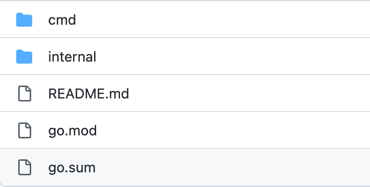

# Develop a Vanus Connector with cdk-go

A Vanus connector is a software component that allows different systems or applications to communicate with the Vanus event platform.
Connectors enable data to be easily and efficiently exchanged between different platforms, making it possible to integrate and automate business processes.

Now, Vanus community is looking for developers helping us contribute more connectors and improve the quality of existed ones.

In order to do that, we provide two CDKs(Connector-Development Kits) and code templates to use them so developers can avoid starting from scratch.

This article introduces the definition of **Vanus Connect**, some tools to help users develop new connectors, and how to use these
templates to write a connector. 

<!--truncate-->

## Table of Contents
- [About Vanus](#about-vanus)
    - [What is Vanus](#what-is-vanus)
    - [What is Vanus Connect](#what-is-vanus-connect)
    - [Why should you write connectors for Vanus](#why-should-you-write-connectors-for-vanus)
- [Pre-requisite](#pre-requisite)
- [How to write a connector for vanus](#how-to-write-a-connector-for-vanus)
    - [Step 1: Identify the connector you want to write](#step-1-identify-the-connector-you-want-to-write)
    - [Step 2: Submit your connector proposal](#step-2-submit-your-connector-proposal)
    - [Step 3: Implement your connector logic](#step-3-implement-your-connector-logic)
- [How to use Golang Source Template](#how-to-use-golang-source-template)
    - [Project Structure of the Golang source template](#project-structure-of-the-golang-source-templatehttpsgithubcomlinkall-labsvanus-connecttreemaintemplatessource-go)
    - [How to add custom configs in the source template](#how-to-add-custom-configs-in-the-source-template)
    - [How to Generate a CloudEvent in the template](#how-to-generate-a-cloudevent-in-the-template)
    - [How to deliver a CloudEvent to the target in the template](#how-to-deliver-a-cloudevent-to-the-target-in-the-template)
- [How to use Golang Sink Template](#how-to-use-golang-sink-template)
  - [Project Structure of the Golang sink template](#project-structure-of-the-golang-sink-templatehttpsgithubcomlinkall-labsvanus-connecttreemaintemplatessink-go)
  - [How to add custom configs in the sink template](#how-to-add-custom-configs-in-the-sink-template)
  - [How to deal with the incoming CloudEvents](#how-to-deal-with-the-incoming-cloudevents)
- [Conclusion](#conclusion)

## About Vanus

### What is Vanus

[Vanus](https://www.vanus.ai) is a Serverless, event streaming system with processing capabilities. It connects SaaS, Cloud Services, and Databases to help users build next-gen event-driven Apps.

### What is Vanus Connect

[Vanus Connect](https://vanus.ai/connector) allows you to skip the complex integration with external services by offering out-of-the-box **connectors**.
Each connector acts as a proxy between external services and your system, enabling you to have faster integrations without writing codes.
Vanus provides a variety of connectors for popular sources and sinks, including databases, cloud services, SaaS applications, and more.

There are two types of connectors of Vanus:

- A source connector obtains data from an underlying data producer and delivers it to targets, after original data has been transformed into CloudEvents. It doesn't limit the way how a source retrieves data. (e.g., A source may pull data from a message queue or act as an HTTP server waiting for data sent to it).

- A sink connector receives CloudEvents and does some specific business logics. (e.g., A MySQL Sink extracts useful data from CloudEvents and writes them to a MySQL database).

### Why should you write connectors for Vanus

[Vanus](https://github.com/linkall-labs/vanus) is an open-source event streaming, which means that it is freely available for anyone to use and modify. However, while the core Vanus system provides a powerful and flexible platform for processing and delivering events, it may not include all of the connectors that are needed to integrate with various systems and applications.

This is where open-source contributors can play a valuable role. By writing connectors for Vanus, they can enable integration with a wide range of different platforms and systems, making it easier for developers to exchange data between different applications and services.

Contributors to Vanus can benefit from the exposure and recognition that comes with contributing to a popular open-source project, as well as the opportunity to improve their skills and gain experience in developing enterprise-level software.

## Pre-requisite

- A GitHub account.
- Developers are familiar with Golang or Java to use our cdks.

## How to write a connector for vanus

Here are the steps you can follow to write a connector for Vanus.

- [Step 1: Identify the connector you want to write](#step-1-identify-the-connector-you-want-to-write)
- [Step 2: Submit your connector proposal](#step-2-submit-your-connector-proposal)
- [Step 3: Implement your connector logic](#step-3-implement-your-connector-logic)

### Step 1: Identify the connector you want to write

Before start contributing, you should determine the system or application that you want to integrate with Vanus, and the type of connector that you want to write. 

Find the connector you are most interested in from [vanus connect issues](https://github.com/linkall-labs/vanus-connect/issues?q=is%3Aissue+is%3Aopen+label%3A%22vanus+connect%22).

### Step 2: Submit your connector proposal

Write your own connector proposal based on source/sink proposal examples in the `vanus-connect/proposals` directory.

The proposal should introduce how a developer tends to implement the connector in detail.

Contributors should not start coding before the proposal PR has been approved and merged.

### Step 3: Implement your connector logic

Vanus Connect currently provides two CDKs (Connector-Development Kits) and code templates to use them so developers can avoid starting from scratch.

You can choose a code template according to the type of connector you'd like to write and the programming language you prefer to use.

- [Golang Source Template](https://github.com/linkall-labs/vanus-connect/tree/main/templates/source-go)
- [Golang Sink Template](https://github.com/linkall-labs/vanus-connect/tree/main/templates/sink-go)
- [Java Source Template](https://github.com/linkall-labs/vanus-connect/tree/main/templates/source-java)
- [Java Sink Template](https://github.com/linkall-labs/vanus-connect/tree/main/templates/sink-java)

## How to use Golang Source Template

### Project Structure of the [Golang Source Template](https://github.com/linkall-labs/vanus-connect/tree/main/templates/source-go)

Below is the structure of the Golang Source Template.



```shell
  source-go
  ├── cmd             // store the entrance codes of the connector
    ├── main.go       // the entrance of the connector cotaining main method
  ├── internal        // store the logic codes of the connector
    ├── config.go     // deal with the configuration required by the connector
    ├── source.go     // store implementaion of the core logic codes
```

### How to add custom configs in the source template

The connector needs to read configs from the user. You should add custom configurations in the `config.go`.

```go
type exampleConfig struct {
    cdkgo.SourceConfig `json:",inline" yaml:",inline"`
    Username  string `json:"username" yaml:"username"`
    Password  string `json:"password" yaml:"password"`
    Secret Secret `json:"secret" yaml:"secret"`
}
```

The codes above requires users to provide two custom configs `username` and `password`. The cdk-go will try to find two fields with keys `username`
and `password` in a`config.yml` file. And assign them to the corresponding fields defined in the above struct `exampleConfig`.

### How to Generate a CloudEvent in the template

Typically, the source connector needs to convert the original data into a CloudEvent and send it to the target.

In the template, you just need to implement the `makeEvent` method.

```go
func (s *exampleSource) makeEvent() *ce.Event {
	rand.Seed(time.Now().UnixMilli())
	time.Sleep(time.Millisecond * time.Duration(rand.Intn(2000)+100))
	s.number++
	event := ce.NewEvent()
	event.SetID(fmt.Sprintf("id-%d", s.number))
	event.SetSource("testSource")
	event.SetType("testType")
	event.SetExtension("t", time.Now())
	event.SetData(ce.ApplicationJSON, map[string]interface{}{
		"number": s.number,
		"string": fmt.Sprintf("str-%d", s.number),
	})
	return &event
}
```

The code above use CloudEvents SDK to create an empty CloudEvent. Then assign mocked values into the event. You can choose
to obtain data from an underlying data producer here. And use the obtained data to construct a CloudEvent in the `makeEvent` method.

### How to deliver a CloudEvent to the target in the template

Once you successfully constructed CloudEvents in the `makeEvent` method, you need to deliver them to a specific target.
Luckily, our cdk did that for you.

```go
func (s *exampleSource) loopProduceEvent() *ce.Event {
	for {
		event := s.makeEvent()
		b, _ := json.Marshal(event)
		success := func() {
			fmt.Println("send event success: " + string(b))
		}
		failed := func(err error) {
			fmt.Println("send event failed: " + string(b) + ", error: " + err.Error())
		}
		s.events <- cdkgo.NewTuple(event, success, failed)
	}
}
```

The `loopProduceEvent` method will repeatedly invoke your `makeEvent` method, and deliver the generated CloudEvent to
a Golang Channel. Another go routine will constantly check if there is an event in that channel. If there is, then it will
send it to the target.

## How to use Golang Sink Template

### Project Structure of the [Golang Sink Template](https://github.com/linkall-labs/vanus-connect/tree/main/templates/sink-go)

Same as the [source template](#project-structure-of-the-golang-source-templatehttpsgithubcomlinkall-labsvanus-connecttreemaintemplatessource-go).

### How to add custom configs in the sink template

Same as how the [source template](#how-to-add-custom-configs-in-the-source-template) does it.

### How to deal with the incoming CloudEvents

Typically, the sink connector needs to extract useful data from the incoming CloudEvents and do some specific logics.

In the template, you just need to implement the `Arrived` method.

```go
func (s *exampleSink) Arrived(ctx context.Context, events ...*ce.Event) cdkgo.Result {
    // TODO
    for _, event := range events {
        dataRow := make(map[string]string)
        err := json.Unmarshal(event.Data(), &dataRow)
        if err != nil {
            log.Fatal(err)
        }
        for k, v := range dataRow {
            fmt.Println(k + " " + v)
        }
    }
    return cdkgo.SuccessResult
}
```

The code above simply extracts the `data` field out of an incoming CloudEvent and prints them as key-value pairs. 
You can implement your business logic to deal with the incoming CloudEvents.

## Conclusion

This blog talks about the definition of the [Vanus Connect](https://github.com/linkall-labs/vanus-connect). And how developers
can use the cdk-go and the Golang template to write a connector.

Feel free to join the [**Slack community**](https://join.slack.com/t/vanusworkspace/shared_invite/zt-1jilbbfo2-NxiFG0VOo8ABGCCNaeNfcA) to discuss how to write or use a connector with global developers.