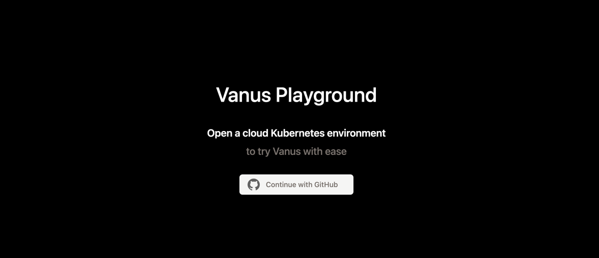
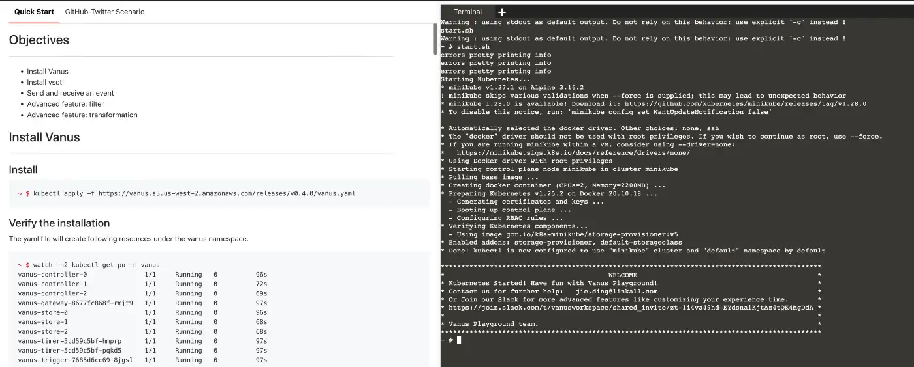
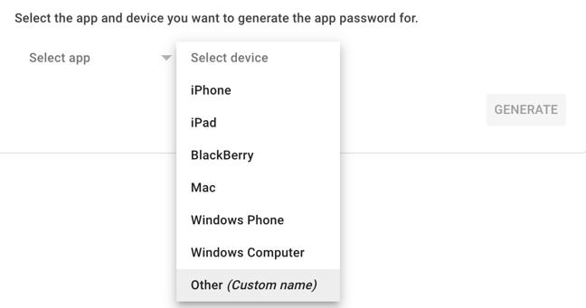
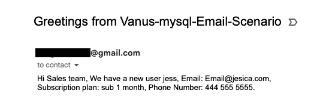

# Get notifications from Mysql to your Email

Welcome to my blog on how to get notifications from MySQL to email. For businesses and organizations that rely on MySQL to manage their data, staying informed about changes to the database is essential. However, manually monitoring the database for updates can be time-consuming and prone to human error.

Thankfully, Vanus provides a solution for this problem by allowing users to set up an event pipeline that automatically sends email notifications whenever a particular event occurs in the database. In this blog, I will provide a step-by-step guide on how to set up this feature and customize it to fit your specific needs.
Whether you are a MySQL user who wants to streamline their database management, or a database administrator who needs to stay informed about updates, this blog will provide you with the knowledge and tools you need to set up email notifications for your MySQL database. So let's dive in and learn how to get notifications from MySQL to email!

<!--truncate-->

Using Vanus, we can automatically send customized messages to multiple email recipients without a single line of code.

**Table of content**
- [About MySQL](#about-mysql)
    - [What is MySQL?](#what-is-mysql)
    - [What is Binlog?](#what-is-binlog)
    - [Why do we need Binlogs?](#why-do-we-need-binlogs)
- [Pre-requisite](#pre-requisite)
- [How to send customized events from Email to MySQL](#how-to-send-customized-events-from-email-to-mysql)
    - Step 1: [Deploy Vanus on the Playground](#step-1-deploy-vanus-on-the-playground)
    - Step 2: [Deploy the MySQL Source Connector](#step-2-deploy-the-mysql-source-connector)
    - Step 3: [Deploy the Email Sink Connector](#step-3-deploy-the-email-sink-connector)
- [Check out the results](#check-out-the-result)
- [Conclusion](#conclusion)

## About MySQL

### What is MySQL?

MySQL is a popular open-source relational database management system (RDBMS) that is used to store and manage data in various applications. It is a powerful and flexible tool that can be used for a wide range of applications, from small personal databases to large-scale enterprise-level systems.
MySQL uses Structured Query Language (SQL) to manage and manipulate data. It is designed to handle large amounts of data with high performance and reliability. MySQL supports a wide range of operating systems, programming languages, and development tools, making it a popular choice for web applications, e-commerce systems, and other types of software.
MySQL was originally developed by MySQL AB, which was later acquired by Sun Microsystems and then Oracle Corporation. However, it remains an open-source project, and the MySQL Community Edition is freely available for download and use.

### What is Binlog?

Binlogs (short for binary logs) are a feature of MySQL that provide a record of all changes to a database. Whenever a transaction or query modifies data in a MySQL database, a record of that change is written to the binary log.
Binlogs are used primarily for replication and recovery purposes. Replication is the process of copying data from one MySQL server to another, and binlogs are used to transfer the changes made to the data from the source server to the destination server. Binlogs can also be used for point-in-time recovery, which involves restoring a database to a specific point in time by replaying the transactions recorded in the binary log.
Binlogs can be configured to record different types of changes, such as statements, row-based changes, or a combination of both. The binary log files are stored on disk and can be rotated based on various criteria, such as file size or time.
It is important to note that binlogs may contain sensitive information, such as user passwords or other confidential data. Therefore, it is essential to protect binlogs with appropriate security measures, such as encryption and access controls.

### Why do we need Binlog?

The binlog (short for binary log) in MySQL is used for a variety of purposes, including:
1. Replication: Binlogs are commonly used to replicate data from a primary MySQL server to one or more secondary servers. In replication, the primary server writes changes to the binlog, and the secondary server(s) read the binlog and apply the changes to their own copy of the data. This is a common way to achieve high availability and scalability in MySQL systems.
2. Point-in-time recovery: Binlogs can be used to recover a MySQL database to a specific point in time by replaying the transactions recorded in the binlog. This can be useful in disaster recovery scenarios, where a database needs to be restored to a specific point in time before a failure or other issue occurred.
3. Auditing: Binlogs can be used to track changes to a MySQL database, providing an audit trail of all modifications made to the data. This can be useful for compliance purposes, or for troubleshooting issues related to data integrity.
4. Testing: Binlogs can be used to test the impact of changes to a MySQL database, by replaying transactions recorded in the binlog on a test server or test database.
5. Debugging: Binlogs can be used to debug issues in MySQL systems, by analyzing the transactions recorded in the binlog and identifying any issues or errors that may have occurred.
6. Notification and Alerting: Binlogs can be used to receive real-time notifications of changes made to a MySQL database. This can be useful for receiving alerts when a specific event occurs, such as a new record being inserted into a table or a database error occurring.

Overall, binlogs notifications provide a powerful tool for monitoring, analyzing, and managing a MySQL database. By
receiving notifications of changes made to the database, you can ensure that it stays in sync, stays compliant, and 
stays secure.

## Pre-requisite

- Have a MySQL database

## How to send customized events from Email to MySQL

Here are the steps you can follow to send email notifications from any MySQL event.

- Step 1: [Deploy Vanus on the Playground](#step-1-deploy-vanus-on-the-playground)

- Step 2: [Deploy the MySQL Source Connector](#step-2-deploy-the-mysql-source-connector)

- Step 3: [Deploy the Email Sink Connector](#step-3-deploy-the-email-sink-connector)

### Step 1: Deploy Vanus on the Playground

- Go to [Vanus Playground](https://www.play.linkall.com), and click “Continue with GitHub”

  

- Wait until the K8s environment is ready (usually less than 1 min).
  
- Install Vanus by typing the following command:

  `kubectl apply -f https://dl.vanus.ai/all-in-one/v0.6.0.yml`

- Verify if Vanus is deployed successfully:
  
```shell
$ watch -n2 kubectl get po -n vanus
  vanus-controller-0               1/1     Running   0          96s
  vanus-controller-1               1/1     Running   0          72s
  vanus-controller-2               1/1     Running   0          69s
  vanus-gateway-8677fc868f-rmjt9   1/1     Running   0          97s
  vanus-store-0                    1/1     Running   0          96s
  vanus-store-1                    1/1     Running   0          68s
  vanus-store-2                    1/1     Running   0          68s
  vanus-timer-5cd59c5bf-hmprp      1/1     Running   0          97s
  vanus-timer-5cd59c5bf-pqkd5      1/1     Running   0          97s
  vanus-trigger-7685d6cc69-8jgsl   1/1     Running   0          97s
  ```

- Install vsctl (the command line tool).

  ```shell
  curl -O https://dl.vanus.ai/vsctl/latest/linux-amd64/vsctl
  chmod ug+x vsctl
  mv vsctl /usr/local/bin
  ```
- Set the endpoint for vsctl.
  ```shell
  export VANUS_GATEWAY=192.168.49.2:30001
  ```
- Create an Eventbus to store your events.
  ```shell
  $ vsctl eventbus create --name mysql-email-scenario
  +----------------+---------------------+
  |     RESULT     |       EVENTBUS      |
  +----------------+---------------------+
  | Create Success | mysql-email-scenario|
  +----------------+---------------------+
  ```
  ### Step 2: Deploy the MySQL Source Connector

- Enable binary logging if you have disabled it (MySQL default Enabled).
Create a new USER and grant roles, choose a unique password for the user.
  
```sql
  CREATE USER 'vanus'@'%' IDENTIFIED WITH mysql_native_password BY 'PASSWORD';
  GRANT SELECT, RELOAD, SHOW DATABASES, REPLICATION SLAVE, REPLICATION CLIENT ON . TO 'vanus'@'%';
```
- Create the config file for MySQL in the Playground. Change MYSQL_HOST, MYSQL PORT, PASSWORD, DATABASE_NAME, and TABLE_NAME.
 
```shell
cat << EOF > config.yml
  target: http://192.168.49.2:30002/gateway/mysql-email-scenario # Vanus in Playground
  name: "quick_start"
  db:
  host: "MYSQL_HOST" # IP address of MySQL server
  port: MYSQL PORT # port address of MySQL server
  username: "vanus" # Username
  password: "PASSWORD" # Password previously set
  database_include: [ "<DATABASE_NAME>" ] # The name of your database


# format is vanus_test.tableName
table_include: [ "TABLE_NAME" ] # The name of your Table

store:
type: FILE
pathname: "/vanus-connect/data/offset.dat"

db_history_file: "/vanus-connect/data/history.dat"
EOF
```

- Run MySQL Source in the background

```shell
  docker run -it --rm --network=host \
  -v ${PWD}:/vanus-connect/config \
  -v ${PWD}:/vanus-connect/data \
  --name source-mysql public.ecr.aws/vanus/connector/source-mysql &
```

### Step 3: Deploy the Email Sink Connector
You can choose any mail provider to send an email by the Email Sink. In this tutorial, I will go with Gmail.
- Enable 2-Step Verification in your Google Account.
  Go to the Google Account. At the left, click Security and enable 2-Step Verification for your account. You may have to sign in again.


- Create an app password.
  Click App passwords and sign in. Under “App passwords,” click Select app and then Mail. Click Select device and then Other. Enter the name of your domain and click Generate. From the app password box, copy the 16 character password generated.
  NOTE: Please save the password carefully, it will be used as in the sink configuration. And it won’t show again once you close the window.
  Select the app and device you want to generate the app password for.



- Get the email-sink yaml file and edit the configuration in it.
```shell
curl -O https://scenario-utils.s3.us-west-2.amazonaws.com/sink-email.yaml

vi sink-email.yaml
```
NOTE: Remember to replace values of default, account, and password with yours. The password should be a 16 character password generated in previous step.


- Run the Email Sink.
```shell
  kubectl apply -f sink-email.yaml
```
## Check out the result
Before checking out the result, let’s recap what we’ve done in previous steps.
Step 1: We created a basic store component of Vanus - EventBus called mysql-email-scenario.
Step 2: We deployed a MySQL Source Connector to receive MySQL events.
Step 3: We deployed an Email Sink Connector waiting to send emails to some contacts.

You may notice that we didn’t specify the contact email address in Email Sink, so how will the Sink Connector know the recipient’s email address?

The missing key-point here is a subscription. It can be used to grab data from specific EventBus and send data to the sink targets (in our case the sink is the Email Sink Connector).

Also, in a subscription, you can create filters to select data which meet your requirements, and create transformers to convert original CloudEvents into any format you need, before before sending them to the target.

Now let’s create a subscription for this tutorial.
You can define your variable according to your own table structure or follow my structure below. For example, username will be defined this way -> “user”: “$.data.username”, note that you need to add data. before your column name.

```sql
My structure ->
CREATE database Name;
CREATE TABLE IF NOT EXISTS dataBaseName.tableName(
`id` int NOT NULL,
`username` varchar(100) NOT NULL,
`email` varchar(100) NOT NULL,
`password` varchar(100) NOT NULL,
`subscription_plan` varchar(100) NOT NULL,
`phone_number` varchar(100) NOT NULL,

PRIMARY KEY (`id`)
) ENGINE=InnoDB;
```
After you define your table structure, you can use the variable to create your own template message with \<variable\>.
```shell
vsctl subscription create --name s3-email-subscription \
--eventbus s3-email-scenario \
--sink 'http://sink-email:8080' \
--transformer '{
"define": {
"username": "$.data.username",
"email": "$.data.email",
"subscription_plan": "$.data.subscription_plan",
"phone_number": "$.data.phone_number"
},
"pipeline":[
{"command":["create","$.xvemailrecipients","contact@linkall.com"]},
{"command":["create","$.xvemailsubject","Greetings from Vanus-mysql-Email-Scenario"]}
],
"template": "Hi Sales team, We have a new user <username>, Email: <email>, Subscription plan: <subscription_plan>, Phone Number: <phone_number>."
}'
```

We created a transformer which did two things:
1. Added two CloudEvents attributes xvemailrecipients to specify the email recipient and xvemailsubject to specify the email subject.
2. Assigned values from the original event to four defined variables username, email, subscription_plan, and phone_number and used them to generate the content which will be sent to our email recipient.

Let’s test everything by making an entry in MySQL.
INSERT into DATABASE.TABLE values(1,"jess","mypassword","Email@jesica.com","sub 1 month","434 555 1232");



## Conclusion

In conclusion, getting notifications from MySQL to email can be a crucial aspect of database management for many businesses 
and organizations. By implementing the steps outlined in this blog, users can set up a trigger in Vanus that sends an 
email notification whenever a particular event occurs in the database.

Not only does this feature help users stay on top of important updates and changes, but it also provides a way to 
automate certain actions and streamline database management. With the clear and concise instructions provided in
this blog, users can easily set up this feature and customize it to their specific needs.

Overall, this blog provides a valuable resource for anyone looking to optimize their use of MySQL and stay 
informed about changes to their database. By following this guide, users can increase their efficiency and 
effectiveness in managing their data, ultimately leading to more successful outcomes for their business or organization.
