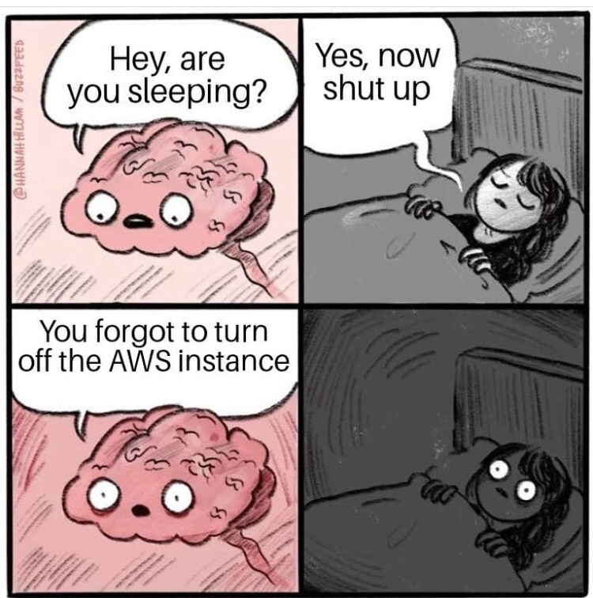
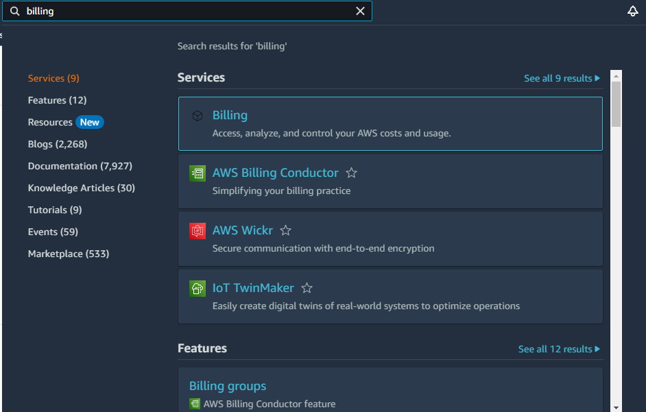
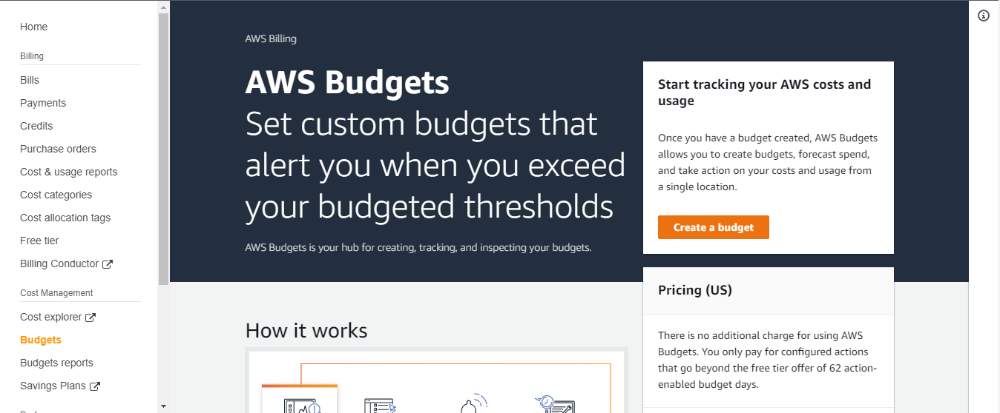
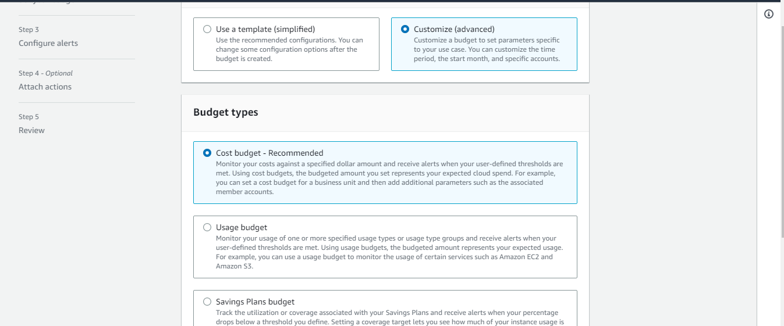
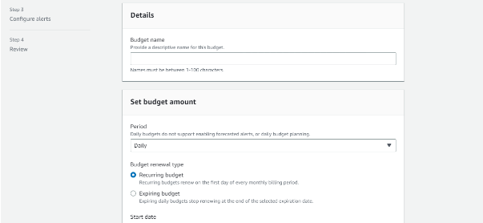
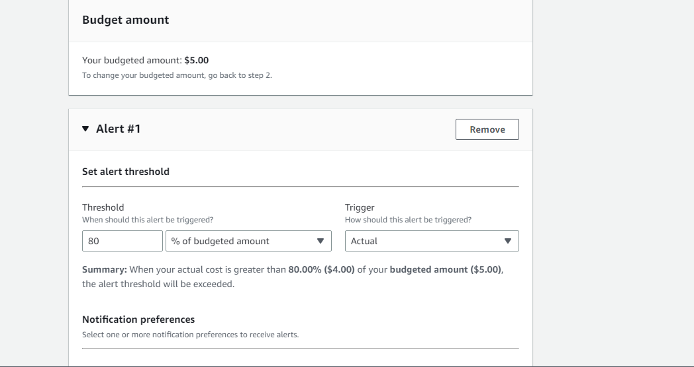
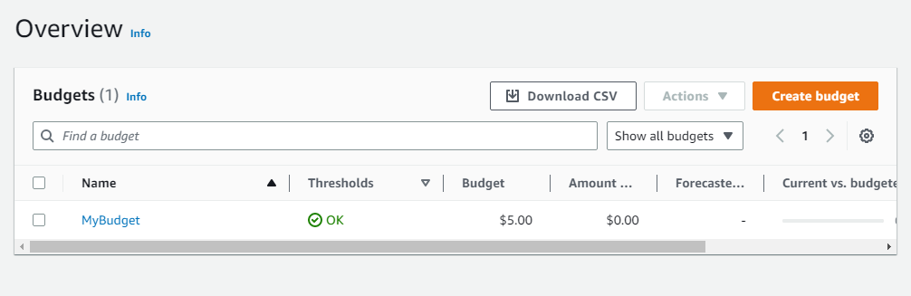

# Introduction

Using Cloud infrastructure definitely costs money. It is best practice to keep track of your operating cost while running different services on the Cloud regardless of the Cloud Provider. In the article, I will talk about a particular Cloud Provider; [AWS](https://aws.amazon.com/). I assume you are familiar with this Cloud Provider or at least have some knowledge about them. I will focus on a particular service they offer called AWS Billing which in plain terms is used to keep track of the cost incurred when you use AWS services. Let’s talk more about it in the next section.

**Table of content**

- [AWS Billing](#aws-billing)
- [AWS Budgets](#aws-budgets)
- [How To Set Up AWS Budgets](#how-to-set-up-aws-budgets)
- [Vanus Connect Extra Feature](#vanus-connect-extra-feature)
- [Conclusion](#conclusion)

## AWS Billing

With the help of the Amazon Billing console, you can manage your consolidated billing if you're a member of an AWS Organization, pay your AWS bills, track and report your AWS costs and consumption, and arrange your AWS usage and costs.

The Billing console works closely with the AWS Cost Management console. Both can be used to manage your spending in a comprehensive way. You can manage your ongoing payments and the payment methods linked to your AWS account using the billing console's tools.

When you register for an AWS account, Amazon Web Services automatically charges the credit card you provided. You can change the credit card AWS will use to make charges by viewing or updating your information at any time.

Next, we will talk about AWS Budgets, and why we need it

## AWS Budgets

`Source: https://www.reddit.com/r/ProgrammerHumor/comments/qbx03g/better_turn_off_aws_before_you_get_a_huge_bill/`

Most times, we accidentally run some services like an EC2 instance and forget to turn it back off. It could even run for a month or months before we realize we have incurred a huge cost. This is why Budgets are very important. With AWS Budgets, you can set a threshold for your expenses and when it gets to that limit, AWS will alert you about it. You can then log in to your AWS Console and shut down such services.

## How To Set Up AWS Budgets

1. Log in to your AWS Console and search for Billing, Click on it and it will open the AWS Billing Page

   

2. On the Tab to the left, select Budgets and then click Create Budget

   

3. Select your budget type. Select Customize and in the next section, select Cost Budget, scroll down and click Next

   

4. In the next step, - Set your Budget name,

   - The budget period (Daily, Monthly, Quarterly, Yearly),
   - Select the Budget renewal type you prefer (Recurring budget, Fixed budget),
   - Set your start month,
   - Set the budgeting method (Fixed, Planned, Auto-Adjusting)
   - Select your budget amount which will prompt a notification when it is exceeded
   - Finally, select All AWS Services in Budget scope

   You should see a page like the screenshot below

   

5. Now, we will configure our alert system according to our set budget. We can set our alert based on percentage or actual value. If set as percentage, we can set a certain percentage level has to reached before we receive an alert. For actual value, we can set the actual amount for an alert trigger. In this example, I have set a budget of $5 and 80% threshold before I receive an alert. Next, I will set an email to receive the notification. AWS also offers other means of notification like Amazon SNS Alerts and AWS Chatbot Alerts.

6. Review your configurations and click Create Budget. If successful, you will see your budget created in the Budget Home

   

If you see this, congrats! You have successfully set up a budget to notify you when you exceed the threshold of budgeted amount.

## Vanus Connect Extra Feature

Setting up your budget is very important as a developer or business. In this article we have used Email to receive the notifications. What if we want to receive the notification in our Slack Channel? We can easily do that with Vanus Connect. Vanus Connect provides out-of-the-box Connectors that enable you to integrate with popular services or applications without writing codes. With a simple configuration file, Vanus Connectors connect to the external service and move data in and out of that service on behalf of user applications, allowing you to focus on your business logic. I have written an article on how you can receive your AWS Billing Reports on a Slack Channel using Vanus Connect. You can check it out [here](https://www.vanus.ai/blog/how-to-receive-aws-billing-reports-on-a-slack-channel/).

## Conclusion

Setting budgets for your business is very crucial, you need to monitor resource usage and be informed when you exceed your threshold. AWS Budgets helps you do that.
