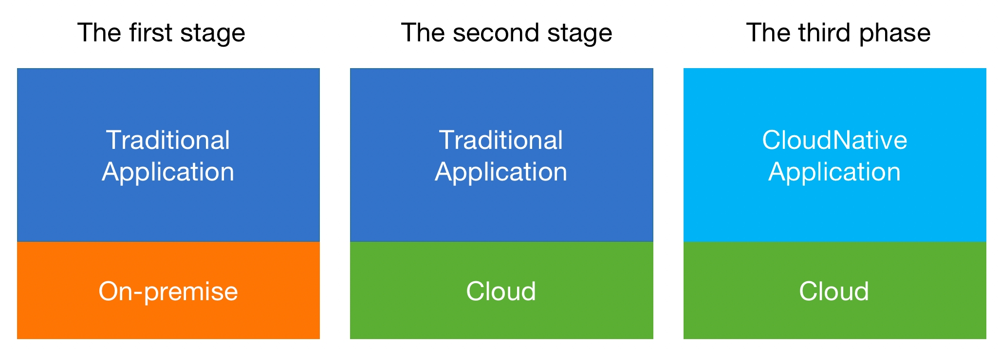

# What is Cloud Native（1）

Cloud-native has been mentioned countless times in technical speeches and articles in recent years and has almost become a synonym for cloud computing technology. However, many developers do not have a clear understanding of the value of cloud native and the challenges that may arise when implementing cloud native applications. I would like to explain the meaning, value, and implementation challenges of cloud native through two articles. The first article, which is this one, will share what cloud native is, the characteristics of cloud native applications, and the huge value that cloud native brings to enterprises. The second article will analyze the technologies and challenges involved in building cloud native applications.

## The concept of cloud-native
In a broad sense, cloud native is a set of methodologies for building software on the cloud. These methods can help enterprises build application software that is most suitable for running on the cloud. We call it cloud native applications. Compared with traditional applications, cloud-native applications are characterized by agility and elasticity and can better utilize the capabilities of cloud computing, so they are the best practices for building applications on the cloud. In a narrow sense, the CNCF Foundation has given a relatively clear definition. Cloud native technology can help organizations build and run scalable applications in modern dynamic environments such as public clouds, private clouds, and hybrid clouds. CNCF also gives some specific technologies for building cloud-native applications, such as containers, servicemesh, microservices, immutable infrastructure, and declarative APIs.

 In order to facilitate understanding, make a simple analogy. If building traditional application software is like building a bungalow in the countryside, then building cloud-native applications is similar to building a building in a city. Compared with bungalows, buildings are obviously more able to play the characteristics of the city. For example, due to spatial agglomeration, limited urban land resources and high population density, buildings can better accommodate the needs of urban residents. Obviously, the structures of bungalows and buildings are completely different, so the construction of buildings also requires new technologies. For example, one-story houses usually need to be built by stacking bricks, and this process is obviously very inefficient for building buildings. Therefore, the construction of buildings usually uses techniques such as concrete pouring. Therefore, technologies such as containers, servicemesh, and serverless are not unfathomable, they are just a kind of technology needed in the process of building cloud-native applications.

 From the perspective of cloud native, the digital development of enterprises is divided into three stages, as shown in the following figure. In the first stage, traditional applications are deployed in local data centers, similar to bungalows built in rural areas. In the second stage, traditional applications are migrated to the public cloud, similar to a bungalow built in a city. In the third stage, cloud-native applications run on public clouds, similar to buildings built in cities. The digitalization process of enterprises in different industries and regions varies greatly. For example, from an overall point of view, the digitalization stage of the United States is superior to that of India, even if the digitalization degree of the Internet industry and the retail industry in the United States are not the same. The Internet industry has the highest degree of digitization, and most companies are in the third stage. In the retail industry, the digitalization of a considerable number of enterprises may only be in the second stage. Even in some industries that are lagging behind in digitalization, enterprise digitalization is still at the first stage.

## Cloud Native Applications and Features

Compared with traditional applications, cloud-native applications are characterized by elasticity, agility, and automation.

Elasticity means that cloud-native applications can dynamically adjust the size of their clusters based on business needs, so that based on business needs, the cluster size of application software can be automatically expanded and contracted. Take Uber as an example to illustrate. During rush hour, a large number of users need to take taxis through Uber. At this time, Uber needs a large cluster to support the taxi requests of a large number of users. In the early hours of the morning, when few people take a taxi, these Ubers need to release computing resources and shrink them into a relatively small cluster. This characteristic of cloud-native applications is also built by fully giving cloud computing elastic computing power scheduling capabilities.

Agility means that the modules of cloud-native applications are loosely coupled, and each module can be developed, deployed, and upgraded independently. With the deepening of enterprise digitization, the business system will become more and more complex. Complex business will reduce the release speed and upgrade frequency of the system, and seriously reduce the response time of user needs. Through the transformation of cloud-native applications, a huge business system is split into very small business digital units. Each digital unit is independently developed and upgraded, and the efficient collaboration between units will allow enterprises to obtain faster product iterations and re-engineering. Create a new, high-quality user experience.

With the in-depth advancement of enterprise digital business, more and more business digital units will be generated, and the huge scale of digital business will generate a lot of operation and maintenance work such as testing, deployment, and upgrading.

| company | **Experience** |
| :----:| :---- |
| [Netflix](https://www.infoq.com/news/2013/06/netflix/) | 600+ microservice，and deploys 100 times per day |
| [Uber](https://www.uber.com/blog/micro-deploy) | 1000+ microservice,  and deploys several thousand times each week. |
| [WeChat](https://www.cs.columbia.edu/~ruigu/papers/socc18-final100.pdf) | 3000+ microservice, and deploys 1000 times per day |

As described in the above table, from the perspective of typical cloud-native applications deployed by Uber and WeChat, there are thousands of deployments per day. Under this scale of digital business, operations such as operation and maintenance and publishing are performed manually, which is very inefficient and requires a huge workload. Therefore, automation is a must-have capability for cloud-native applications. O&M operations such as deployment, upgrade, system expansion, and shrinkage all need to be automated.

## The value that cloud-native applications bring to enterprises

The value that cloud-native applications bring to enterprises is mainly reflected in reducing costs, improving efficiency, and accelerating business innovation.

From an economic point of view, in the second stage, when enterprise application software is migrated from local to cloud, if the establishment of software architecture is also adopted, its digital expenditure will increase significantly. Because the computing power cost per unit time on the cloud is actually higher than that locally. If application software wants to run more economically on the cloud, it needs to have the feature of running on demand. Cloud-native applications can automatically adjust the size of the cluster according to the specific needs of the business. For example, in Uber's business, during the peak period of car usage, Uber will dynamically expand the cluster to involve more computing resources to support user requests. When car usage is low, Uber can quickly release computing resources and return computing resources to cloud vendors. Compared with before, it is necessary to install business peaks and purchase computing resources in the local computer room. Cloud-native applications only need to pay according to volume, which greatly reduces the cost of digital enterprises.

Because most cloud-native applications adopt the microservice architecture and have the ability of continuous delivery and integration. This allows for largely decoupled business unit dependencies. Each digital business unit can be independently developed, released, and upgraded. This brings great flexibility to the business of the enterprise and greatly accelerates the speed of business iteration. For example, the update period of a traditional website may be once a month. However, after adopting the cloud-native architecture, because of the use of technologies such as automated integration and deployment, it can be updated once or even several times a day. This increase in business iteration speed allows digital enterprises to provide a better user experience than traditional enterprises.