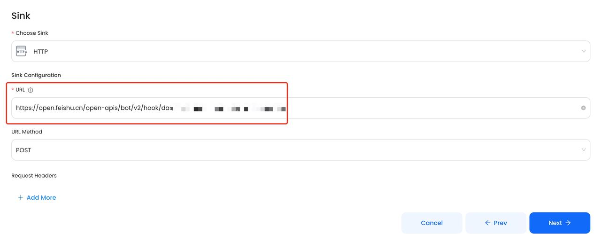
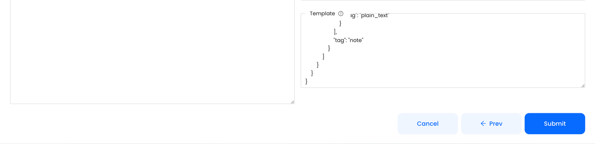

Receive Instant Notifications on GitHub When Someone Stars Your Repo

Do you want to know how many stars your open-source project has at this moment? Do you want to know who gave your project a star, as well as which other open-source projects they have contributed to? When someone stars your GitHub open-source repo, GitHub doesn't notify the project owner. 

This information can help you measure the impact of your project, identify potential collaborators, and build a stronger community. In this blog post, we'll show you how to receive instant notifications on GitHub when someone stars your repo.

## Table of Contents

- [How to Build a GitHub Star Notification System in Seconds Without Writing Any Code](#how-to-build-a-github-star-notification-system-in-seconds-without-writing-any-code)
- [How to Configure the Notification System Using Vanus Cloud](#how-to-configure-the-notification-system-using-vanus-cloud)
- [Result Display](#result-display)

## How to Build a GitHub Star Notification System in Seconds Without Writing Any Code :

Step 1: Configure the Source - Authorize GitHub and select your desired repo - **10 Seconds**

Step 2: Configure the Sink - Obtain a Feishu webhook address - **30 Seconds**

Step 3: Configure the Subscription - Create a connection using the template - **10 Seconds**

**You're all set, you can now move on to other things.**

## How to Configure the Notification System Using [Vanus Cloud](https://cloud.vanus.ai/)

### Step 1: Configure the Source - Authorize GitHub and select a GitHub repo

- Log in to [Vanus Cloud](https://cloud.vanus.ai/) and choose the "**GitHub star event triggers a** **Feishu** **message**" template.

- Find the "**Sign in with GitHub**" button and authorize GitHub. Then, select the repo you want to configure.

### Step 2: Configure Sink - Get the Feishu Webhook URL

- Add a bot to the specified group in Feishu settings and copy the Webhook URL to paste into the Sink configuration.

  

### Step 3: Configure Subscription - Create a Connection Using the Default Template

- Use the pre-configured Star Template and simply click "**Submit**" to create the Connection.

Note: You can customize the display format and content of the notifications by configuring the **Subscription**.

- After submission, the status will show as "**running**". 

## Result Display

- When someone stars your open-source GitHub repo, you will receive a real-time GitHub Star Notify in Feishu. The blue text in the notification received on Feishu are hyperlinks that can be clicked to directly view the GitHub profile of the developer.

In conclusion, receiving instant notifications on GitHub when someone stars your repo can be a game-changer for your open-source project. Not only can you stay informed about the popularity of your project, but you can also engage with your community and build stronger relationships with potential collaborators. By using [Vanus Cloud](https://cloud.vanus.ai/), you can set up a real-time notification system in just a few minutes. So why not give it a try and see how it can help take your project to the next level?