#  How to create a GitHub Pull Request


GitHub is a robust platform that enables developers to manage their software development projects efficiently, collaborate with others, and maintain a complete history of changes and versions.

This blog guides you through commands to make a pull request to a GitHub repository to learn how to contribute to open-source projects.

<!--truncate-->

## Table of Contents

- [What is GitHub](#what-is-github)
- [What is a pull request in GitHub](#what-is-a-pull-request-in-github)
- [How to install and configure Git](#how-to-install-and-configure-git)
  - [Step 1: Prerequisites](#step-1-prerequisites)
  - [Step 2: How to install Git](#step-2-how-to-install-git)
  - [Step 3: How to configure Git](#step-3-how-to-configure-git)
- [How to clone GitHub repository](#how-to-clone-GitHub-repository)
  - [Step 1: Fork GitHub repository](#step-1-fork-github-repository)
  - [Step 2: Clone the repository](#step-2-clone-the-repository)
  - [Step 3: Clone to the local terminal](#step-3-clone-to-the-local-terminal)
- [How to push to GitHub](#how-to-push-to-gitHub)
  - [Step 1: Add changes](#step-1-Add-changes)
  - [Step 2: Commit the changes](#step-2-commit-the-changes )
  - [Step 3: Push changes to the remote repository](#step-3-Push-changes-to-the-remote-repository)
- [How to create a Pull Request](#how-to-create-a-pull-request)
  - [Step 1: Create a pull request](#step-1-create-a-pull-request)
  - [Step 2: Describe changes](#step-2-Describe-changes)
  - [Step 3: Submit pull request](#step-2-describe-changes)
- [GitHub pull request template](#github-pull-request-template)

## What is GitHub?

GitHub is a web-based platform that provides hosting and collaboration services for Git version control repositories.

GitHub has a vast collection of open-source projects and a robust developer community, making it a crucial tool for modern software development.

## What is a pull request in GitHub


A pull request is a feature in GitHub that allows developers to propose changes to a project's codebase. It is essentially a request to the project's maintainers to review and merge a set of changes into the main branch of the repository.

To create a pull request in GitHub, a developer first forks the project's repository, creates a new branch, and then makes changes to the codebase. Once the changes are complete, the developer can open a pull request on the project's main repository to request that their changes be reviewed and potentially merged into the main branch.

The pull request allows the project maintainers and other developers to review the proposed changes, comment on them, and suggest modifications. This review process is important to ensure that the codebase remains stable, maintainable, and free from errors. Once the proposed changes have been reviewed and approved, the project maintainers can merge them into the main branch of the repository.

Overall, pull requests are an important tool in GitHub that allows developers to collaborate on a project's codebase, and ensure that changes are reviewed and merged in a controlled and organized manner.

## How to install and configure Git

### Step 1: Prerequisites

- Installed Git
- GitHub account
- Configure Git

### Step 2: How to install Git

Please refer to [Installing Git](https://git-scm.com/book/en/v2/Getting-Started-Installing-Git) to complete the operating system installation process if you need to install it.

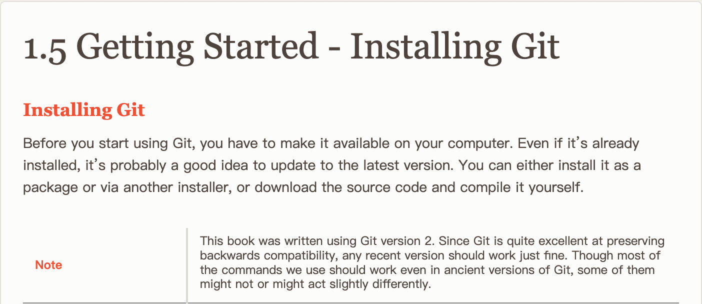

### Step 3: How to configure Git

- Enter the command **`ssh-`****`keygen`****` -t rsa`** in the local terminal, and click `Enter` three times in a row to generate and copy the key.

```Plain
ssh-keygen -t rsa
```

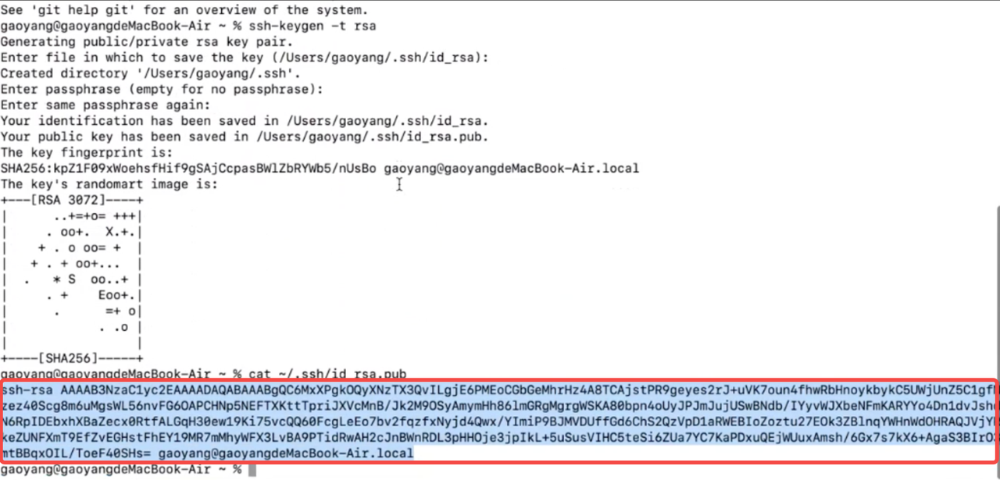

- Log in to GitHub, click the avatar in the upper right corner, find `Settings`, and open it. Find the `SSH and GPG keys` in the left directory of the settings page and open it.


- The new page with a green button `New SSH key` will appear on the right side, and click to open it . Fill in the `Title`, and paste the copied key into the blank space of the `Key` to complete the configuration. 

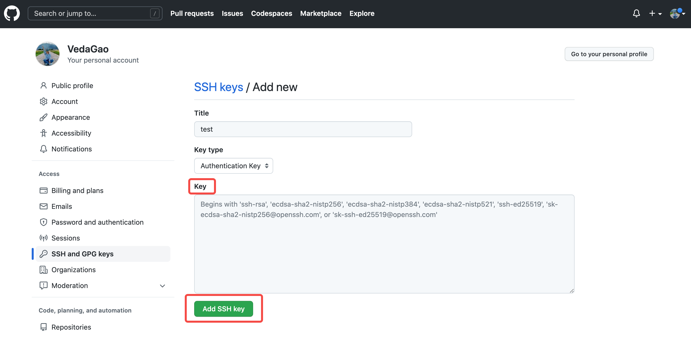

- Enter the following commands in the local terminal to complete the configuration of username and email.

```Plain
git config --global user.name "<your-github-id>"
git config --global user.email <your-email@example.com>
```

## How to clone GitHub repository

Before getting started, you need to choose an open-source GitHub project you want to contribute to. Let's take the open-source project [Vanus](https://www.vanus.ai/) as an example.

### Step 1: Fork GitHub repository

- Click the `Fork` button to copy the [Vanus repository](https://github.com/linkall-labs/vanus) to your own GitHub.

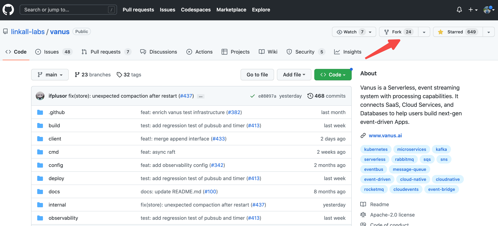

- Click the `Create fork` button.

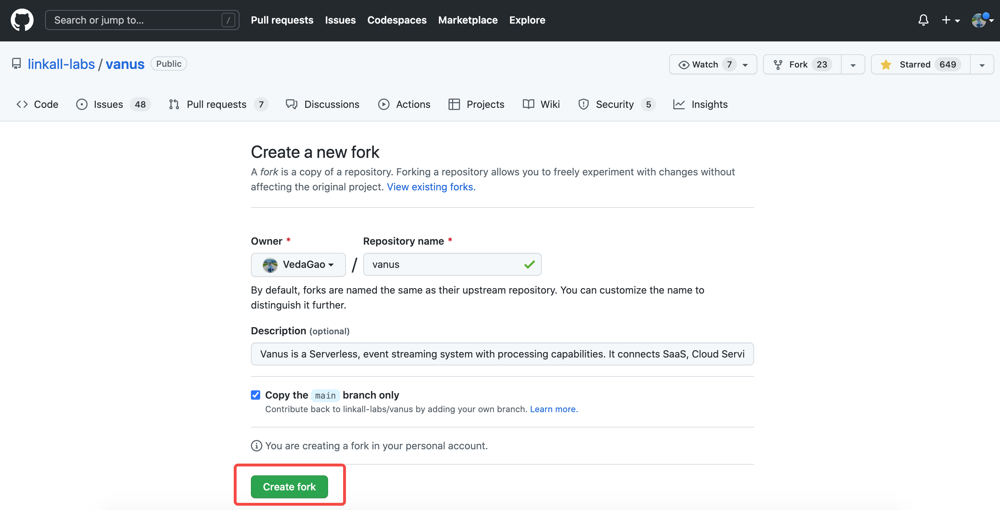

- Screenshot after Fork to your own account.

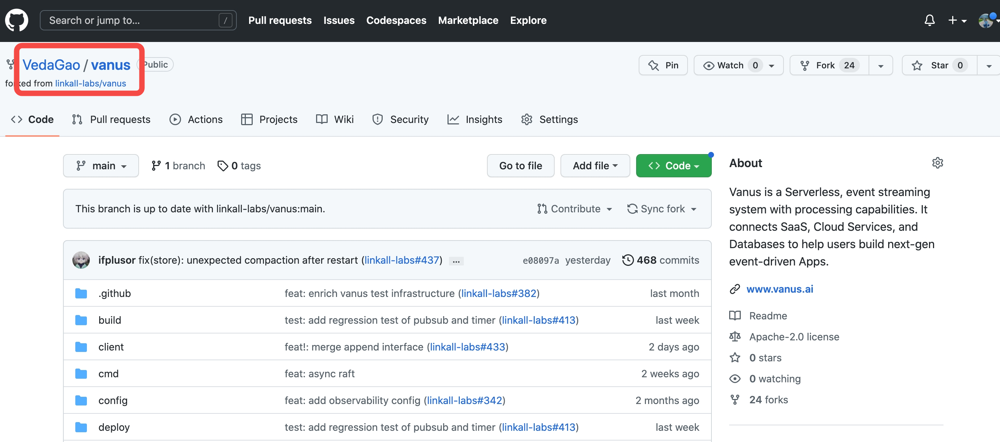

### Step 2: Clone the repository

- Click the green button `Code` on the Vanus repository page, select `SSH` and copy the address. 

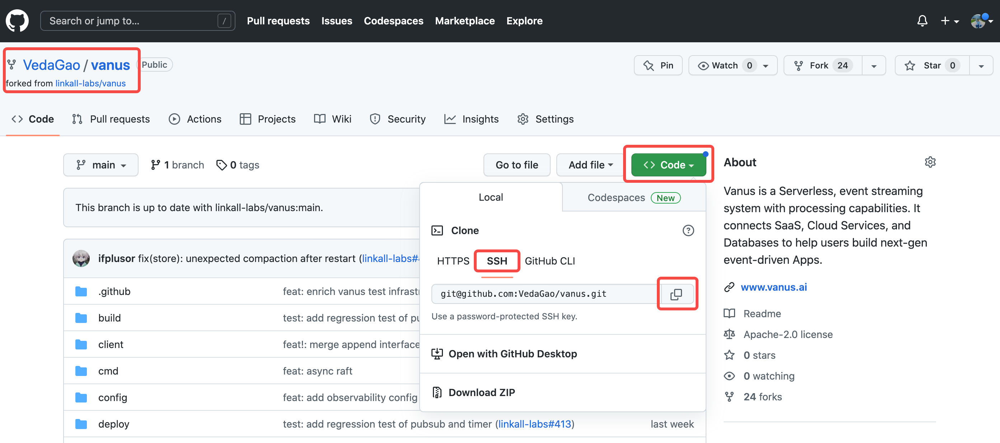

### Step 3: Clone to the local terminal

- Open your terminal or Git Bash if you are using Windows.
- Navigate to the directory where you want to clone the repository. Type `git clone` followed by the copied link.

```Bash
 git clone git@github.com:VedaGao/vanus.git
```

- Press Enter to clone the repository.


## How to push to GitHub

Pushing to GitHub involves sending your local changes to the remote repository on GitHub. Here are the steps to push to GitHub:

### Step 1: Add changes

- After completing your contribution to an open-source project, stage the changes you want to push using the command `git add`. For example, if you want to stage all changes, use the command `git add .`.

```undefined
git add .
```

### Step 2: Commit the changes 

- Commit the changes using the command `git commit -m "Your commit message here"`. Make sure to include a meaningful commit message that describes the changes you made

```undefined
git commit -m "12345"
```

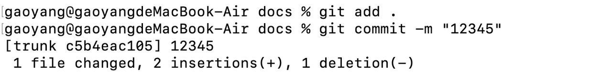

### Step 3: Push changes to the remote repository

- Push your changes to the remote repository on GitHub using the command `git push`.  If you haven't set the upstream branch, you may need to specify the remote and branch name using git push \<remote\>  \<branch\>.  For example, git push origin main.

```undefined
git push origin main
```

**Note:** If you're pushing to a branch you haven't pushed to before, you may be prompted to create a new branch on the remote repository.  Follow the instructions to create the branch.

That's it!  Your local changes have now been pushed to your remote repository on GitHub.

## How to create a Pull Request

### Step 1: Create a pull request

- Go to the original repository on GitHub and click the `New pull request` button. Select your forked repository and the branch you just created, then click `Create pull request`.

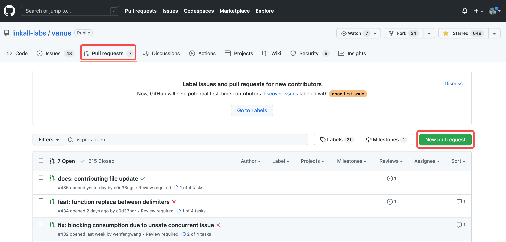

### Step 2: Describe changes

- Give a brief description of the changes you made, why they are necessary, and any potential issues you see.

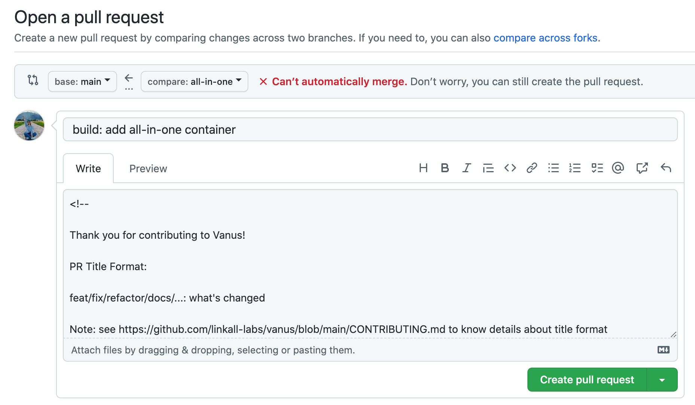

### Step 3: Submit pull request

- Click the `Create pull request` button to submit your pull request.

## GitHub pull request template

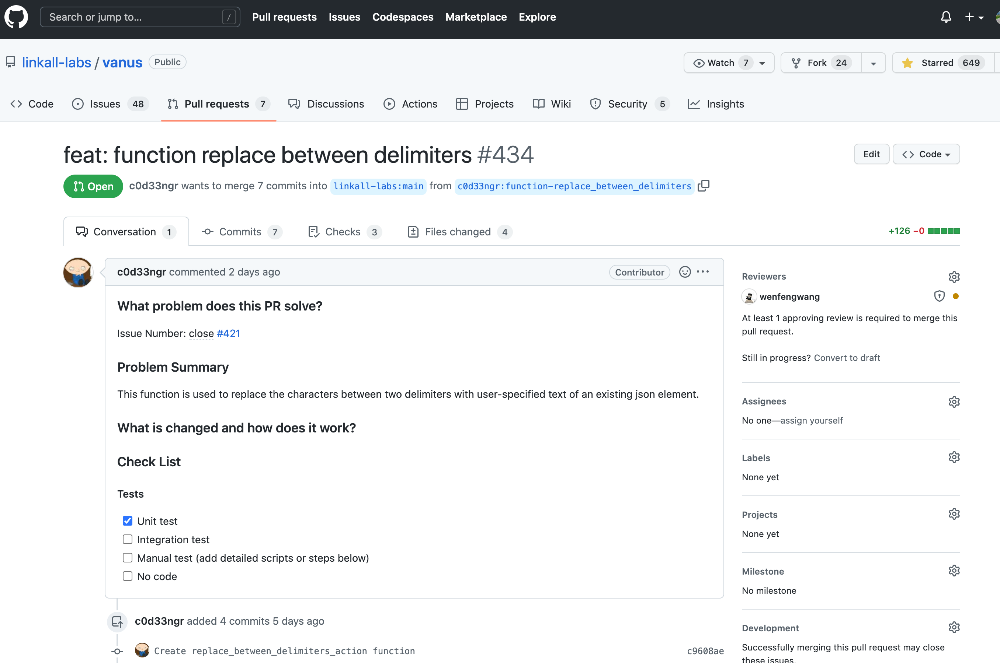

Once you have submitted the pull request, the repository owners will receive a notification and will review your changes. They may provide feedback or ask for additional changes before merging your pull request into the main codebase.

