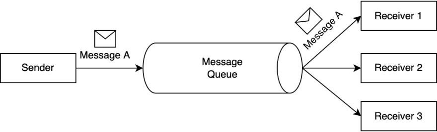

# Best 8 Message Queues Most Suitable for Cloud Native Applications

## What is Message Queue

Message Queue is a common communication pattern used in software architecture to enable asynchronous communication between system components. It allows one component of a system to send a message or task to another component, which may be running on a different server or in a different process or thread.

The message queue acts as a buffer between the sender and the receiver, holding messages until the receiver is ready to process them. This allows the sender to continue its work without waiting for the receiver to process the message immediately. When the receiver is ready, it can pull messages from the queue and process them.

Message queues can be used for a variety of purposes, such as load balancing, task distribution, and decoupling components. They can be implemented in many different ways, such as using in-memory data structures or external message brokers like RabbitMQ or Apache Kafka.

The following blog articles will help you focus on the **message queues* most suitable for cloud-native applications in 2023. The first three are currently the most influential message queues, and the last four are the latest and most popular next-generation message queues in the past two years

* Apache Kafka   
* RabbitMQ
* Pulsar
* Nats
* Redpanda
* Vanus
* KubeMQ
* Memphis

##  4 of the most well-known open source message queues

If you want to understand a piece of software deeply, you may want to pay attention to its birth background. To understand a person's character, one needs to know his family, because the family determines a person's genes. Similarly, if you want to understand a message queue, you may want to pay attention to the background of its birth, because the background will determine the DNA of a message queue.

If you take the time to sort out the history of message queues, you will find a very interesting phenomenon. Most of the currently popular message queues were born around 2010. For example, Apache Kafka was born at LinkedIn in 2010, Derek Collison developed Nats in 2010, and Apache Pulsar was born at Yahoo in 2012. What is the reason for this?

There are roughly three applications that make 2010 the era of the birth of message queues:

* Development of internet technology: Around 2010, thanks to the rapid development of the mobile Internet, users of Internet applications experienced explosive growth. In 2008 Facebook had only 50 million users, and in 2010 it had 545 million users. Also, in 2008, LinkedIn had 23 million users, compared to 161 million in 2011. With the rapid increase in users, people increasingly need to process a large amount of real-time data streams, which greatly promotes the rapid development of Internet technology. As these demands cannot be met by traditional means of data transmission, storage, and processing, there is a need for new solutions. Message queuing technology has also been greatly developed in this context.

* Popularity of distributed systems: Distributed systems became increasingly popular around 2010, and distributed systems need an efficient, scalable, and reliable way to deliver messages. Message middleware was born to meet these needs.

* The Rise of Open Source Software: Around 2010, open-source software became increasingly popular. Open source software allows developers to use, modify and distribute the code freely, so many developers build their own solutions and share them with other developers. Kafka, Pulsar, and NATS are all open-source software so they can be widely used and improved easily.

* The Rise of Cloud Computing: Around 2010, cloud computing became increasingly popular. Cloud computing needs an efficient, scalable, and reliable message delivery mechanism, which also promotes the development of message middleware.

The following is an introduction to the currently well-known open-source message queues：

### 1 Apache Kafka

[Apache Kafka](#https://kafka.apache.org/) is a distributed streaming platform designed to handle high volumes of data in real time. It was originally developed by LinkedIn in 2010 and later became an open-source project under the Apache Software Foundation in 2011.

Kafka is a publish-subscribe messaging system that enables applications to send and receive large amounts of data in real time, using a message broker architecture. It provides a fast, scalable, and fault-tolerant way to process and store data streams.

Kafka is commonly used for a variety of use cases such as:

- Real-time data processing: Kafka can be used to process and analyze large volumes of data in real time, making it useful for use cases such as fraud detection, stock trading, and online advertising.
- Log aggregation: Kafka can collect logs from various sources and store them in a central location, making it easier to manage and analyze logs.
- Event streaming: Kafka can stream events such as clicks, searches, and user interactions to various applications for real-time processing.

There is no doubt that Kafka is the most influential message queue today. It has become the de facto standard for significant data transmission, and 80% of the Fortune 100 are using Kafka; Kafka is often used with other tools in the extensive data ecosystem, such as Apache Spark, Apache Flink, and Apache Storm, for data processing and analysis.

### 2 RabbitMQ

[RabbitMQ](#https://www.rabbitmq.com/) is an open-source message broker software that allows applications to communicate with each other using a messaging protocol. It was developed by Rabbit Technologies and first released in 2007, which was later acquired by VMware.RabbitMQ is based on the Advanced Message Queuing Protocol (AMQP) and provides a reliable, scalable, and interoperable messaging system.

With RabbitMQ, applications can send and receive messages from other applications or services. It can handle various types of messages, including text, binary data, and JSON, and provides message queuing, routing, and persistence features. RabbitMQ also supports multiple messaging protocols and has various plugins extending its functionality.

RabbitMQ is one of the most popular Message Queue today. It is widely used in enterprise applications, cloud-based systems, and distributed systems, where different components need to communicate with each other asynchronously. It provides a reliable and efficient way to pass messages between applications and services, making it a popular choice for many organizations.

### 3 Nats

[NATS](#https://nats.io/) is an open-source, high-performance messaging system for distributed systems, cloud-native applications, and microservices architectures. Derek Collison initially developed it in 2010.  Derek Collison started developing NATS while working as the CTO of  Apcera, a cloud computing company.

NATS provides a lightweight and efficient messaging protocol for communication between different applications and services. It has a client-server architecture and supports various messaging patterns, including point-to-point, request-reply, and publish-subscribe.

NATS is designed to be simple and easy to use, with a small footprint and low latency. It is often used in cloud-native environments to connect different components of a distributed system or to enable communication between microservices. NATS also supports message persistence, security, and clustering, making it a robust messaging system for building scalable and resilient applications.

### 4 Apache Pulsar

[Apache Pulsar](#https://pulsar.apache.org/) is an open-source distributed pub-sub messaging system originally developed by Yahoo. It was born in 2012, and its original purpose was to replace other message systems within Yahoo and build a messaging platform with a unified logical large cluster. 

Pulsar supports multiple messaging patterns, including publish-subscribe and message queuing, and provides a rich set of features, including:

- Multi-tenancy: Pulsar allows multiple applications to share a single cluster, with each application isolated.
- Geo-replication: Pulsar can replicate data across multiple clusters in different geographic regions, providing high availability and disaster recovery capabilities.
- Message TTL: Pulsar allows messages to expire automatically after a certain amount of time, which can be useful for implementing time-based workflows or cleaning up old data.
- Tiered storage: Pulsar can store messages in multiple storage tiers, ranging from high-performance storage to cold storage, which can help reduce costs and improve performance.

Pulsar also provides a rich set of client libraries for various programming languages, making it easy to build messaging and streaming applications using Pulsar. Apache Pulsar is a popular choice for real-time data processing and messaging in large-scale data processing applications, such as those used in the financial, telecommunications, and internet-of-things industries.

## 4 latest popular message queues

Like 2010, 2020 is also a very important year. Let's take a look at some background information around 2020:

* Cloud becomes the infrastructure of society: Digitalization has become an important driving force driving the development of enterprises. More and more enterprises choose to build their digital business based on the public cloud. In the 10 years from 2010 to 2020, the global cloud computing market size ranged from $41 billion to $312 billion. Even during the epidemic, the market growth rate in 2020 will still be as high as 33%.
* Global economy enters recession: Although we don't want to see it, we must admit that it is now in a massive recession. The spread of the epidemic worldwide is one of the most important reasons. The recession has made business extremely difficult. Saving costs has become an important topic for many business executives.
* Cloud native is becoming increasingly popular: Modern enterprises demand better agility, flexibility, and lower costs from their digital businesses. This has given birth to the rapid development of cloud-native technology. For example, C I/CD technology can provide the ability of rapid delivery, and Serverless technology can provide the ability of fast elasticity and on-demand operation.
* Kubernetes is becoming the infra of cloud-native apps: Kubernetes provides a powerful ability to automatically expand and shrink applications and dynamically adjust resources according to the load of the application, thereby achieving higher resource utilization and faster application response time.his helps enterprises save costs and improve efficiency, so more and more enterprises deploy their software on k8s.

Around 2010, due to the surge of mobile Internet users, a large amount of data needed to be processed, which gave birth to the emergence of message queues such as Kafka. In 2020, due to the large number of cloud technologies adopted by enterprises and the emergence of cloud-native technologies such as Kubernetes and serverless, enterprises have new needs. This time, they need a message queue with a cloud-native architecture that is truly suitable for the new infrastructure. However, message queues, which were born around 2010, are obviously powerless in the face of new infrastructure and new applications, such as serverless due to different technical architectures and application scenarios. For example, Kafka obviously has many problems running on Kubernetes:

* StatefulSet requirement: Kafka is a distributed system that requires each node to maintain its state, which can make it difficult to run on Kubernetes. In particular, running Kafka on Kubernetes requires using StatefulSets, which can be more complex to manage than Deployments.

* Resource consumption: Kafka requires significant resources to run, including CPU, memory, and storage. This can make it challenging to run Kafka in a scalable way on Kubernetes, where resources are typically shared among many different applications.

* Networking complexity: Kafka requires a well-defined network topology in order to work correctly, and this cannot be easy to achieve on Kubernetes. In particular, Kafka requires that each node have a unique hostname and IP address, which can be challenging to achieve in a containerized environment.

* Data locality: Kafka performs best when data is stored on the same node as the consumer that will be reading it. However, Kubernetes does not provide strong guarantees about where pods are scheduled, which can make it difficult to ensure that data is stored on the same node as the consumer.

Different from virtual machines and traditional microservice architecture applications, new infrastructure such as k8s and cloud-native applications such as serverless have significantly different requirements for message queues:

Fully elastic: It can make full use of the capabilities of Kubernetes and automatically expand or contract as needed. Kafka can only be expanded or contracted manually, and data migration for replication is required.

Lightweight & K8s native: It needs to be lightweight enough, with very little resource dependence, and can run in pods.

Friendly to serverless cloud-native applications: Cloud-native applications, such as cloud functions, usually have strong elasticity. When traffic comes, hundreds of instances may need to be expanded to process requests within 1 second. The new message queue needs to support the rapid scaling of large-scale applications.

The following introduces four popular message queues born around 2020. Compared with Kafka, they are more suitable for k8s and new cloud-native applications.

### 1 [Redpanda](#https://redpanda.com/)

[Redpanda](#https://redpanda.com/) is an open-source distributed streaming platform that can be used as a high-performance message queue. Redpanda message queue is based on Apache Kafka's design but provides several improvements, such as faster performance, lower latency, and better scalability.

Redpanda message queue allows multiple producers to write messages to a single topic, and multiple consumers to read messages from that topic in parallel. Messages can be buffered in memory for fast delivery and persist to disk for durability. Redpanda also provides a number of features, such as replication, partitioning, and compression, to help manage large amounts of data.

One of the key benefits of using Redpanda message queue is its ability to handle large volumes of data in real-time. This makes it a popular choice for applications that require high throughputs and low latency, such as streaming analytics, real-time monitoring, and online gaming.

Overall, Redpanda message queue is a powerful and flexible tool for building real-time streaming applications that require reliable and high-performance message processing.

### 2 [Vanus](#https://www.vanus.ai/)

[Vanus](#https://www.vanus.ai/) is an open-source serverless event streaming platform with built-in event processing capabilities. It connects SaaS, cloud services, and databases to help users build next-generation event-driven applications. Vanus separates storage and computing resources and offers modern development features such as CloudEvents Specification, FaaS Integration, built-in Connectors, data filtering, and transformation.

* Build the event-driven application

  * Send SaaS-generated events to the data lake for analysis.
  * Deliver cloud services events to cloud functions for processing.
  * Real-time transmission of events between SaaS.

  * Synchronize data between databases in real-time.

* Out-of-the-box event computing capabilities

  * Provides 100+ built-in functions to help developers process events in real-time.
  * Provides general and flexible filtering rules, and developers can easily filter events.
  * Supports event processing through cloud functions such as aws lambda.

* Serverless, a simple and effortless process

  * Automatically scale up or down clusters based on event traffic, reducing costs by up to 90%.
  * Seamlessly integrate mainstream cloud functions and open-source FaaS platforms.
  * One-click deployment, the installation is done in seconds with 0 operations needed.

### 3 [KubeMQ](#https://kubemq.io/)

[KubeMQ](#https://kubemq.io/) is a Kubernetes-native message queue and messaging system providing a reliable, scalable, high-performance messaging infrastructure for distributed applications. It is designed to be easy to deploy, operate, and use within a Kubernetes environment.

KubeMQ is built as a set of microservices that can be deployed as containers on a Kubernetes cluster. It includes features such as message queuing, publish/subscribe messaging, request/reply messaging, and event-driven messaging. KubeMQ also supports multiple messaging protocols, including REST, gRPC, and WebSocket, and provides client libraries for several programming languages, including Go, Java, Python, and .NET.

One of the key benefits of KubeMQ is that it is designed to be highly available and fault-tolerant. It includes features such as automatic sharding, data replication, and data backup and recovery, which help to ensure that messages are reliably delivered even in the event of node failures or network disruptions.

KubeMQ is also designed to be scalable, allowing users to add or remove nodes from the cluster as needed to handle changing message volumes or application requirements. Additionally, it provides monitoring and analytics capabilities that allow users to track message flow, monitor system health, and troubleshoot issues.

 KubeMQ is a powerful and flexible messaging system that is well-suited for distributed applications running in a Kubernetes environment.

### 4 [Memphis](#https://memphis.dev/)

[Memphis](https://memphis.dev/) is an open-source, cloud-native message queue and streaming platform. It is designed to provide a reliable and scalable messaging infrastructure for distributed applications. Memphis can be deployed on Kubernetes, and it supports multiple messaging patterns, including publish/subscribe, request/reply, and stream processing.

Memphis is built using Rust, which is known for its performance, reliability, and safety. The platform uses a distributed architecture, which allows for horizontal scaling and high availability. It also includes features such as message persistence, message filtering, and message batching, which help to ensure that messages are reliably delivered and processed.

One of the key benefits of Memphis is its simplicity and ease of use. It provides a simple and intuitive API that can be used with several programming languages, including Rust, Python, and Java. Additionally, it includes a web-based management console that allows users to monitor message traffic, view statistics, and manage the messaging infrastructure.
