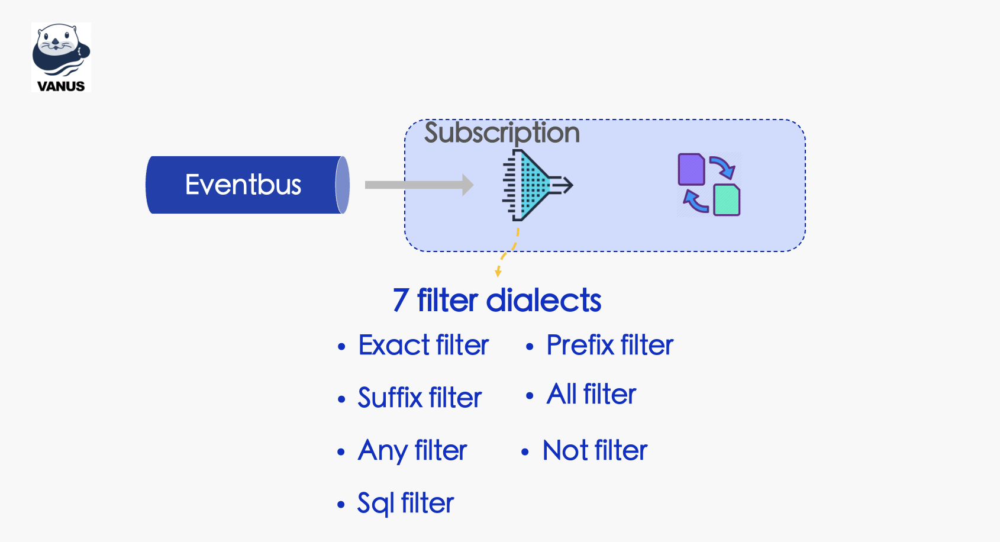

The traditional message queue requires subscribers to do the message filter/process at client end after they get the full message from Topics, this would take extra resources and need additional codes/scripts to finish all the work, largely increased the complexity. By adding the filter ability into the messaging infrastructure, it would benefit user a lot.

# Benefits of filtering

Filtering messages in a message queue can provide several benefits, including:

1. Increased efficiency: By filtering messages, you can reduce the number of messages that a consumer needs to process. This can help improve the overall efficiency of the system, as fewer resources will be needed to handle the message traffic.
2. Improved performance: Filtering messages can help ensure that only relevant messages are processed by consumers, which can improve the overall performance of the system. This is particularly important in high-throughput systems where there are large volumes of messages that need to be processed.
3. Reduced processing time: By filtering messages based on specific criteria, you can ensure that only the most important or urgent messages are processed first. This can help reduce processing time for critical messages, which can be particularly important in real-time systems or systems that require fast response times.
4. Enhanced scalability: Filtering messages can help improve the scalability of the system by reducing the load on individual consumers. By distributing the workload more evenly across multiple consumers, you can help ensure that the system can handle larger volumes of messages without being overwhelmed.

Overall, filtering messages in a message queue can help optimize the performance, efficiency, and scalability of the system, while also ensuring that critical messages are processed in a timely manner.

# Vanus's Filter

In Vanus, the filter feature is a set of conditions we can set to a Subscription to filter the events we want to consume from an Eventbus. Completes the events filter, then you can do transformation and delivers the events.



Vanus Filter is fully compatible with [CloudEvents attributes](https://github.com/cloudevents/spec/blob/main/subscriptions/spec.md#324-filters), and it's also extended to support the filtering of CloudEvents data.

# Filter Types

## Event Demo

Here are 3 event examples, we will use them to show how each of the following 7 filter dialects would work on these 3 events.

- Event 1


```json
{
    "id": "080e28a0-b437-11ed-9250-18275c0cc45b",
    "source": "https://api.github.com/repos/vanus-demo/test-repo",
    "type": "com.github.star.created",
    "datacontenttype": "application/json",
    "time": "2022-02-21T07:32:44.190Z",
    "data": {
        "action": "created",
        "sender": {
            "login": "vanus-demo",
            "type": "User"
        }
    }
}
```

- Event 2

```json
{
    "id": "080e28a0-b437-11ed-9250-18275c0cc45b",
    "source": "https://api.github.com/repos/vanus-demo/test-repo",
    "type": "com.github.watch.started",
    "datacontenttype": "application/json",
    "time": "2022-02-21T07:32:44.190Z",
    "data": {
        "action": "created",
        "sender": {
            "login": "vanus-demo",
            "type": "User"
        }
    }
}
```

- Event 3

```json
{
    "id": "080e28a0-b437-11ed-9250-18275c0cc45b",
    "source": "https://api.github.com/repos/vanus-demo/test-repo",
    "type": "com.github.star.created",
    "datacontenttype": "application/json",
    "time": "2022-02-21T07:32:44.190Z",
    "data": {
        "action": "deleted",
        "sender": {
            "login": "vanus-demo",
            "type": "User-test"
        }
    }
}
```

## Exact  filter

Match CloudEvents attributes; that value must match exactly with the associated value.

```json
{ 
  	"exact": { 
      	"source": "https://api.github.com/repos/vanus-demo/test-repo", 
      	"datacontenttype": "application/json" 
    } 
}
```

**Match event: Event 1、Event 2、Event 3**

## Prefix  filter

Match CloudEvents attributes; that value must all start with the associated value.

```json
{ 
  	"prefix": {
      	"source": "https://api.", 
          "type": "com.github.star." 
    } 
}
```

**Match event: Event 1、Event 3**

## Suffix  filter

Match CloudEvents attributes; that value must all end with the associated value.

```json
{ 
  	"suffix": { 
      	"type": ".created", 
      	"data.action": "eted" 
    } 
}
```

**Match event: Event 3**

## Not  filter

One nested filter expressions; inverse of filter expressions.

```json
{
  	"not": { 
      	"exact": { 
          	"type": "com.github.star.created" 
        } 
    }
}
```

**Match event: Event 2**

## All  filter

A nested array of filter expressions; all filter expressions evaluate to true.

```json
{
    "all": [
        { "exact": { "source": "com.github.star.created" } },
        { "prefix": { "data.sender.type": "User-te" } }
    ]
}
```

**Match event: Event 3**

## Any  filter

A nested array of filter expressions; any filter expressions evaluate to true.

```json
{
    "any": [
        { "exact": { "type": "com.github.watch.started" } },
        { "prefix": { "data.action": "created" } }
    ]
}
```

**Match event: Event 1、Event 2**

## SQL  filter

A [CloudEvents SQL Expression](https://github.com/cloudevents/spec/blob/main/cesql/spec.md)

```json
{ "sql": "data.sender.login LIKE '%vanus%'" }
```

**Match event: Event 1、Event 2、Event 3**