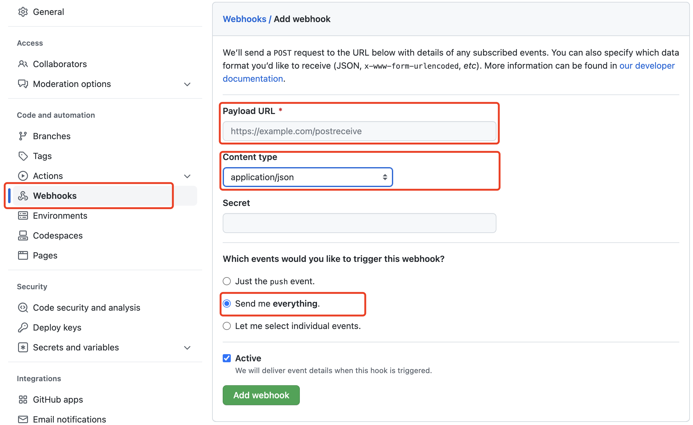

Using the events in GitHub for analysis can help you better understand the behavior of developer on GitHub. By analyzing data, you can draw various useful conclusions to support your business needs.

# Concept

## About events in GitHub

GitHub is a web-based hosting service that provides version control and collaboration features for software development projects. It allows users to create and store repositories for their projects, track changes to code, collaborate with others on coding projects, and contribute to open source software projects.

GitHub provides a number of features for tracking events related to your projects. These events include:

1. Push events - occur when a user pushes code changes to a repository.
2. Pull request events - occur when a user creates, updates, or closes a pull request.
3. Issue events - occur when a user creates, updates, or closes an issue.
4. Release events - occur when a user creates a new release of a project.
5. Fork events - occur when a user forks a repository.
6. Watch events - occur when a user starts or stops watching a repository.

GitHub also allows you to configure webhooks, which can be used to send notifications to external services when certain events occur in your repository. For example, you can configure a webhook to send a notification to a chat service when a pull request is created or updated.

Overall, GitHub provides a comprehensive set of features for tracking events related to your projects and collaborating with others on coding projects.

## About Snowflake

Snowflake is a cloud-based data warehousing and analytics platform that allows organizations to store, manage, and analyze large amounts of data in a scalable and cost-effective way.

One of the key features of Snowflake is its architecture, which separates compute and storage. This allows organizations to scale compute and storage resources independently, and pay only for the resources they use. Snowflake also supports both structured and semi-structured data, including JSON, Avro, Parquet, and ORC.

Snowflake also provides a number of built-in features and services for data warehousing and analytics.

Overall, Snowflake provides a modern and flexible solution for data warehousing and analytics in the cloud, with a focus on scalability, performance, and security.

# Easy GitHub to Snowflake integration with Vanus

Vanus’s open source connection allows you to integrate Vanus with your GitHub events to track event data and automatically send it to Snowflake.

## Prerequisites

- GitHub: your open-source repository.
- Snowflake: a working Snowflake account.
- Go to [Vanus Playground](https://play.linkall.com/) :an online K8s environment where Vanus can be deployed.

## Step 1: Deploying Vanus

1. Login [Vanus Playground](https://play.linkall.com/).
2. Refer to the `Quick Start` document to complete the `Install Vanus` & `Install vsctl`.

3. Create an eventbus

   ```
   ~ # vsctl eventbus create --name github-snowflake
   +----------------+------------------+
   |     RESULT     |     EVENTBUS     |
   +----------------+------------------+
   | Create Success | github-snowflake |
   +----------------+------------------+
   ```

## Step 2: Deploy the GitHub Source

1. Set config file. Create config.yml in any directory, the content is as follows:

   ```
   target: http://192.168.49.2:30002/gateway/github-snowflake
   port: 8082
   ```
   
2. Run the GitHub Source

   ```Plain
   docker run -it --rm --network=host \
     -v ${PWD}:/vanus-connect/config \
     --name source-github public.ecr.aws/vanus/connector/source-github > a.log &
   ```

3. Create a webhook under the Settings tab in your GitHub repository.

   

   **Payload URL***

   Go to GitHub-Twitter Scenario under Payload URL.

   ```
   http://ip10-1-53-4-cfie9skink*******0-8082.direct.play.linkall.com
   ```

   **Content type**

   ```
   application/json
   ```

   **Which events would you like to trigger this webhook?**

   ```
   Send me everything.
   ```

## Step 3: Deploy the Snowflake Sink

1. Create a yml file named sink-snowflake.yml in the playground with the following command:

   ```
   cat << EOF > sink-snowflake.yml
   apiVersion: v1
   kind: Service
   metadata:
     name: sink-snowflake
     namespace: vanus
   spec:
     selector:
       app: sink-snowflake
     type: ClusterIP
     ports:
       - port: 8080
         name: sink-snowflake
   ---
   apiVersion: v1
   kind: ConfigMap
   metadata:
     name: sink-snowflake
     namespace: vanus
   data:
     config.yml: |-
       port: 8080
       snowflake:
         host: "myaccount.ap-northeast-1.aws.snowflakecomputing.com"
         username: "vanus_user"
         password: "snowflake"
         role: "ACCOUNTADMIN"
         warehouse: "xxxxxx"
         database: "VANUS_DB"
         schema: "public"
         table: "vanus_test"
   ---
   apiVersion: apps/v1
   kind: Deployment
   metadata:
     name: sink-snowflake
     namespace: vanus
     labels:
       app: sink-snowflake
   spec:
     selector:
       matchLabels:
         app: sink-snowflake
     replicas: 1
     template:
       metadata:
         labels:
           app: sink-snowflake
       spec:
         containers:
           - name: sink-snowflake
             image: public.ecr.aws/vanus/connector/sink-snowflake
             imagePullPolicy: Always
             resources:
               requests:
                 memory: "128Mi"
                 cpu: "100m"
               limits:
                 memory: "128Mi"
                 cpu: "100m"
             ports:
               - name: http
                 containerPort: 8080
             volumeMounts:
               - name: config
                 mountPath: /vanus-connect/config
         volumes:
           - name: config
             configMap:
               name: sink-snowflake
   EOF
   ```

2. Replace the config value with yours.

   ```
   host: "myaccount.ap-northeast-1.aws.snowflakecomputing.com"
   username: "vanus_user"
   password: "snowflake"
   role: "ACCOUNTADMIN"
   warehouse: "xxxxxx"
   database: "VANUS_DB"
   schema: "public"
   table: "vanus_test"
   ```

3. Run snowflake sink in kubernetes.

   ```
   kubectl apply -f sink-snowflake.yaml
   ```

## Step 4: Create subscription

Through the deployment of the above parts, the components required to push GitHub events to Snowflake have been deployed. And GitHub events can be filtered and processed through the filter and transformer capabilities of Vanus.

1. Through a filter, you can filter out other events and only post the GitHub events they are interested in. For example：StarEvent([CloudEvents Adapter specification](https://github.com/cloudevents/spec/blob/main/cloudevents/adapters/github.md)).
2. Create a subscription in Vanus, and set up a transformer to extract and edit key information.

```Plain
vsctl subscription create  \
  --eventbus github-snowflake  \
  --sink 'http://sink-snowflake:8080'  \
  --filters '[
      { "exact": { "type": "com.github.star.created" } }
    ]'
  --transformer '{
      "define": {
      	 "login": "$.data.repository.owner.login",
      	 "star": "$.data.repository.stargazers_count",
      	 "repo": "$.data.repository.html_url"
         "sender":"$.data.sender.login",
         "time":"$.data.repository.updated_at"
      },
      "template": "{\"owner\": \"<login>\",\"star\":\"<star>\",\"repo\":\"<repo>\",\"sender\":\"<sender>\",\"time\":\"<time>\"}"
    }'
```

## Step 5: Test

Open the Snowflake console and use the following command to make sure Snowflake has the data.

```
select * from public.vanus_test;
```

# Summary

Snowflake provide a powerful platform for analyzing GitHub event data. By loading the data into Snowflake, creating tables, cleaning data, analyzing data, visualizing data, and drawing conclusions, you can get deep insights about the value of GitHub events and use those insights to optimize your business decisions.

