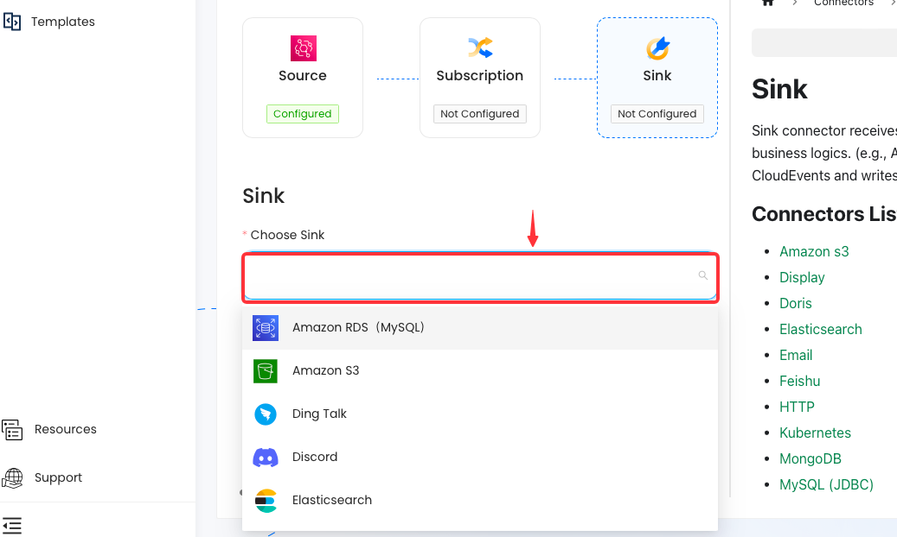

--- 
hide_table_of_contents: true
hide_title: true
---

### Create a Custom Connection

The Sink connector is a tool to connect Vanus core with other applications and services. It removes the complication of integration by sending the data to your application or service.

### Setup

Select a sink connector from the list to complete your connection.

---

### List of Sink connectors

- Amazon RDS (MySQL)
- Amazon S3
- Ding Talk
- Discord
- Elasticsearch
- Feishu
- Google Sheets
- HTTP
- MySQL
- Slack Webhook
- Slack App
- Snowflake
- WhatsApp
- More coming soon!

If you cannot find a connector that meets your needs, please feel free to send us an email at `contact@linkall.com` or join our [Slack community](https://join.slack.com/t/vanusworkspace/shared_invite/zt-1irlglugm-CHWGHKd2Nzs7yYhzEMnMlg) to request it.

---

Learn more about Vanus and Vanus Connect in our [documentation](https://docs.vanus.ai).
