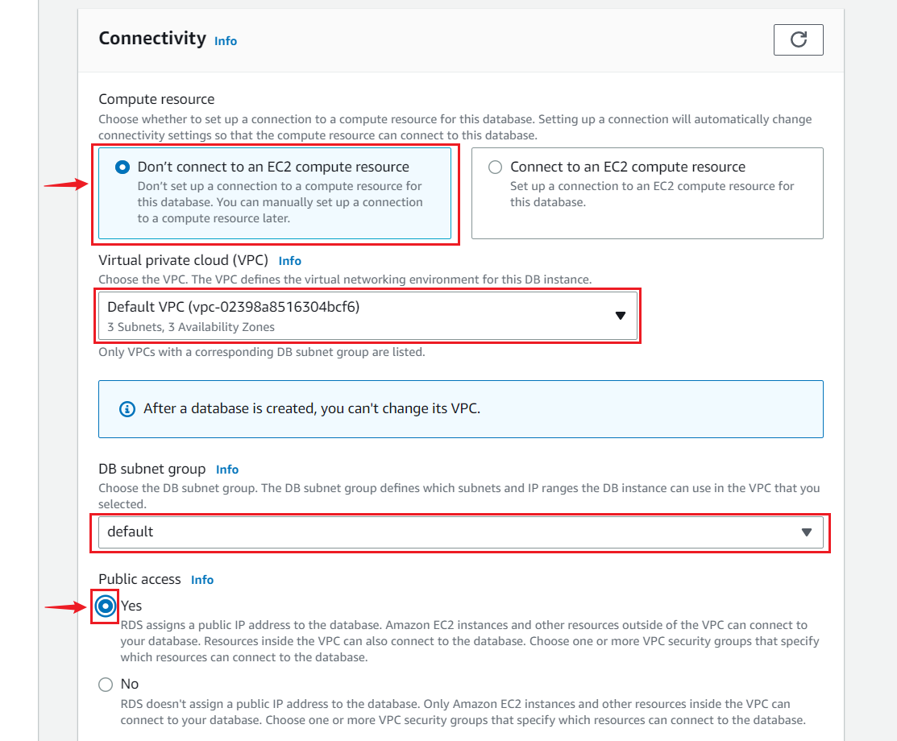

--- 
hide_table_of_contents: true
hide_title: true
---

### Prerequisites

- Have an [AWS Account ](https://aws.amazon.com)

---

**Perform the following steps to configure your Amazon RDS MySQL Sink.**

### Step 1: Setup A MySQL server in AWS using RDS

1. Log in to the [AWS Management Console](https://aws.amazon.com/) using your root account credentials.  

2. Type "[RDS](https://console.aws.amazon.com/rds/)" in the search box and select it from the results.   

3. In the top right corner of the Amazon RDS console, select the Region in which you want to create the DB instance.   

4. Click **Create database** in the **Create Database** section.  

5. Select **standard create** and choose the MySQL icon.  

6. Leave the default value for edition, and select the **Free Tier Template** for testing or **Production Template** for production.   
   

:::note
Multi-AZ deployment is only available for paid tier. A Multi-AZ deployment automatically provisions and maintains a synchronous standby replica in a different Availability Zone.
:::

7. Enter the following information.

- **DB Instance Identifier:** Give a unique name to your instance.

- **Master Username:** This is the username that will be used to log in to your DB instance.

- **Master Password:** This is the password that will be used to log in with the username.

- **Confirm password:** Write the password again.

8. Leave the default Instance configuration. 

9. Select the GP2 storage type. It's efficient and cost-effective for our intended use.  
   

### Step 2: Connectivity

1. Leave the default subnet group.  

2. Enable public access. This allocates an IP to your database instance and allows direct connection to the database from your own device.  

3. Select **Create new VPC security group**. This will create a security group that allows outside connections to the MySQL server.

4. Leave **the Database port** on `3306`.

5. Select the password method of authentication.   

6. Leave **enabled monitoring** unchecked to stay within the free tier limit.  

 
7. Set a database name. If you do not provide one, Amazon RDS will not create a database on the instance being created.  

8. Set your preferred backup retention period.  

9. Leave **Deletion protection** unchecked, if you want to be able to delete your database in the future.  

10. Click on **Create database**.
   

11. The DB is now in the process of being created. This could take a few minutes. 
   

#### Modify your VPC security groups

1. Click on the server you just created in AWS RDS.

2. Now, Click on your **VPC Security Group**.

3. Under the **Inbound rules**, click **Edit inbound rules**.

4. To be able to connect to the server, we will need to add a new rule by clicking on the **Add rule** button.

5. Change the type to 'All traffic', Source 'Anywhere-IPv4' and click **Save rules**.

Now you can connect to your server and create a table and database. 

---

### Step 3: Amazon RDS MySQL Connection Settings

1. Click on the server you just created in AWS RDS.

2. Now copy and paste your **Endpoint** and **Port** into vanus.

- **Host:** This is your RDS endpoint.
- **Port:** Enter the port number on which your MySQL server is listening. The default port for MySQL is 3306.
3. Enter the rest of your credentials.
- **Username:** Master username selected during the database creation.
- **Password:** User password.
- **Database Name:** The initial database name.
- **Table Name:** The name of the table you want your events to be sent to. 
- choose the insertion mode.
4. Click `Next` and finish the configurations.

---

Learn more about Vanus and Vanus Cloud in our [documentation](https://docs.vanus.ai).

