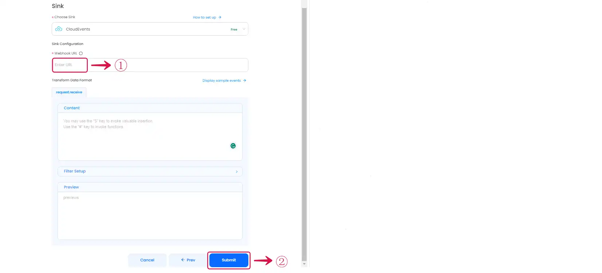

--- 
hide_table_of_contents: true
hide_title: true
---

### Prerequisites

- A [Vanus Cloud account](https://cloud.vanus.ai)

---

**Perform the following steps to configure your CloudEvents Sink.**

## CloudEvents Connection Settings

- Paste the **URL**① in Webhook field.

- Click the **Submit**② button to finish the connection.

---

Learn more about Vanus and Vanus Connect in our [documentation](https://docs.vanus.ai).