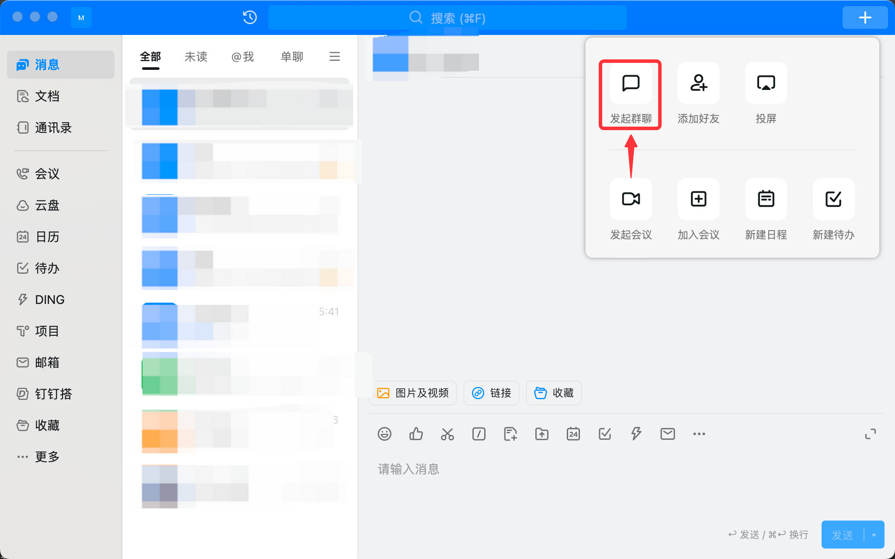
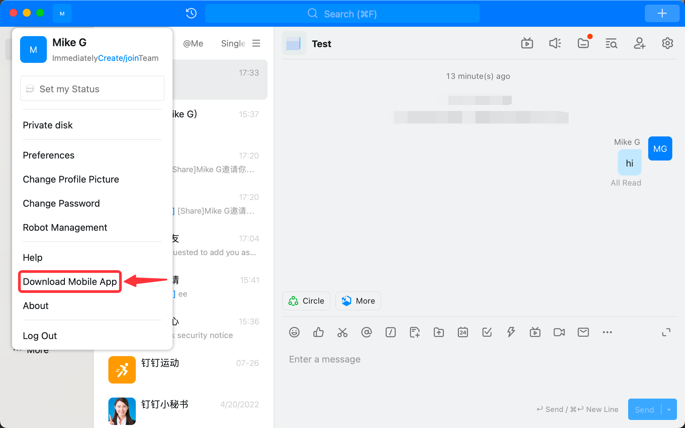
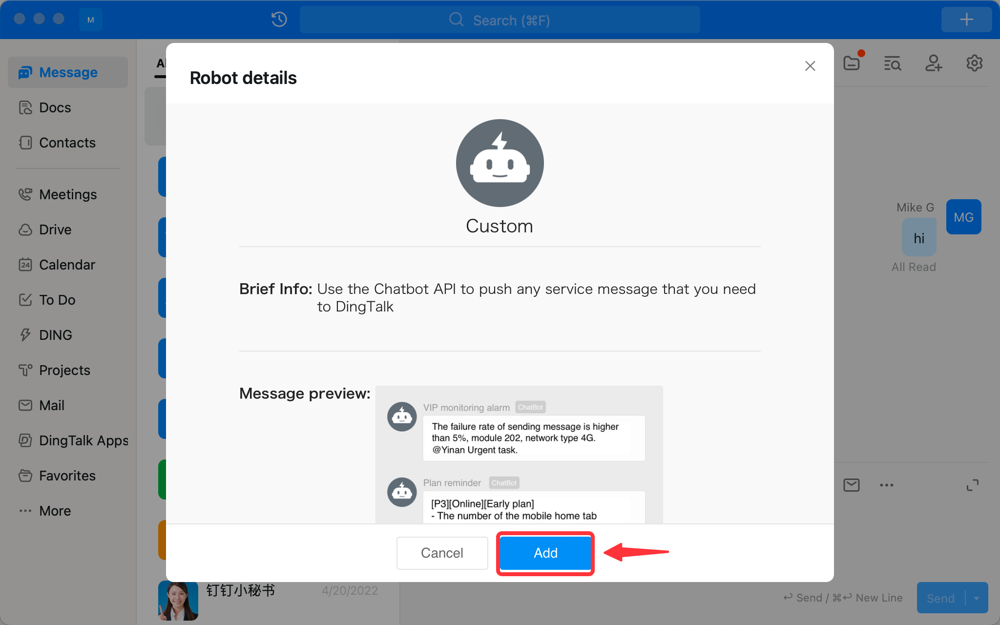
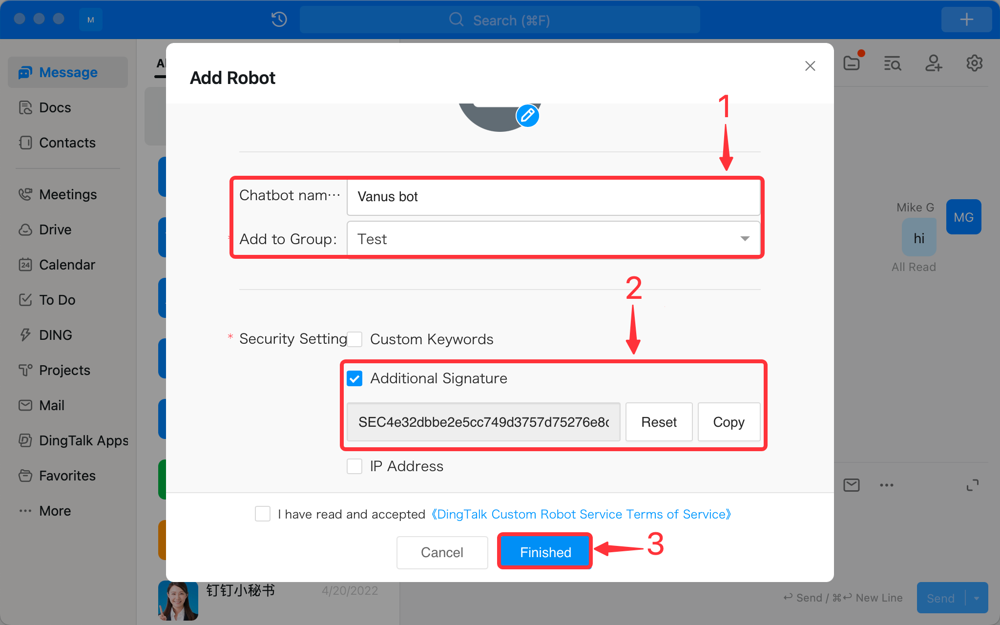

--- 
hide_table_of_contents: true
hide_title: true
---

### Prerequisites

- A Ding Talk account with administrative privileges

---

**Perform the following steps to configure your DingTalk Sink.**

### Step 1: Create a Group

1. Log in to your Ding Talk account.
2. Create a **new group**, go to the `+`, and select **New Chat**.
   
3. Now click **发起群聊**.
   
4. Click **外部群**.
   
5. Select **minimum two members** of your team to create a group, set a group name and press **Ok**.
   

---

### Step 2: Add Bot to Ding Talk Group

1. In the top navigation pane, click **Robot Management**.

2. In the **Robot Management** page, click **Custom**.

3. In the **Robot details** page, click **Add**.

4. In the **Add Robot** dialog:

   - In the **Chatbot name** field, provide a name for the robot.
   - In the **Add to Group** field, select the target group in which the Robot will create.
   - In the **Security Settings** field, select the **Additional Signature**, copy the signature and paste it to Vanus Cloud.
   - Accept the Terms of Service.
   - Click **Finished**.
5. Now click **Copy**, keep the Webhook URL safe and click **Finished**.

---

### Step 3: DingTalk Connection Settings

1. **Webhook URL**: The webhook address you've received previously from DingTalk.
2. **Signature Verification**: The signature, you've also received previously from DingTalk.

Click **Next** to continue.

---

Learn more about Vanus and Vanus Cloud in our [documentation](https://docs.vanus.ai).
