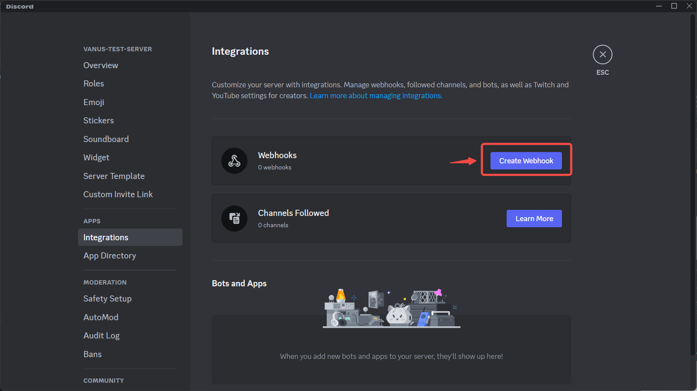

--- 
hide_table_of_contents: true
hide_title: true
---

## Prerequisites

- A Discord Account

---

**Perform the following steps to configure your discord Sink:**

## Step 1: Create a Server

1. Go to the Discord application.

2. Create a new server by clicking the `+`.

    
3. Choose a template or create your own.

    

    

4. Finish setting up your server.

    

---

## Step 2: Get a webhook url

1. Go to **Server Settings**.
    
2. Click **integration** in the sidebar under APPS.
    
3. Click **create Webhook**.
    
4. Click on the webhook you just created.
    
5. Copy and save your payload URL
    

---

## Step 3: Connection Setup

1. Go back to Vanus Cloud.
2. Paste your webhook URL in the `URL` field.

    
3. Click "Next" to continue.

---

Learn more about Vanus and Vanus Cloud in our [documentation](https://docs.vanus.ai).
