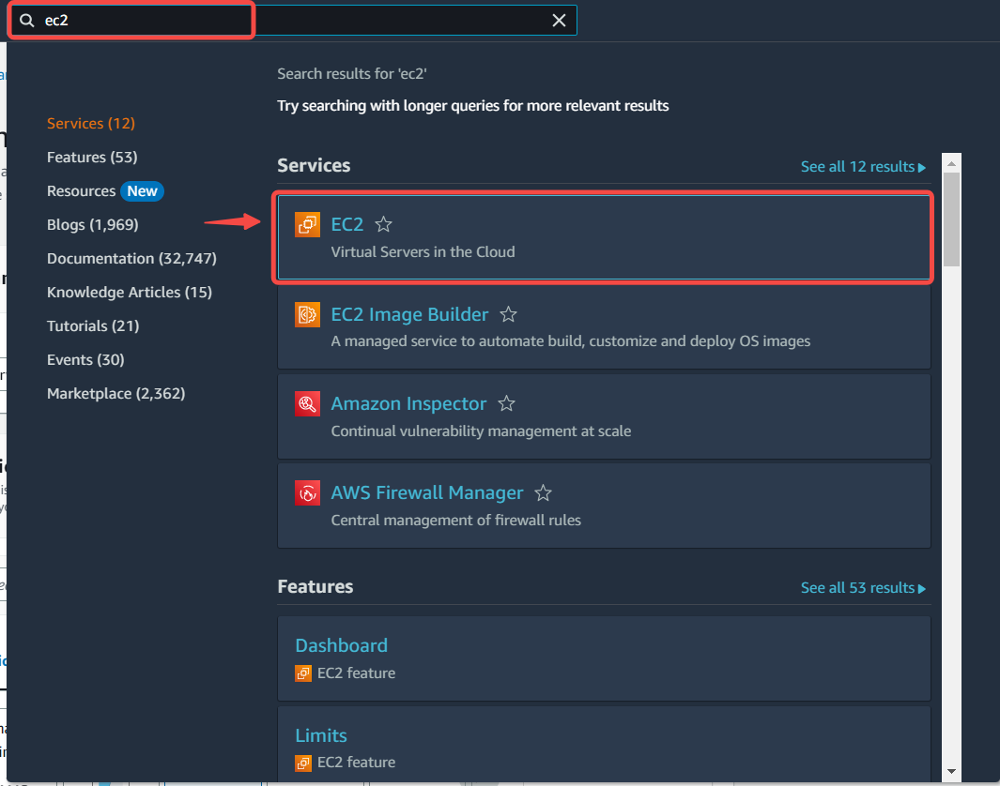
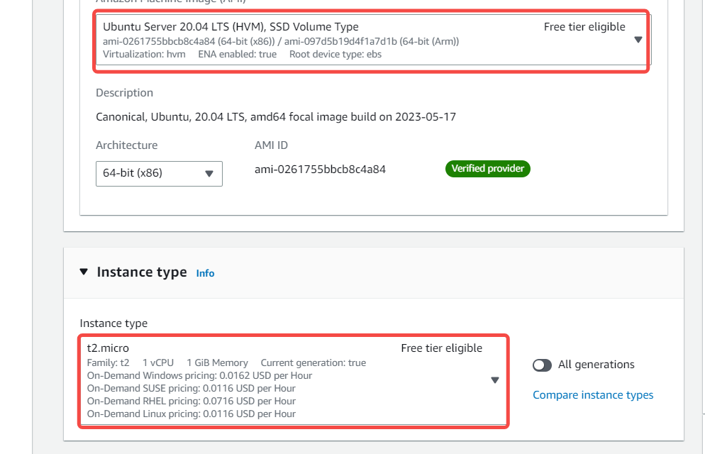
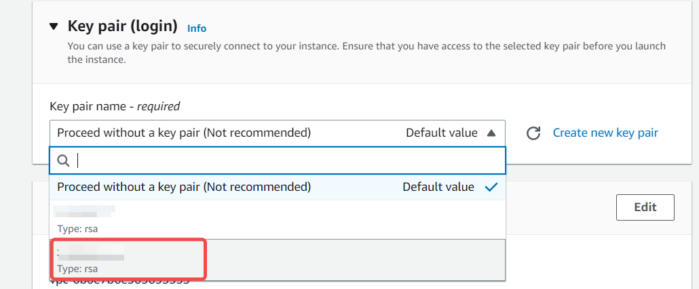
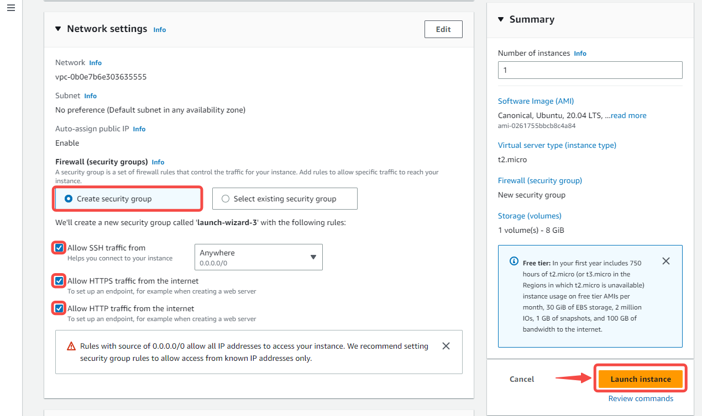
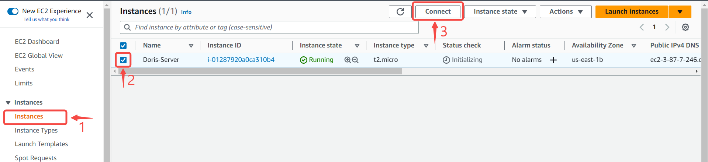
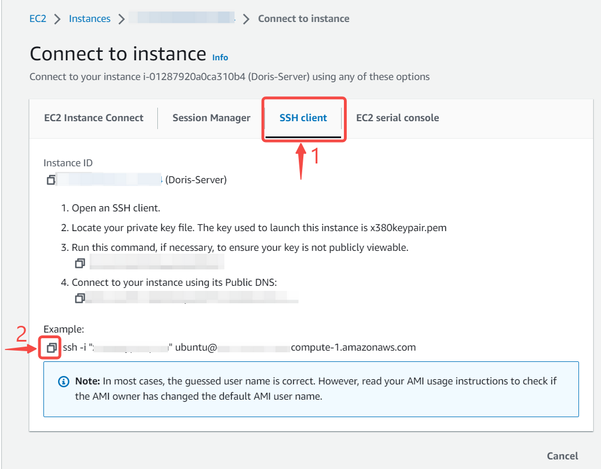
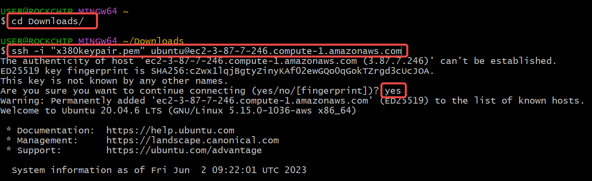
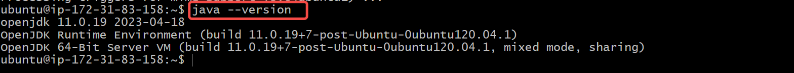

--- 
hide_table_of_contents: true
hide_title: true
---

## Prerequisites

Before forwarding events to Doris, you must have:

- A Doris cluster.

---

**Perform the following steps to configure your Doris Cluster**

## Step 1: Setup A Doris Cluster using AWS EC2 Instance

### Launch an AWS EC2 Instance

1. Go to the [AWS Management Console](https://console.aws.amazon.com) and sign in using your AWS account credentials.

2. Search for "EC2" in the AWS Management Console search bar or locate it under the "Compute" category. Click on "EC2" to access the EC2 Dashboard.

3. On the EC2 Dashboard, click on the "Launch Instance" button to start the instance creation process.

4. Choose an Amazon Machine Image (AMI) and Instance type.

5. Create or select a key pair.

5. Create or select a security group to control inbound and outbound traffic to your instance.

6. Launch the instance.

### SSH into the EC2 Instance

1.In your EC2 Dashboard, click on Instances, then check the box next to the instance you created, and finally connect.

2. Click on the SSH Client Tab and then copy the text labelled Example.

3. Open your computer's terminal, navigate to the directory containing your keypair, and then paste the text you copied previously. Run it and then enter 'yes' when prompted.

### Installing Apache Doris

Before installing Apache Doris, ensure that your system meets the minimum requirements and dependencies. This typically includes having Java JDK installed and configured properly. 

1. Update and upgrade your system to refresh your APT cache index.

`sudo apt -y update && sudo apt -y upgrade`

2. Once the update is done, disable the swap partition.

`sudo swapoff -a`

3. Install dependencies
`sudo apt install build-essential maven cmake byacc flex automake libtool-bin bison binutils-dev libiberty-dev zip unzip libncurses5-dev curl git ninja-build -y`

4. To install the JRE from OpenJDK 11, run the command below:

`sudo apt install default-jre -y`

5. Confirm the java installation
`java --version`

## Doris Connection Settings

1. Provide the following credentials

   - Fenodes: Enter the comma-separated list of FQDNs or IP addresses of the nodes that make up your Doris cluster.
   - Database Name: Enter the name of the database that you want to use for the sink.
   - Table Name: Enter the name of the table that you want to use for the sink.
   - Username: Enter the username that you want to use to connect to your Doris database.
   - Password: Enter the password that corresponds to the username you entered in the previous step.
     

2. Click `Next`

---

Learn more about Vanus and Vanus Cloud in our [documentation](https://docs.vanus.ai).

