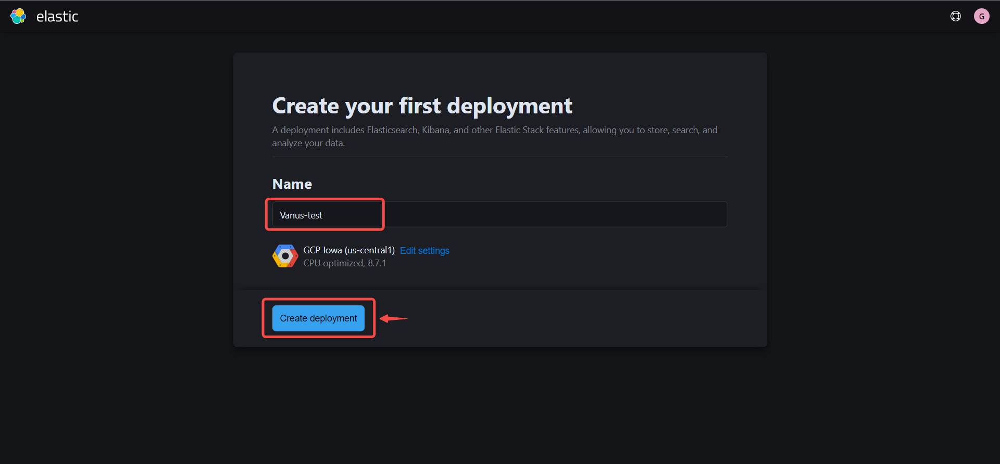
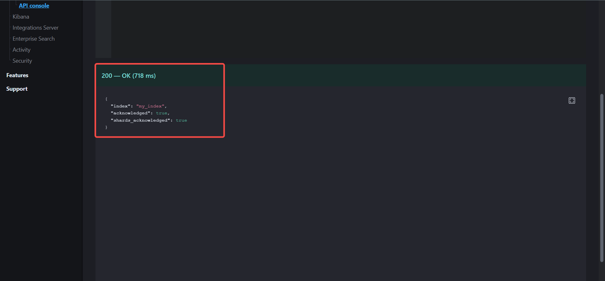

#  
# Prerequisites

Before forwarding events to Elasticsearch, you must have:

- Have an Elasticsearch cluster. 

---

**Perform the following steps to configure your elasticsearch Sink:**

# Step 1: Setup an Elasticsearch cluster 

1. Got to the [Elasticsearch](https://www.elastic.co/) official website and sign up for an account.  
   


2. Input your name and company, select your interest and reason for using Elastic search, and click next.  
   


3. Create your deployment,  a deployment includes Elasticsearch, kibana, and other elastic stack features
    

- Name your deployment.  

- Choose the cloud provider you want to make use of.  

- Select your region.  

- You can leave the other settings on default or customize your settings further, depending on your use case. We left them on default because the default settings are sufficient for our use case.  

- Click on **create deployment** to finish creating your deployment.  


4. Download your deployment credentials, you will need them to log in to your endpoint, and they would also be needed for your Vanus connection.  
   


5. Wait for the creation of your deployment to be completed.     


6. Your deployment has been successfully created, click **continue**  
   


**Getting your server endpoint** 
---

1. Click on the **settings** icon at the right side of your deployment.  
   


2. Copy your Elasticsearch endpoint.  
   


3. Paste the copied endpoint in your browser, fill in the credentials you downloaded while creating your deployment and click on sign in. 
   

   


**Creating an Index** 
---

1. Click on API Console  
   

2. Select the **PUT** option, write the name of your index, and click submit. For this tutorial we named our index **"my_index".** 
   

    
 

3. Add a backslash and your index name to your endpoint, to see the content of your index. 
   

---

# Step 2: Setting up your connection in Vanus cloud 

**To set up Elasticsearch Sink in Vanus Cloud:**

1. Provide the following credentials
   - Server Endpoint: The endpoint of your elasticsearch cluster.  
   - Index: The name of the index you created.  
   - Username: The username you downloaded during the creation of your deployment.   
   - Password: The password you downloaded during the creation of your deployment.  
    
2. Click `Next` and finish the configurations.

---

# Custom Connection

Create your template following the structure of your database, an example:

```json
{
  "_index": "vanus_test",
  "_type": "_doc",
  "_id": "CqFnBIEBzJc0Oa5TERDD",
  "_version": 1,
  "_source": {
    "id": 123,
    "date": "2022-06-13",
    "service": "test data"
  }
}
```
