--- 
hide_table_of_contents: true
hide_title: true
---

### Prerequisites

- A [**Vanus Cloud account**](https://cloud.vanus.ai).
- [**Have an ElasticSearch account**](https://cloud.elastic.co/)

---

**Perform the following steps to configure your ElasticSearch Sink.**

### Step 1: Create a Deployment

1. Go to the [**Elasticsearch**](https://www.elastic.co/) official website.

2. Input your **Email and Password**①, then click **Sign up with email**②.

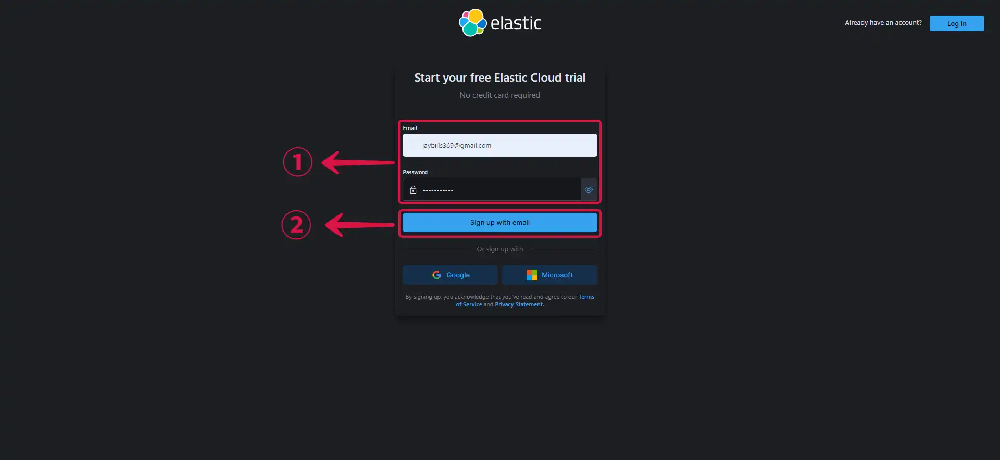

3. Give your deployment a **Name**③ and click **Create deployment**④.

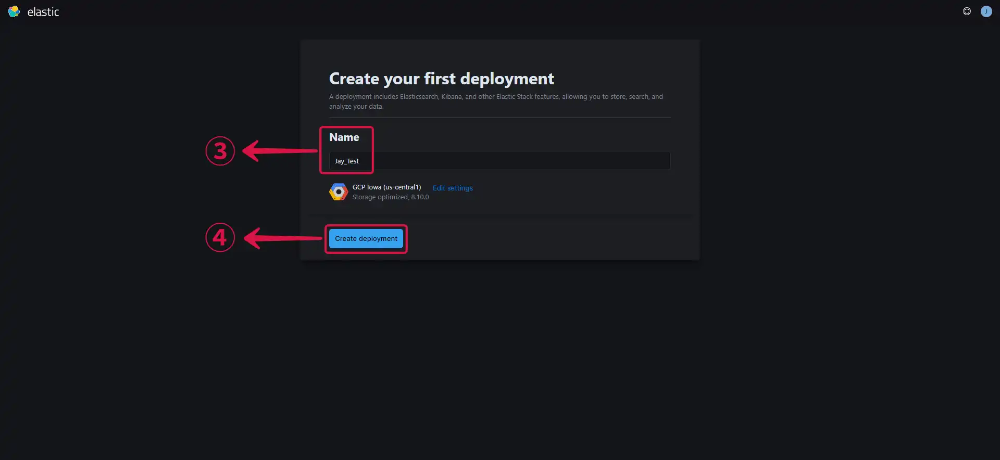

*A deployment includes Elasticsearch, Kibana, and other elastic stack features.*  

4. Click on the **Cloud Provider**⑤ field to change your cloud provider and the **Region**⑥ field to change your region.

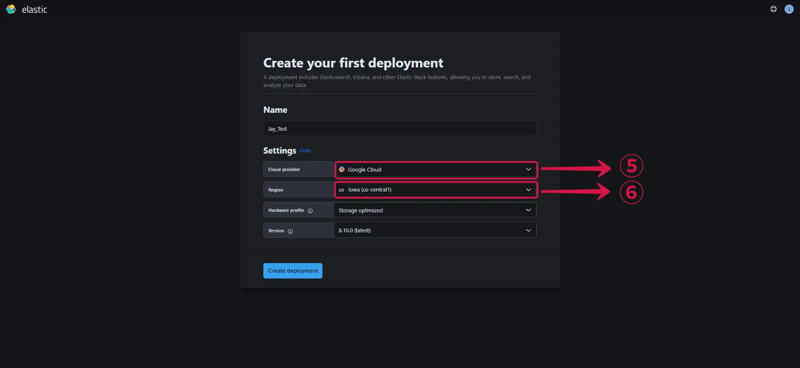

*You can leave the other settings on default or customize your settings further, depending on your use case.*

5. Click on **Create deployment**⑦ to finish creating your deployment.  

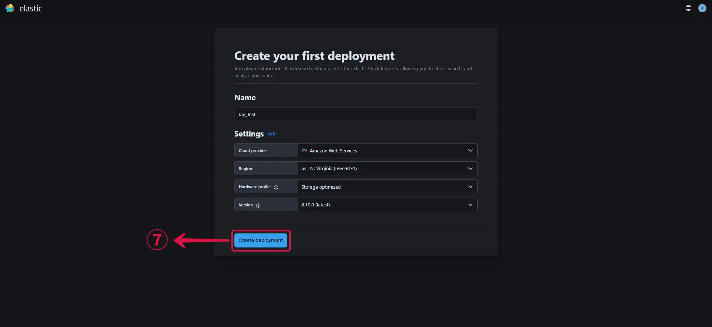

6. **Download**⑧ your deployment credentials, you will need them to log in to your endpoint, and they will also be needed for your Vanus connection.  

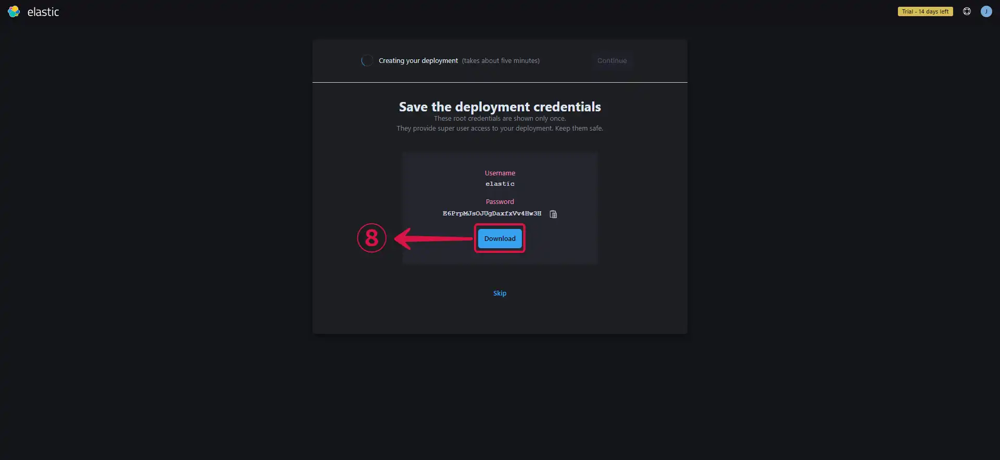

7. Your deployment has been successfully created, now click **Continue**⑨.

#### Getting your server endpoint

1. Navigate to the [**Deployment Page**](https://cloud.elastic.co/deployments/) to see your deployments.

2. Click on the the **created deployment**①.

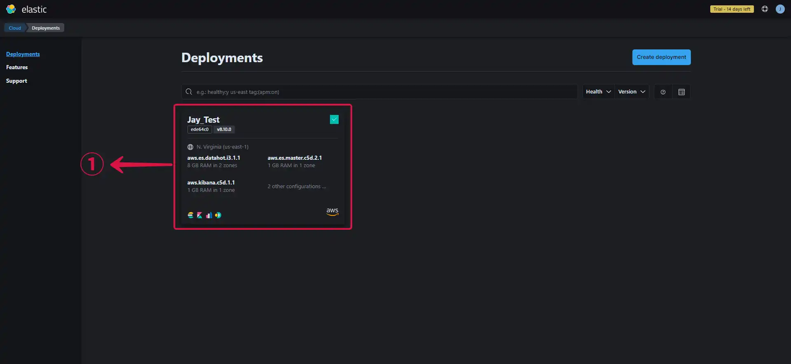

3. Copy your Elasticsearch endpoint by clicking on **Copy endpoint**②.  

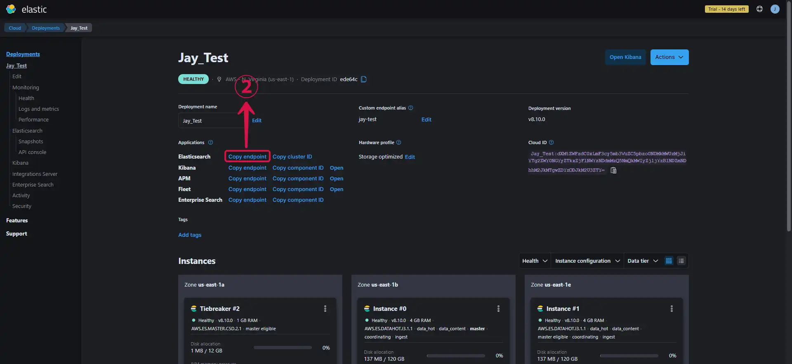

4. Paste the copied **endpoint**③ in your browser, fill in the **credentials**④ you downloaded while creating your deployment and click on **Sign in**⑤.

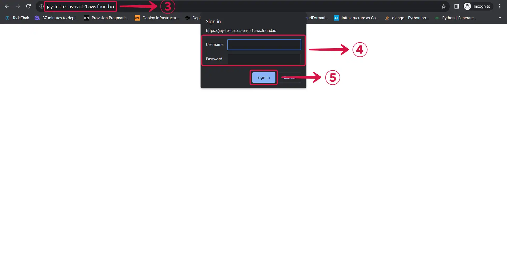

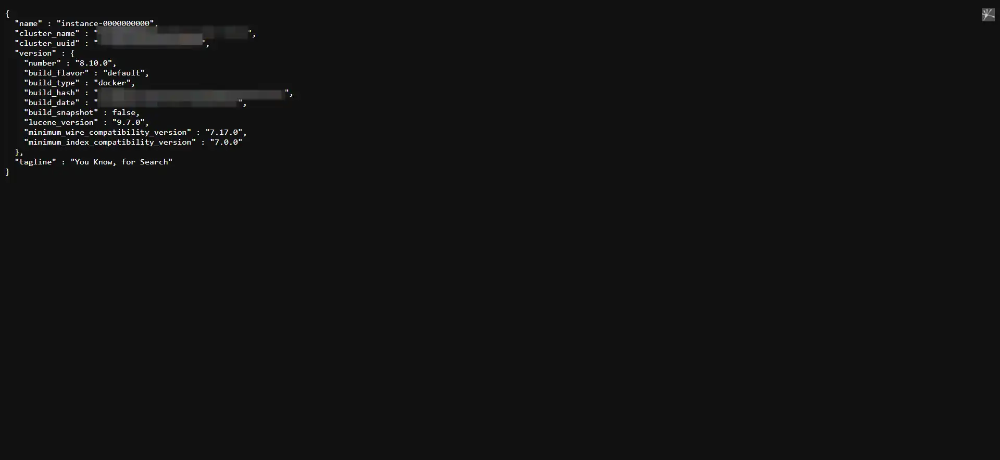

#### Creating an Index

1. Click on **API Console**①.

2. Select the **PUT**② option, write the **name of your index**③, and click **Submit**④.

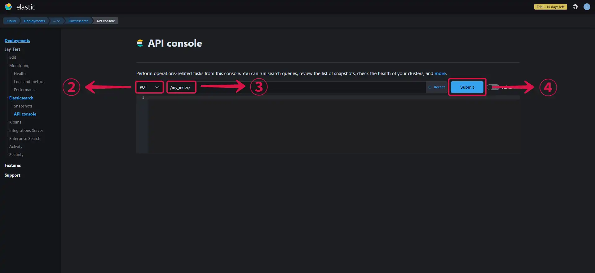

3. You'll get a **200-OK**⑤ message if your index was successfully created.

3. Add a **backslash and your index name**⑥ to your endpoint to see the content of your index.

---

### Step 2: ElasticSearch Connection Settings

1. Provide the following credentials.

- **Server Endpoint①:** The endpoint of your ElasticSearch cluster.

- **Index②:** The name of the index you created.

- **Username③:** The username you downloaded during the creation of your deployment.

- **Password④:** The password you downloaded during the creation of your deployment.

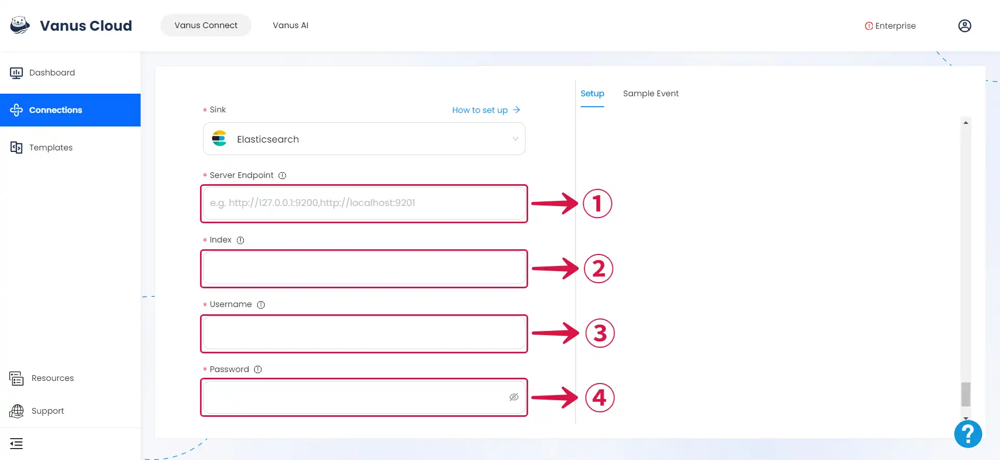

---

### Step 3: Personalize Event Structure

:::note
This is a general instruction on how to personalize your event structure. You can structure your events to suit your specific requirements and create connections for different scenarios.
:::

1. Click on **Display sample events**① for reference and click on **Add More**② to add events.

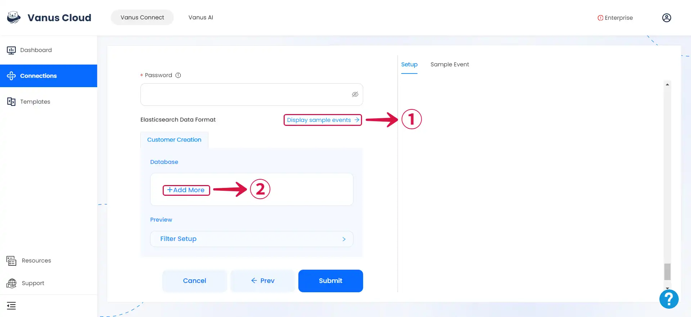

2. **Input key**③ and search for the corresponding **value**④ for the event you want.

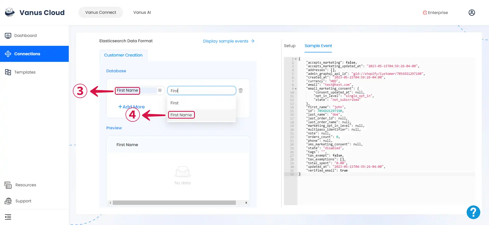

3. You can fill in as many **key-value pairs**⑤ as you wish to receive.

4. Click **Submit**⑥ to finish the configuration process.

---

Learn more about Vanus and Vanus Connect in our [**documentation**](https://docs.vanus.ai).
