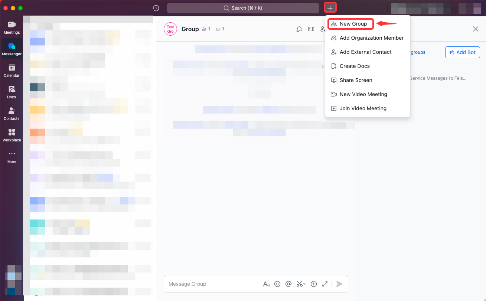
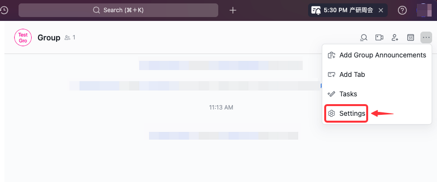
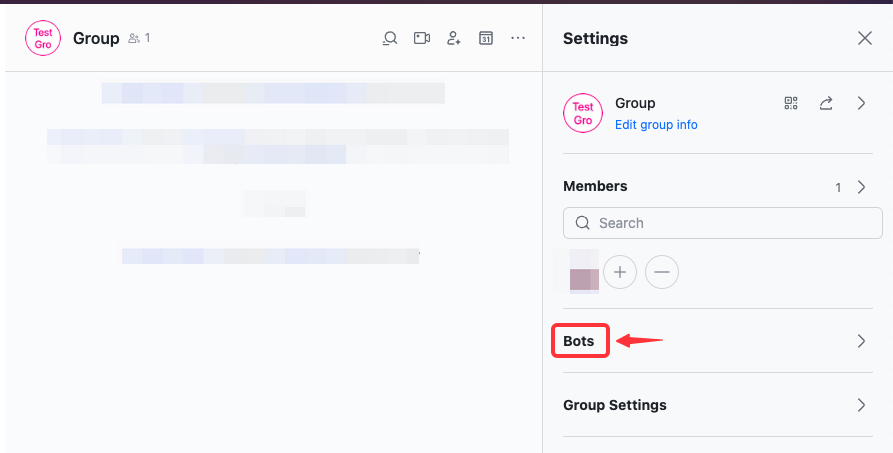
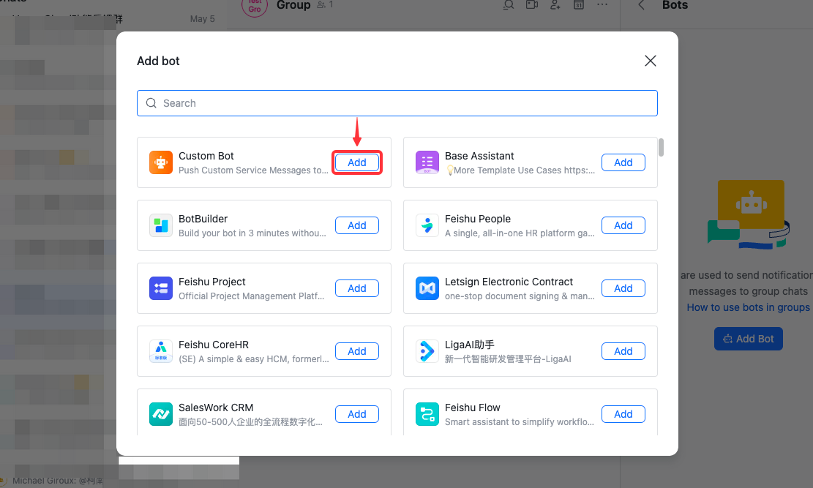
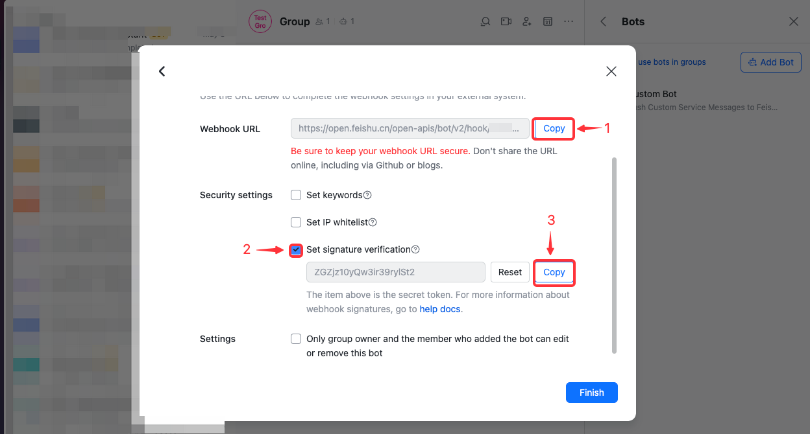
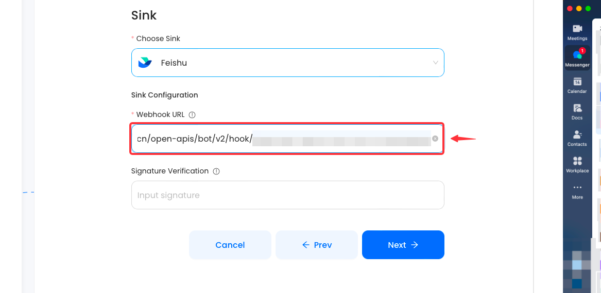

#
# Prerequisites

Before forwarding events to Feishu, you must have:

- A [Feishu](https://www.feishu.cn) account.

---

**Perform the following steps to configure your feishu Sink:**

# Step 1: Setup a Feishu bot
1. Create a new Group chat

2. In the feishu group click `...` and then **settings**.

3. Now click **Bots**.
   
4. Click on **Add Bot** and select **Custom bot**.
   
5. Enter a name for your bot and click **Continue**.
6. Copy the **Webhook URL** and keep it safely.
7. (Optionally) you can also set a **Signature verification** for added security.
   

---

# Step 2: Finish your Connection

1. Paste the ** Feishu Webhook URL** into the "URL" field.

2. (Optionally) add your **Signature Verification**.

3. Click "Next" to continue.

---

Check out this article on how to get a [Feishu Webhook](https://www.vanus.ai/blog/retrieve-feishu-webhook-url/) for more details.

:::caution
**ChatGPT Source**
Trying to create a ChatGPT to Feishu connection, Checkout the article on how to proceed after creating the connection [**click here**](https://xjxt2gkbqf.feishu.cn/wiki/wikcnQpoi1rqoo4jI7q7j4iMYob).
Also note that after creating your connection there is still some more steps.
:::
