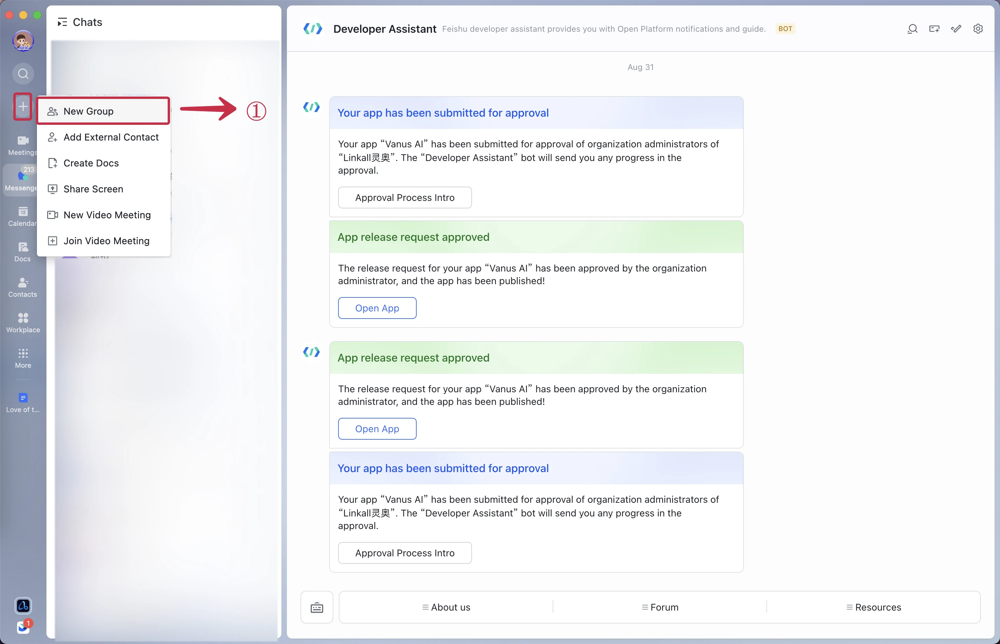
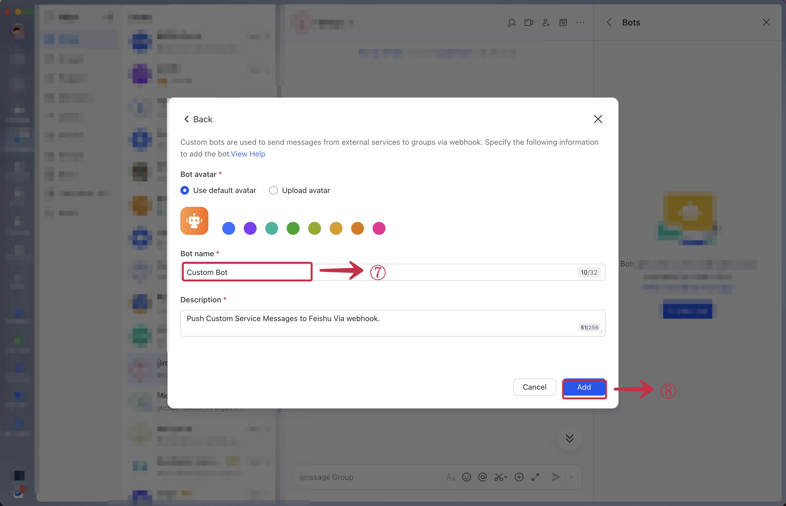
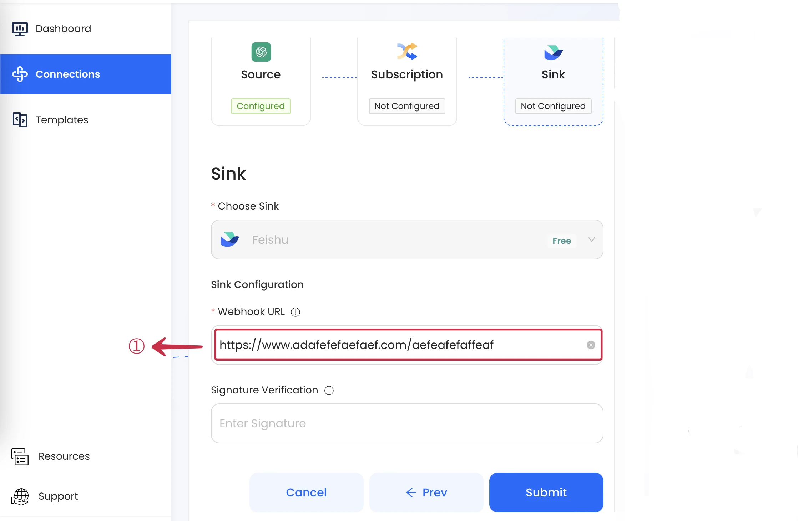
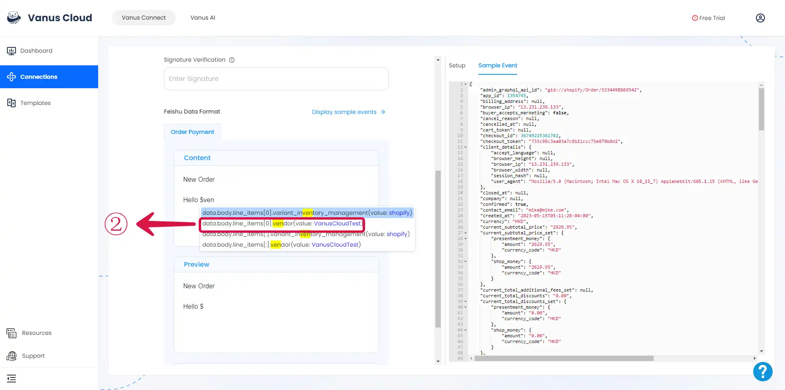

--- 
hide_table_of_contents: true
hide_title: true
---

### Prerequisites

- A [Feishu](https://www.feishu.cn "Feishu") account.

---

**Perform the following steps to configure your Feishu Sink.**

### Step 1: Setup a Feishu bot

1.  Create a **New Group**① chat.

2.  In the Feishu group click `...`②  and then **Settings**③.

3.  Now click **Bots**④.

4.  Click on **Add Bot**⑤ and select **Custom Bot**⑥.

5.  Enter a **name**⑦ for your bot and click **Add**⑧.

6.  Copy the **Webhook URL**⑨, and click **Finish**⑩.

---

### Step 2: Feishu Sink Settings

1.  Paste the step **Feishu Webhook URL**❶ into the "URL" field.&#x20;
2.  ⚠Don't forget the next step❗Click your **Connection**❷ , and then click **How to Use this URL**❸ to setup ChatGPT in Feishu.&#x20;
3.  Now click **Submit** to continue.

---

Learn more about Vanus and Vanus Connect in our [documentation](https://docs.vanus.ai "documentation").