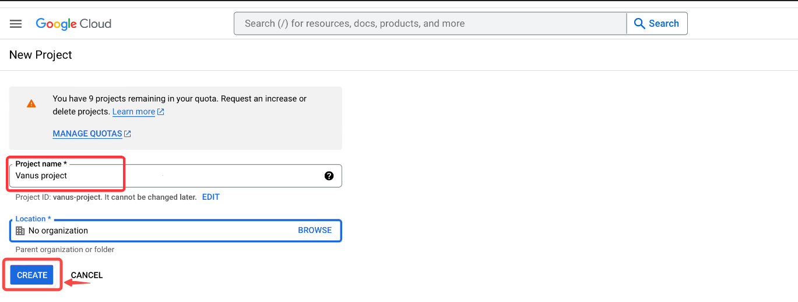
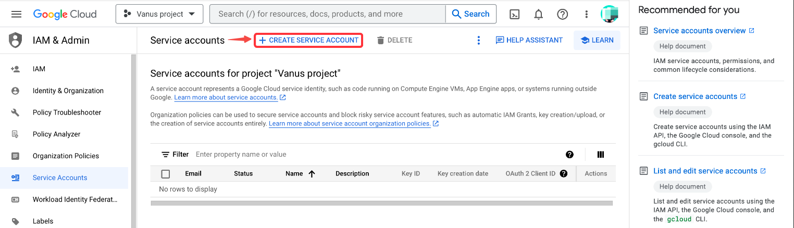
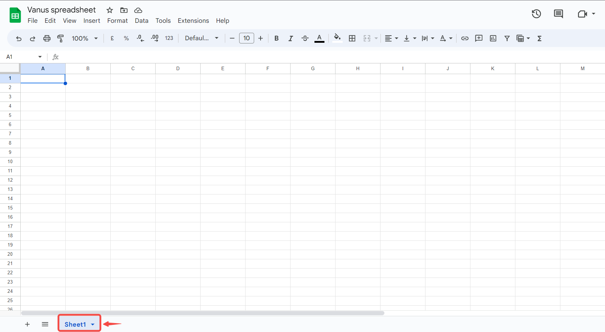

--- 
hide_table_of_contents: true
hide_title: true
---

### Prerequisites

- A Google account with administrative privileges.

---

**Perform the following steps to configure your google-sheets Sink.**

### Step 1: Create a Google Spreadsheet

1. Go to [Google Sheets](https://docs.google.com/spreadsheets/u/0/) and **Sign in**.
2. Create a new blank spreadsheet.

3. Copy the `ID` of the spreadsheet found in the link.

---

### Step 2: Create a Connection

import Tabs from '@theme/Tabs';
import TabItem from '@theme/TabItem';

<Tabs>

<TabItem label="Authentication via Google" value="authentication-via-google">

1. Click on "Sign in with Google" and follow the process to sign in to your Google account.
   

</TabItem>

<TabItem label="Service Account Credentials" value="service-account-credentials">

1. Go to the Google [Service account](https://console.cloud.google.com/iam-admin/serviceaccounts) and click create project.

2. Give a name to your project and click **CREATE**.

3. Now click '+ CREATE SERVICE ACCOUNT'.

4. Create **Service account details**
    1. First write a **Service account name**, this can be any name you would like to give it.
    2. Secondly write a Service account ID, this ID must be written in lowercap and needs to be at least 6 character.
    3. Now click **CREATE AND CONTINUE**.

5. The connection doesn't need to set specific roles you can press **DONE**.

6. Now click on your **Service Account**.

7. Click on **KEYS** in the TAB menu.

8. Now click on **ADD KEY** and **Create new key**.

9. Choose **JSON** and **CREATE**.

10. It will trigger the download of a JSON file copy the whole content and paste it in Vanus Cloud.

</TabItem>

</Tabs>

---

## Step 3: Google Sheets Connection Settings

1. Paste the string from the sheet URL Example: `1i9b80jHcKzkUSOUDE9RAjnGevdWKScq_6Jnpofvb4CU` from Step 1.
2. Obtain the name of the sheet at the bottom of the spreadsheet.
   
3. Paste the default sheet name: `Sheet1`.
4. Click **Next** to continue.

---

Learn more about Vanus and Vanus Cloud in our [documentation](https://docs.vanus.ai).
