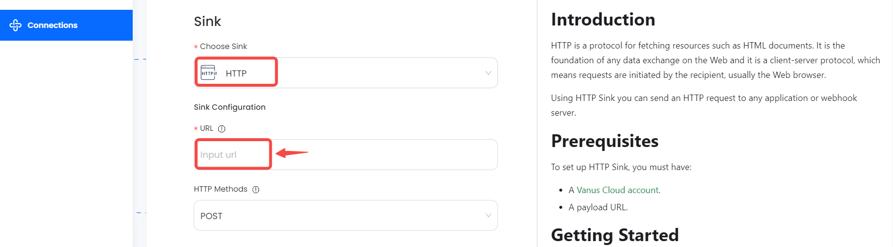

#
# Prerequisites

To set up HTTP Sink, you must have:

- A payload URL.

---

**Perform the following steps to configure your http Sink:**

In Vanus Cloud,

1. Select the **HTTP** Sink connector.
2. Get a Payload URL from your application. (The EndPoint URL to send the HTTP requests)
3. Paste the payload URL into the `URL` field and press **Next**


You can also select the URL Method (`POST`, `GET`, `PATCH`, `DELETE`, `PUT`)

4. Click `Next` and finish the configurations.

---

# Required Data Format

The event data must be JSON form4at, here a simple message, example:

```json
{
  "body": "Message must go here!"
}
```
