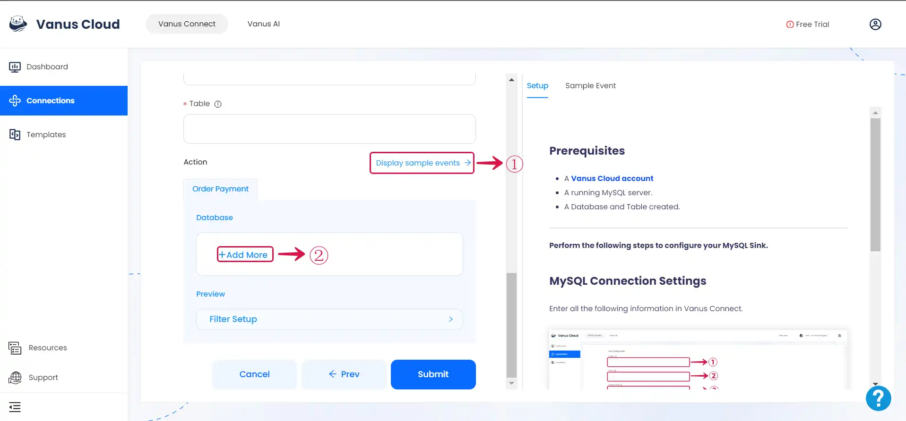
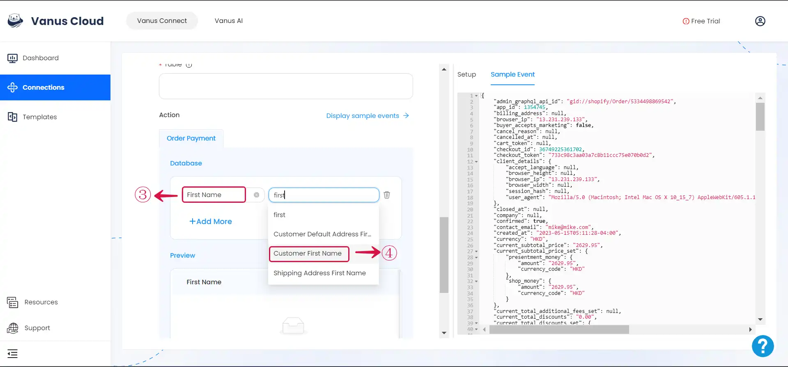

--- 
hide_table_of_contents: true
hide_title: true
---

### Prerequisites

- A [**Vanus Cloud account**](https://cloud.vanus.ai)
- A running MySQL server.
- A Database and Table created.

---

**Perform the following steps to configure your MySQL Sink.**

### Step 1: Create a Connection

Enter all the following information in Vanus Connect.

- **Choose the action to execute**①
- **Host**② - The IP address of your MySQL Server.
- **Port**③ - The Port of your MySQL Server: 3306.
- **Username**④ - A Username with the following permissions INSERT, UPDATE, DELETE.
- **Password**⑤ - The user password.
- **Database**⑥ - The database name.
- **Table**⑦ - The table name.

### Step 2: Personalize Event Structure

:::note
This is a general instruction on how to personalize your event structure. You can structure your events to suit your specific requirements and create connections for different scenarios.
:::

1. Click on **Display sample events**① for reference and click on **Add More**② to add events.

2. **Input key**③ and search for the corresponding **value**④ for the event you want.

3. You can fill in as many **key-value pairs**⑤ as you wish to receive. Click **Submit**⑥ to finish the configuration process.

---

Learn more about Vanus and Vanus Connect in our [**documentation**](https://docs.vanus.ai).
