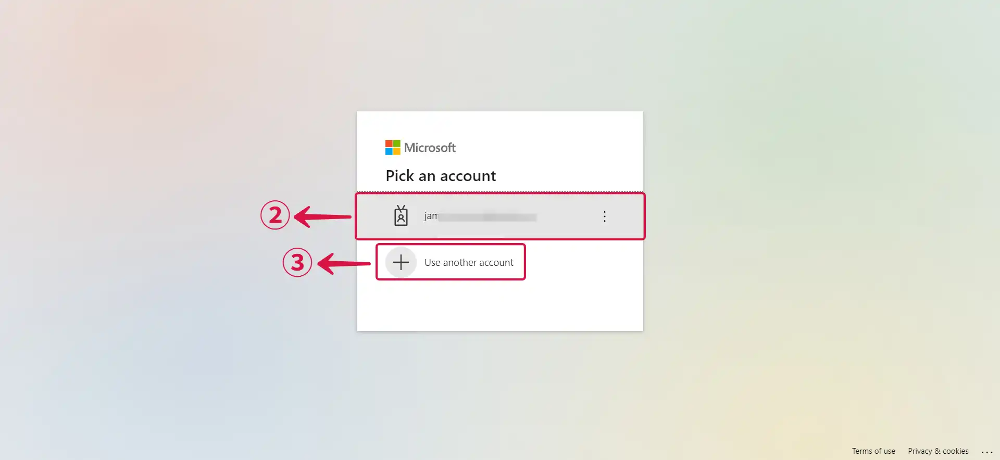
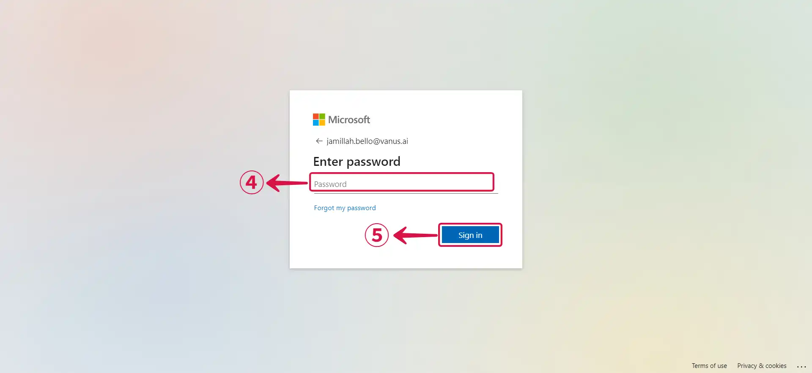
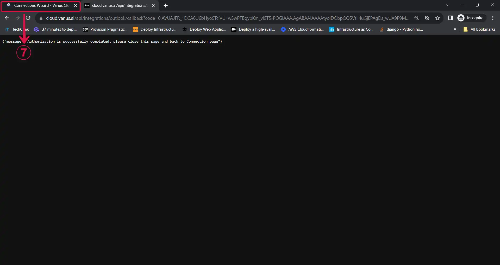
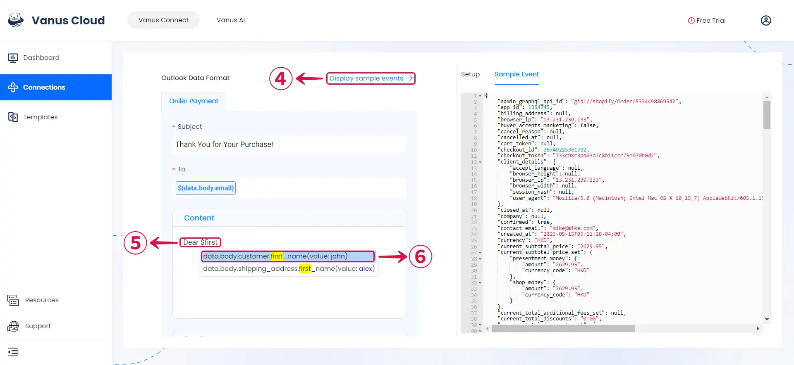

--- 
hide_table_of_contents: true
hide_title: true
---

### Prerequisites

Before forwarding events to Outlook, you must have:

- An [**Outlook Account**](https://www.microsoft.com/en-us/microsoft-365/outlook/email-and-calendar-software-microsoft-outlook?deeplink=%2fowa%2f&sdf=0)

- A [**Vanus Cloud Account**](https://cloud.vanus.ai).

---

**Perform the following steps to configure your Outlook Sink.**

### Step 1: Outlook Connection Settings

1. Click **Authorize**① to establish a connection with your Outlook account.

2. Pick an **Account**② or **Use another account**③.

3. Type in your **Password**④ and click **Sign in**⑤.

4. Click on **Accept**⑥ to grant Vanus Connect access to your Outlook account.

5. Return to Vanus Connect and complete your configuration.

### Step 2: Personalize Event Structure

:::note
This is a general instruction on how to personalize your event structure. You can structure your events to suit your specific requirements and create connections for different scenarios.
:::

1. Compose your **Subject**①, specify the recipient's email by inputting **`$` followed by the desired event**② to access a **list of corresponding event values**③, and select the one you want.

2. Click **Display sample events**④ for reference. Then **type your message and input `$` followed by the desired event⑤** to access a **list of corresponding event values**⑥.

3. You can structure the content as you prefer and fill in as many **values**⑦ as you wish to receive.

4. Click **Submit**⑧ to finish the configuration process.

---

Learn more about Vanus and Vanus Connect in our [**documentation**](https://docs.vanus.ai).
