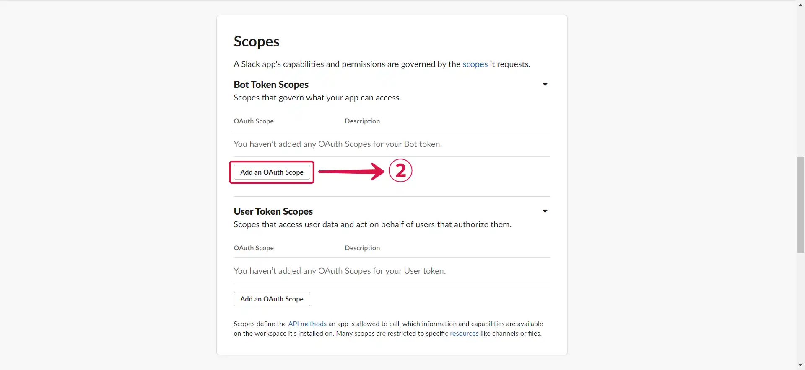
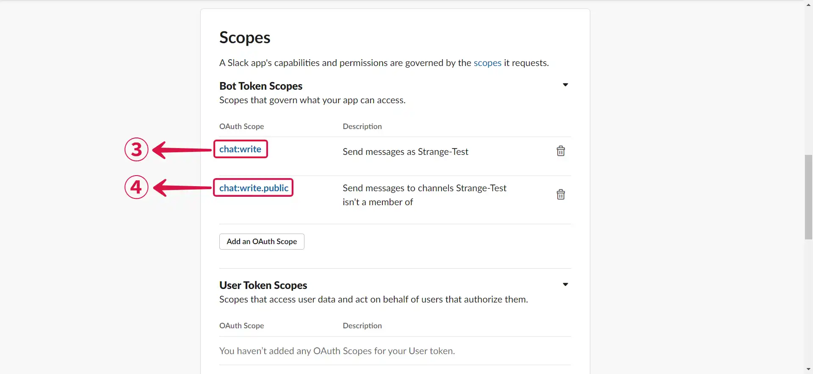
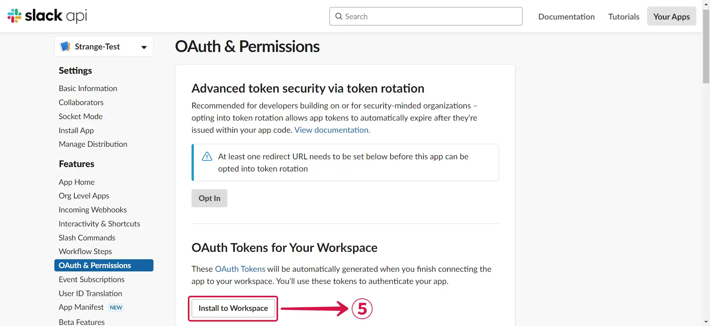
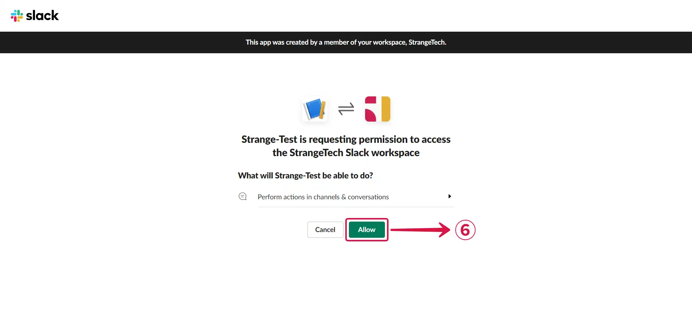
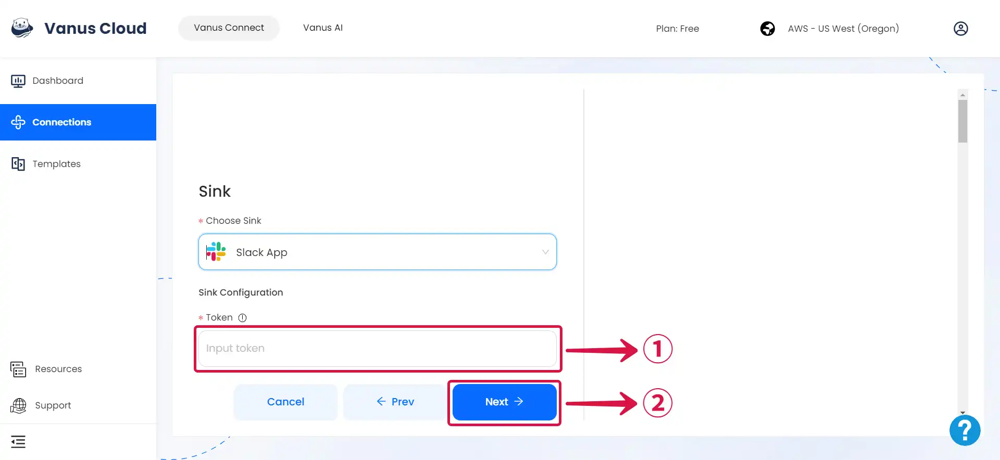
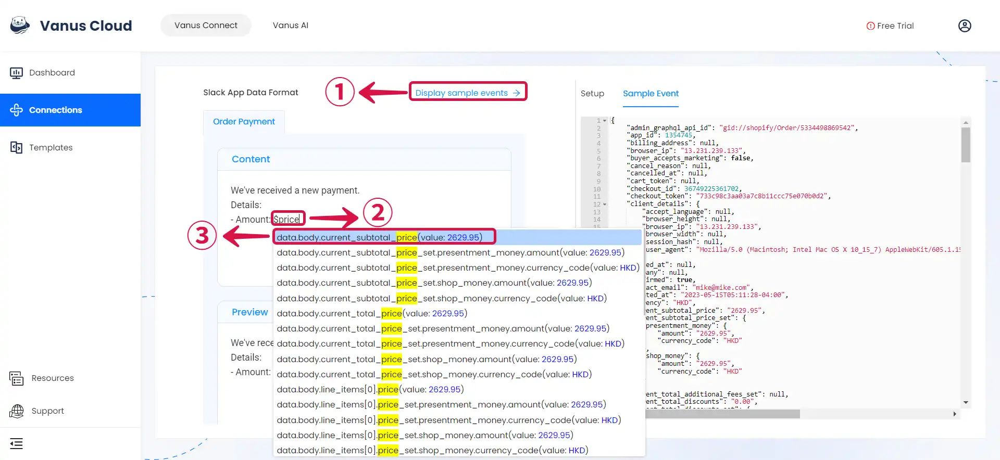
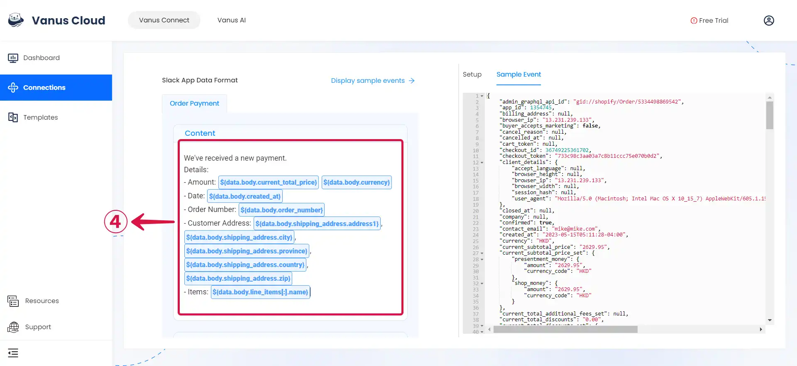
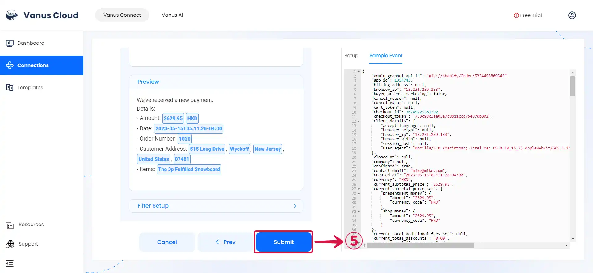

--- 
hide_table_of_contents: true
hide_title: true
---

### Prerequisites

- A [**Slack Account**](https://slack.com)
- A [**Slack Workspace**](https://slack.com/help/articles/206845317-Create-a-Slack-workspace)

---

**Perform the following steps to configure your Slack Sink.**

### Step 1: Create a Slack App

1. Go to [**Slack API**](https://api.slack.com/apps), and click **Create New App**①.

2. Select **From scratch**②.

3. Set the **App name**③ and **Workspace**④, then click **Create App**⑤.

---

### Step 2: Configure your App

1. Add the **Permissions**① feature for your app.

2. Scroll down to `Scopes/Bot Token Scopes`, and click **Add an OAuth Scope**②.

3. Add **chat:write**③ and **chat:write:public**④ permission to your app.

4. Scroll up to the top of the page, and click **Install to Workspace**⑤.

5. Click **Allow**⑥ to install the app.

6. **Copy**⑦ the Bot User OAuth Token.

7. Return to the Vanus Connect page and paste your Bot User OAuth Token in the **Token**⑧ field.

---

### Step 3: Personalize Event Structure

:::note
This is a general instruction on how to personalize your event structure. You can structure your events to suit your specific requirements and create connections for different scenarios.
:::

1. Click on **Display sample events**① for reference, compose your preferred message, then type **`$` followed by the desired event**② to access a **list of associated event values**③, and choose the one you prefer.

2. You can structure the content as you prefer and fill in as many **values**④ as you wish to receive.

3. Click **Submit**⑤ to finish the configuration process.

---

Learn more about Vanus and Vanus Connect in our [**documentation**](https://docs.vanus.ai).
