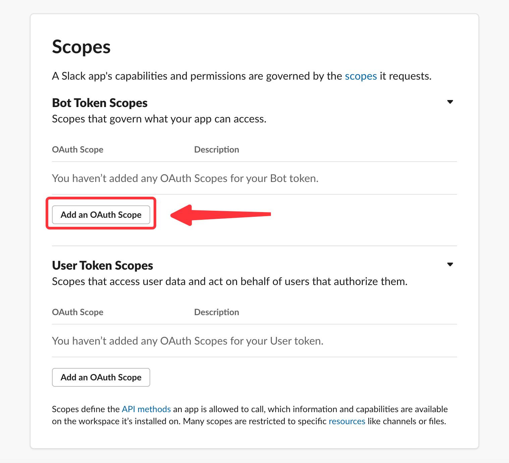
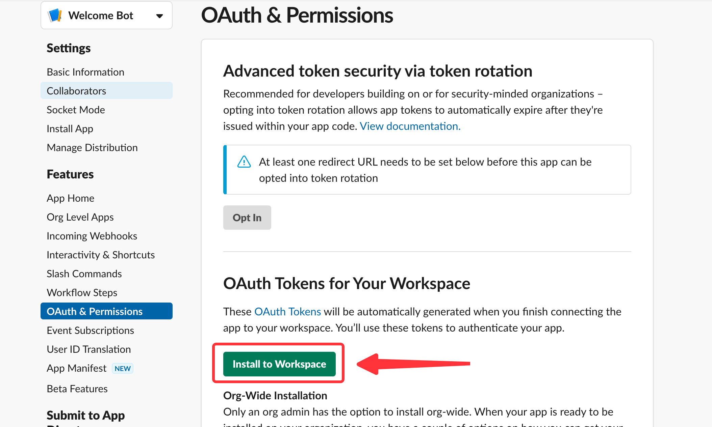
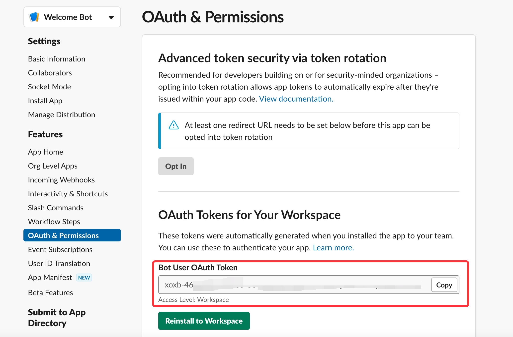

--- 
hide_table_of_contents: true
hide_title: true
---

### Prerequisites

- A [slack account](https://slack.com)

---

**Perform the following steps to configure your slack Sink**

### Step 1: Create a Slack App
1. Go to [Slack API](https://api.slack.com/apps), and click Create New App.

2. Select From scratch.

3. Set the app name and Workspace.

---

### Step 2: Configure your App
1. Add Permissions feature for your App.

2. Scroll down to Scopes/Bot Token Scopes, and click Add an OAuth Scope.

3. Add `chat:write` permission to your App.

4. Notice: we only need a chat:write permission in Bot Token Scopes.

5. Scroll up to the top of the page, and click install to Workspace to install your app.

6. Click allow to install the app.

7. Copy the Bot User OAuth Token.
 

---

### Step 3: Slack App Connection Settings
1. Paste the Bot User OAuth Token to Slack Sink.

2. Click **Next** to continue.

---

Learn more about Vanus and Vanus Cloud in our [documentation](https://docs.vanus.ai).
