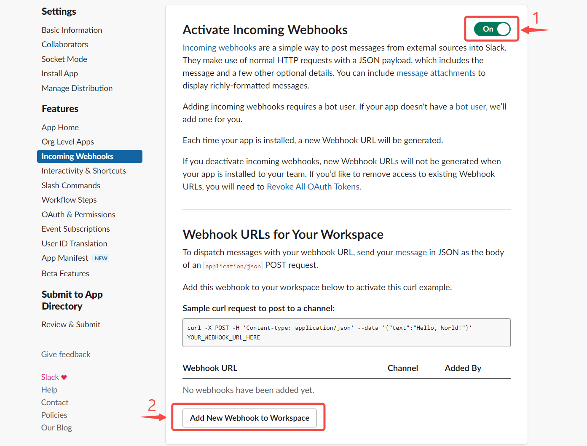
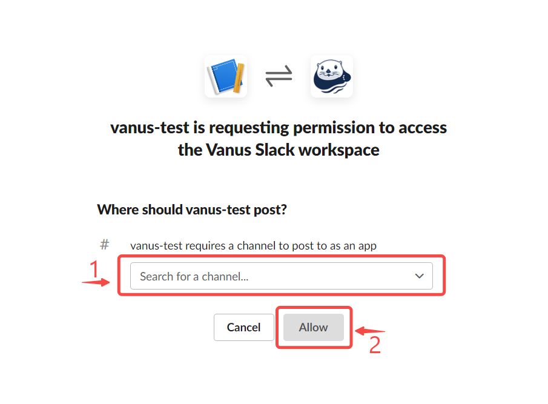
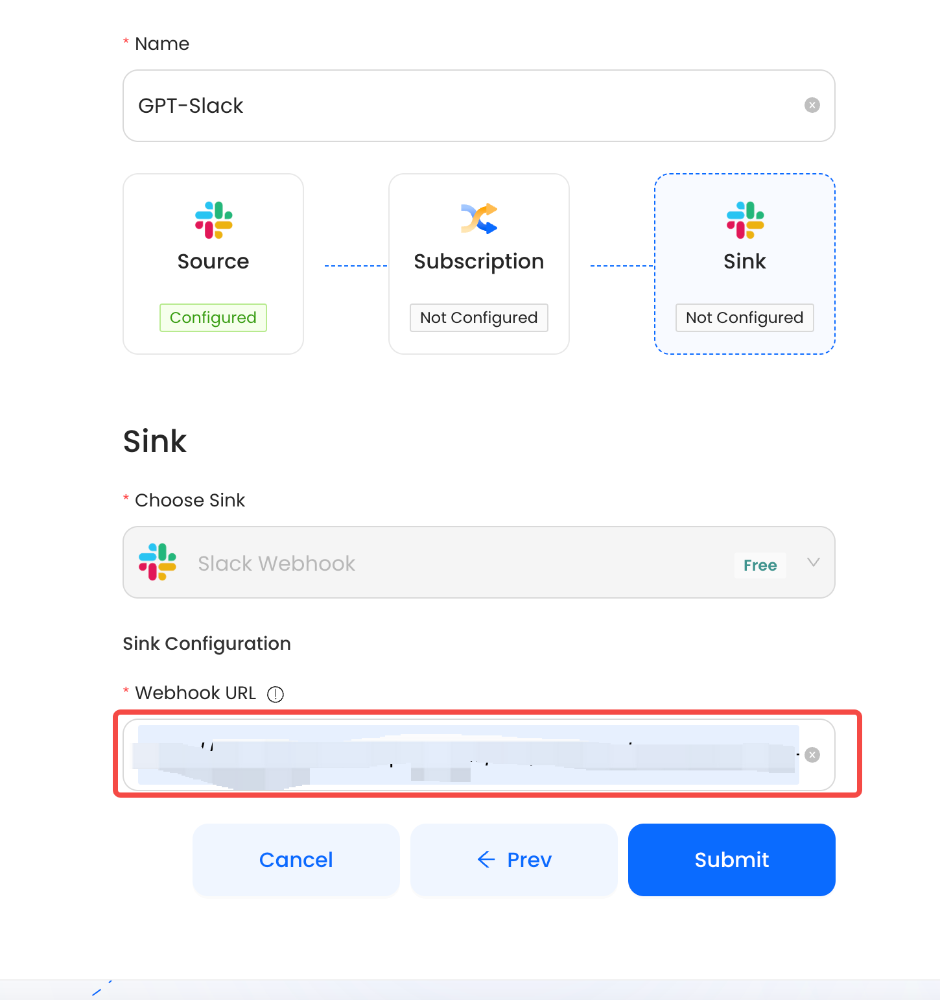

--- 
hide_table_of_contents: true
hide_title: true
---

## Prerequisites

- A [slack account](https://slack.com)
- A slack[ Workspace](https://slack.com/help/articles/206845317-Create-a-Slack-workspace)

---

Perform the following steps to configure your Slack Sink.

**Note: If you already have created a Slack App, you can skip Step 1 and directly go to [Step 2](#step-2-create-an-incoming-webhook).**

### Step 1: Create a Slack App
1. Create an [App on Slack](https://api.slack.com/apps).
   
2. Select From Scratch.
   
3. Set the app name and Workspace.

---

### Step 2: Create an Incoming Webhook
1. Select **Incoming Webhooks** in the sidebar menu.

2. Turn on Webhooks, scroll down, and click **Add New Webhook to Workspace** to add a new one.

3. Select the channel to receive messages and click **Allow**.

4. Now copy the webhook URL.

---

### Step 3: Slack Connection Settings

1. Paste the Webhook URL into the `URL` field, and Click on submit to finish the configuration.
   
   
---

