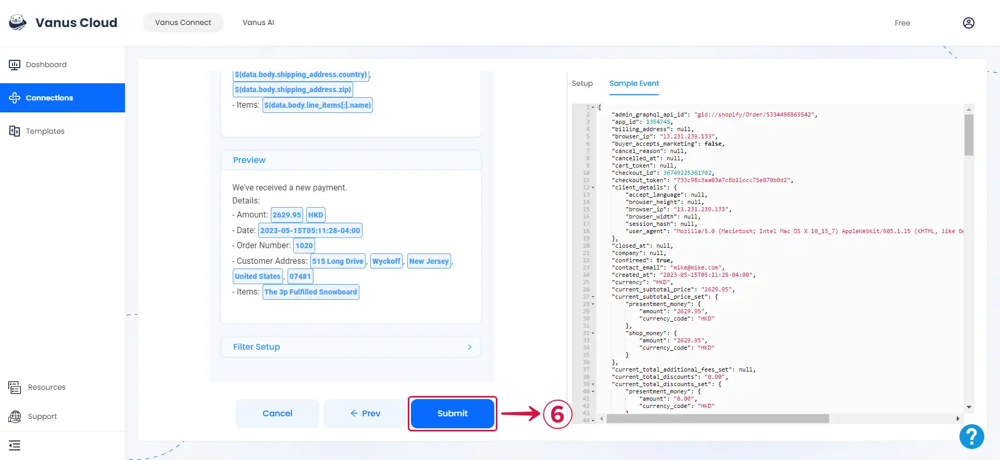
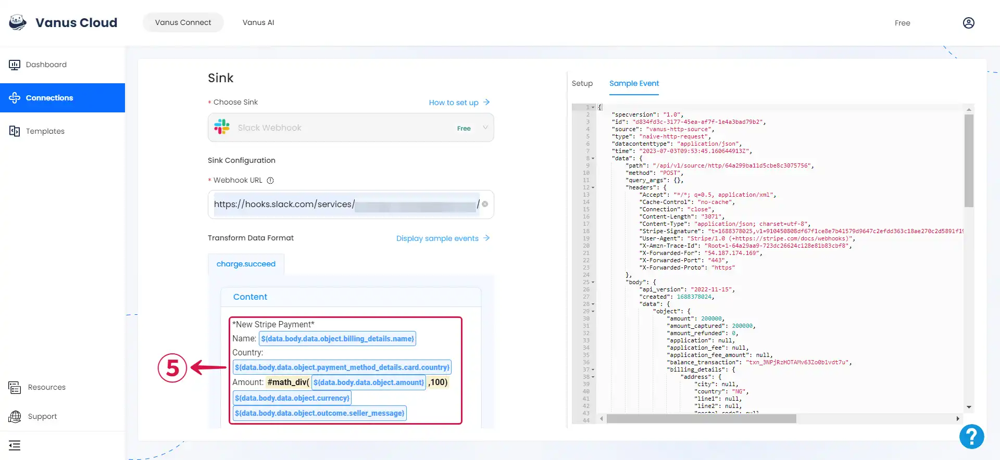
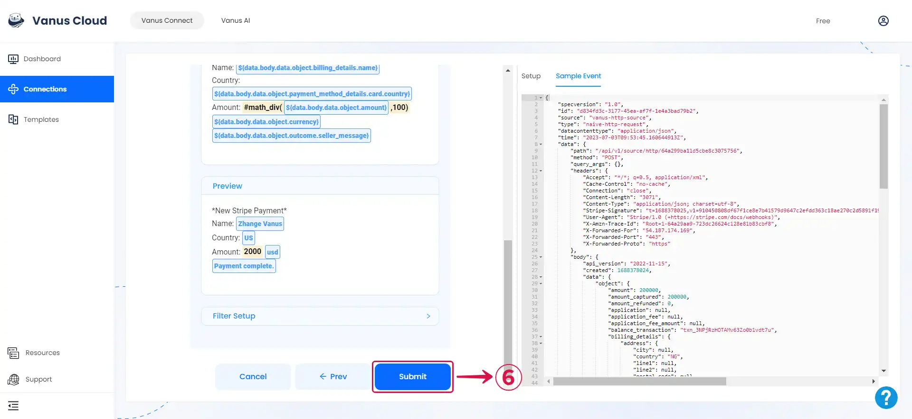

--- 
hide_table_of_contents: true
hide_title: true
---

### Prerequisites

- A [**Slack Account**](https://slack.com)

- A [**Slack Workspace**](https://slack.com/help/articles/206845317-Create-a-Slack-workspace)

---

Perform the following steps to configure your Slack Sink.

:::note
If you have created a Slack App already, you can skip Step 1 and directly go to [**Step 2**](#step-2-create-an-incoming-webhook).
:::

### Step 1: Create a Slack App

1. **Create an App**① on [**Slack**](https://api.slack.com/apps).

2. Select **From scratch**②.

3. Set the **App Name**③ and **Workspace**④, then click **Create App**⑤.

---

### Step 2: Create an Incoming Webhook

1. Select **Incoming Webhooks**① in the sidebar menu.

2. Turn on **Activate Incoming Webhooks**②.

3. Scroll down, and click **Add New Webhook to Workspace**③ to add a new one.

4. Select the **channel**④ to receive messages and click **Allow**⑤.

5. Now **Copy**⑥ the webhook URL.

---

### Step 3: Slack Connection Settings

**Complete SetUp Based On Source Connector**

import Tabs from '@theme/Tabs';
import TabItem from '@theme/TabItem';

<Tabs>

<TabItem label="Shopify" value="shopify">

1. Paste the Webhook URL into the **Webhook URL**① field, and click on **Display sample events**② for reference.

2. Compose your preferred message, then type **`$` followed by the desired event③** to access a **list of associated event values**④, and choose the one you prefer.

3. You can structure the content as you prefer and fill in as many **values**⑤ as you wish to receive.

4. Click **Submit**⑥ to finish the configuration process.

:::note
You can structure your events to suit your specific requirements, create connections for different scenarios, or take advantage of our pre-existing connection templates for a more organized approach to sending events.
:::

</TabItem>

<TabItem label="Stripe" value="stripe">

1. Paste the Webhook URL into the **Webhook URL**① field, and click on **Display sample events**② for reference.

2. Compose your preferred message, then type **`$` followed by the desired event③** to access a **list of associated event values**④, and choose the one you prefer.

3. You can structure the content as you prefer and fill in as many **values**⑤ as you wish to receive.

4. Click **Submit**⑥ to finish the configuration process.

:::note
You can structure your events to suit your specific requirements, create connections for different scenarios, or take advantage of our pre-existing connection templates for a more organized approach to sending events.
:::

</TabItem>

</Tabs>

---

Learn more about Vanus and Vanus Connect in our [**documentation**](https://docs.vanus.ai).
