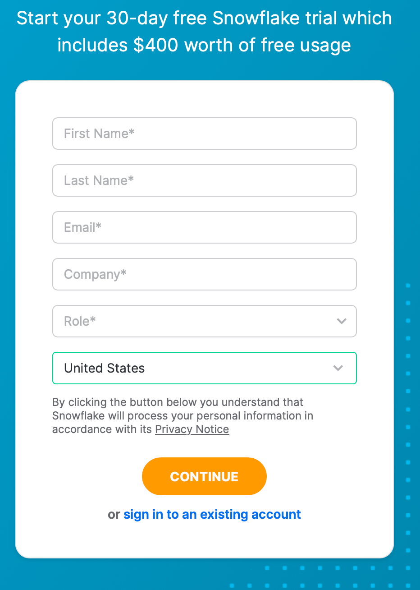
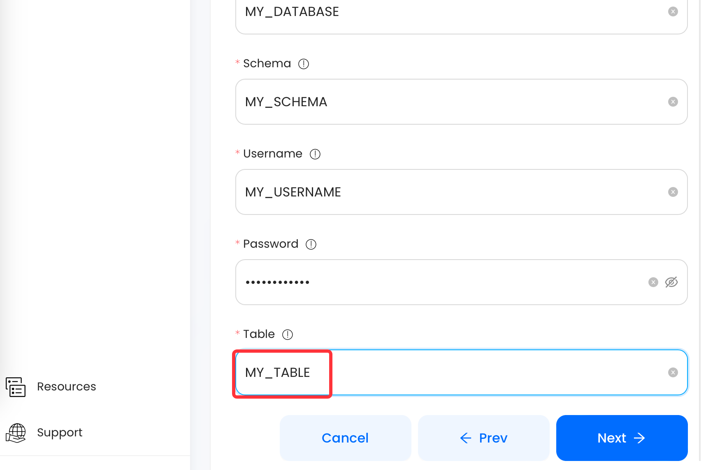

#
# Prerequisites

Before forwarding events to Snowflake, you must have:

- A [Snowflake](https://www.snowflake.com/) account with administrative privileges
- The user has either ACCOUNTADMIN or SECURITYADMIN role in Snowflake.

---

**Perform the following steps to configure your Amazon RDS PostGreSQL Source:**

# Step 1: (Optional) Creating a Snowflake Account
When you sign up for an account on Snowflake, you'll receive 30 days of free access along with $400 credits. However, any usage beyond this limit will be charged. The free trial begins once you complete the sign-up process and activate your account.

If you end up utilizing all $400 credits before the 30-day trial period is over, your account will be suspended, and you won't be able to use any of its features. You can still log in to your account, but you won't be able to perform any actions, such as running a virtual warehouse, loading data, or running queries.

Let's get started:

1. Go to [Snowflake Sign Up](https://signup.snowflake.com/)
2. In the Sign Up page, specify the following and click **CONTINUE**:
   - First Name and Last Name: The first and last name of the account user.
   - Email: A valid email address that can be used to manage the Snowflake account.
   - Company: The name of your organization.
   - Country: The organization’s country or region.
   
3. Select the Snowflake edition you want to use.


Note: that Snowflake offers multiple editions, each tailored to specific organizational requirements. To ensure you select the most suitable edition for your needs, we recommend that you read through the [Snowflake Editions](https://docs.snowflake.com/en/user-guide/intro-editions.html) documentation to explore the various options available.

4. Select the desired cloud platform. You can choose to host your Snowflake account on any of the following cloud platforms.
   - Amazon Web Services (AWS)
   - Google Cloud Platform (GCP)
   - Microsoft Azure (Azure)

For detailed information on pricing and other specifics related to each cloud platform supported by Snowflake, please refer to the [Supported Cloud Platforms documentation](https://docs.snowflake.com/en/user-guide/intro-cloud-platforms.html).

5. Select the region for your cloud platform. In each platform, Snowflake provides one or more regions where the account can be provisioned.
6. Click **GET STARTED**.

Great! An activation email from Snowflake has been sent to your registered email address. To sign in to your Snowflake account, simply click on the link provided in the email.

---

# Step 2: Create and Configure a Snowflake Warehouse

Vanus provides you a ready-to-use script to configure the Snowflake warehouse you intend to use as the Destination.

Follow these steps to run the script:

1. Log in to your Snowflake account.
2. In the Worksheets tab, click `+` and select **SQL Worksheet** to create a new worksheet.

3. Copy and modify the following script in your Snowflake worksheet. This script will create a new role for Vanus in your Snowflake Destination, while ensuring that your privacy is safeguarded by granting only the minimum necessary permissions required by Vanus to load data into your Destination.

```sql
-- create variables for user / password / role / warehouse / database (needs to be uppercase for objects)
set role_name = 'VANUS'; -- Replace "Vanus" with your role name
set user_name = 'USERNAME'; -- Replace "Username" with your username
set user_password = 'password'; -- Replace "password" with the user password
set warehouse_name = 'WAREHOUSE'; -- Replace "Warehouse" with the name of your warehouse
set database_name = 'DATABASE'; -- Replace "Database" with the name of your database
set schemaName = 'SCHEMANAME'; -- Replace "schemaName" with the database schema name

set db_schema = concat($database_name, '.', $schemaName);

begin;

-- change role to securityadmin for user / role steps
use role securityadmin;

-- create role for Vanus
create
role if not exists identifier($role_name);
grant role identifier($role_name) to role SYSADMIN;

-- create a user for Vanus
create user if not exists identifier($user_name)
password = $user_password
default_role = $role_name
default_warehouse = $warehouse_name;

-- Grant access to the user
grant role identifier($role_name) to user identifier($user_name);

-- change role to sysadmin for warehouse / database steps
use role sysadmin;

-- create a warehouse for Venus, if it does not exist
create
warehouse if not exists identifier($warehouse_name)
warehouse_size = xsmall
warehouse_type = standard
auto_suspend = 600
auto_resume = true
initially_suspended = true;

-- create database for Vanus
create database if not exists identifier($database_name);

-- grant Vanus role access to warehouse
grant USAGE
on warehouse identifier($warehouse_name)
to role identifier($role_name);

-- grant Vanus access to database
grant CREATE SCHEMA, MONITOR, USAGE, MODIFY
on database identifier($database_name)
to role identifier($role_name);

use role accountadmin;
CREATE SCHEMA IF not exists identifier($db_schema);
GRANT USAGE, MONITOR, CREATE TABLE, CREATE EXTERNAL TABLE, MODIFY ON SCHEMA identifier($db_schema) TO ROLE identifier($role_name);

commit;
```
:::caution
Note that you should replace the sample values given in lines 2-7 of the script with your own credentials to create a warehouse that you'll be able to use to connect to Vanus. You can either use pre-existing warehouse, role, and database names or specify new ones to load data into. These credentials will be crucial in establishing a connection between your warehouse and Vanus.
:::

:::note
The values for `role_name`, `user_name`, `warehouse_name`, `database_name` and `schemaName` must be in upper case.
:::

---

# Step 3: Finish your connection in Vanus Cloud.
1. Get your account URL by going to **Admin** and **Accounts** from the side menu, and click the button to copy the link.

2. Write following information from previously in **step 2**.
   - **Role**: This is the name of the role that has the necessary privileges to perform operations on the Snowflake table.
   - **Warehouse**: This is the name of the warehouse that will execute queries for the Snowflake table.
   - **Database**: This is the name of the database that contains the Snowflake table.
   - **Schema**: This is the name of the schema that contains the Snowflake table.
   - **Username**: This is the username for your Snowflake account.
   - **Password**: This is the password for your Snowflake account.

3. Create a **table** by entering a name.

4. Click "Next" to continue.

---

# Required Data Format

The event data must be in JSON format with the following keys:

```json
{
    "column1": "value1",
    "column2": "value2",
    "column3": "value3",
    "etc...": "etc..."
}