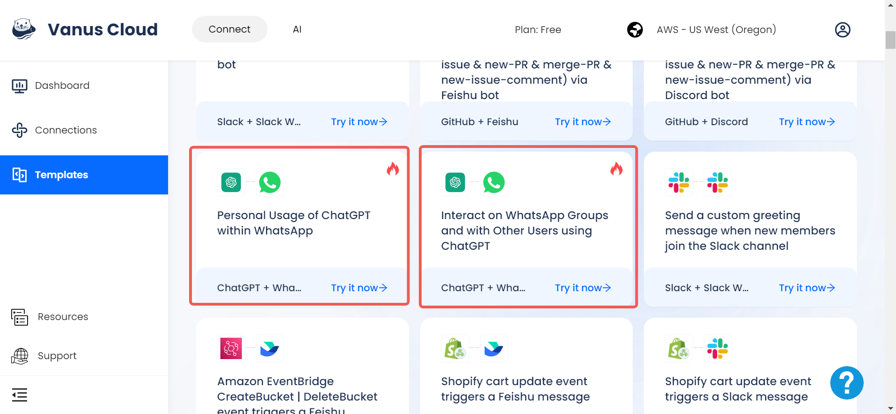
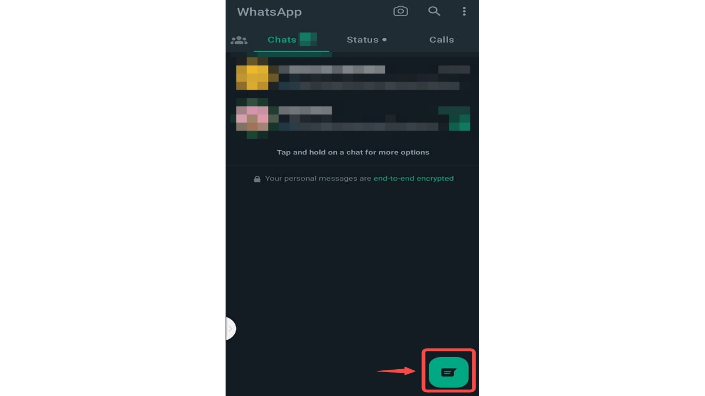

--- 
hide_table_of_contents: true
hide_title: true
---

### Prerequisites

- A [WhatsApp account](https://www.whatsapp.com)

**Perform the following steps to configure your WhatsApp Sink.**

### WhatsApp Connection Settings

1. Write a connection name without any spaces.

2. Click `Authorize` to authorize Vanus to establish a connection with your WhatsApp account. 

3. Scan the QR Code with your mobile WhatsApp 

**Note**: *If you did not turn on `Enable Chat AI` on the WhatsApp Source Connector, the WhatsApp connection will not use ChatGPT.*

To use ChatGPT on WhatsApp, you can use the ChatGPT on WhatsApp Templates. 

- Select any of the ChatGPT on WhatsApp Templates you want to use.

## Using *Personal Usage of ChatGPT within WhatsApp* Template

Personal usage of ChatGPT within WhatsApp can be on Mobile Devices (Android & iOS) or Desktop/Web.

### WhatsApp Mobile (Android)
On WhatsApp Android, do the following:

- Click on the `Chat` icon at the bottom-right corner to open the contact list.

- In the contact list, click on the contact with your profile display. It is usually identified as the first contact on the list and also has the word `You` attached to it.

- Simply type a message or ask a question and you will get a response.

### WhatsApp Mobile (iOS)
On WhatsApp iOS, do the following:

- - Click on the `Chats` icon at the bottom menu to open the contact list.

- In the contact list, click on the contact with your profile display. It is usually identified as the first contact on the list and also has the word `You` attached to it.

- Simply type a message or ask a question and you will get a response.

### WhatsApp Desktop & WhatsApp Web
- On WhatsApp Desktop/Web, The contact button show the users contact list. The Contact button has been identified with the number `1` in the screenshot. Click on the button and a list of all your contacts will be displayed. Select the one with your contact profile, it has been identified with the number `2` and also has the word `You`. This way, you chat with ChatGPT by chatting with yourself.

    

- Simply type any question you like to ask, ChatGPT will respond to you on the chat.

    

## Using *Interact on WhatsApp Groups and with Other Users using ChatGPT* Template

This template has two features:
- ChatGPT can be used on WhatsApp Groups by tagging the contact used to make the ChatGPT to WhatsApp connection. To tag the contact, use the `@` symbol.

    

- Other people can ask questions in the contact message privately and they will get answers.

---

Learn more about Vanus and Vanus Connect in our [documentation](https://docs.vanus.ai).
