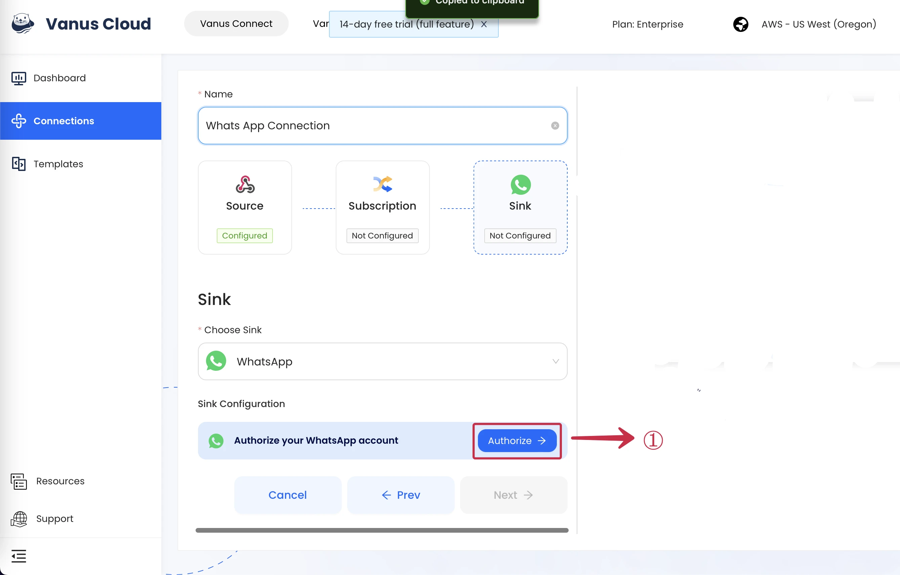
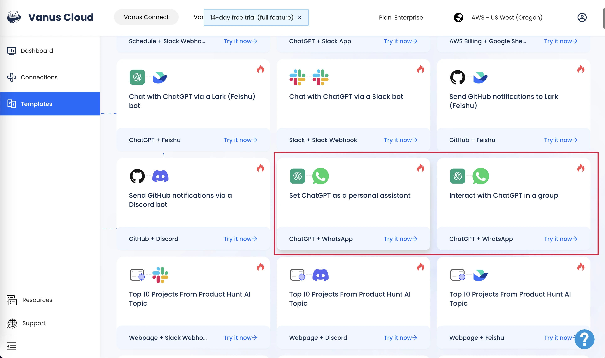
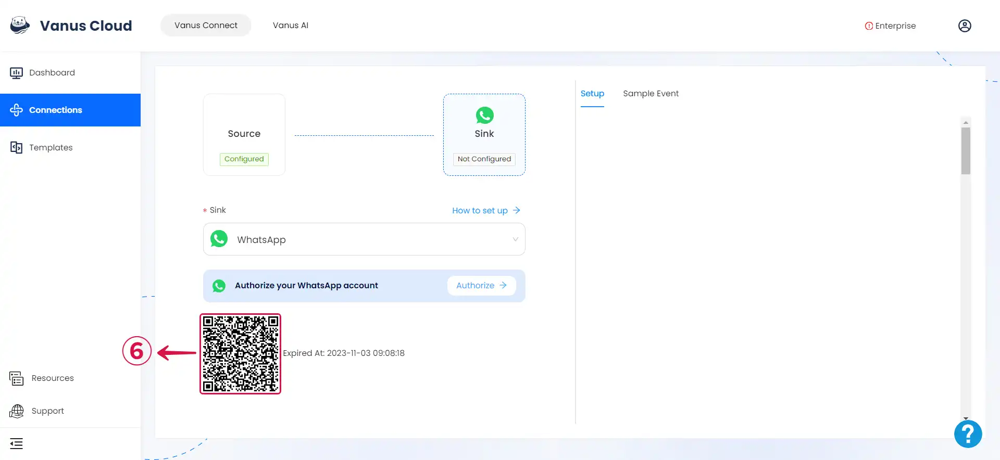
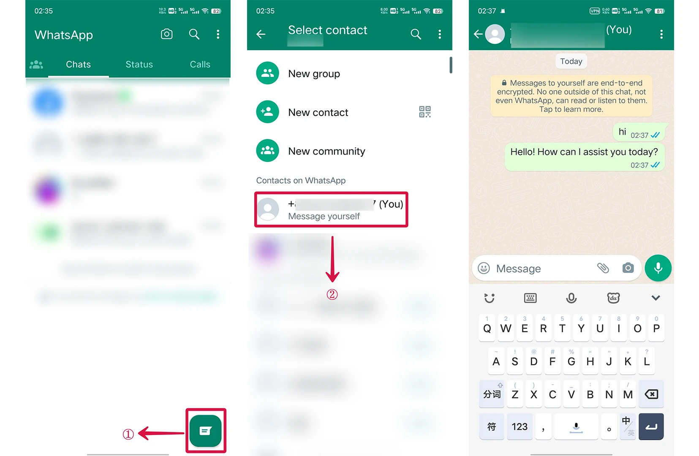

--- 
hide_table_of_contents: true
hide_title: true
---

### Prerequisites

- A [WhatsApp account](https://www.whatsapp.com)

---

**Perform the following steps to configure your WhatsApp Sink.**

### WhatsApp Connection Settings

1. Click **Authorize**①  to create a QR code to establish a connection with your WhatsApp account.

2. On your phone go to **Settings**② and click **Linked Devices**③.
 
3. Click **Link a Device**④

4. Scan the **QR Code**⑤ ⑥ with your mobile WhatsApp.

### How to use ChatGPT

**Note**: *If you haven't activated the "Enable Chat AI" option within the WhatsApp Source Connector, the WhatsApp connection won't utilize the capabilities of ChatGPT.*

If you wish to utilize ChatGPT in WhatsApp, you can go back to the template tab and select one of the two ChatGPT template.

import Tabs from '@theme/Tabs';
import TabItem from '@theme/TabItem';

<Tabs>

<TabItem label="Android" value="android">

1. Tap on the 💬① icon at the bottom-right corner to display the contact list.

2. Within the contact list, select the **contact**② with your profile display. It's typically the first contact on the list and has the word `You` attached to it.

3.  Send a message or pose a question and you'll receive a response.

</TabItem>

<TabItem label="iOS" value="ios">

1. Tap the 💬①  icon at the bottom menu and tap the 📝② icon at the top.

2. Within the contact list, select the **contact**③ with your profile display. It's typically the first contact on the list and has the word `You` attached to it.

3. Send a message or pose a question and you'll receive a response.

</TabItem>

</Tabs>

To use in WhatsApp groups just tag the AI account using `@`.

---

Learn more about Vanus and Vanus Connect in our [documentation](https://docs.vanus.ai).
