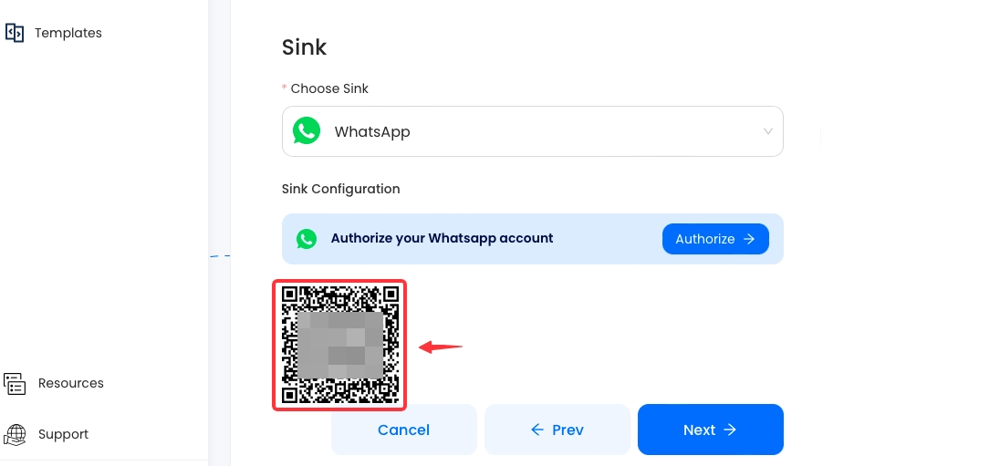

--- 
hide_table_of_contents: true
hide_title: true
---

### Prerequisites

- A [WhatsApp account](https://www.whatsapp.com)

**Perform the following steps to configure your WhatsApp Sink.**

### WhatsApp Connection Settings

1. Write a connection name without any spaces.

2. Click `Authorize` to authorize Vanus to establish a connection with your WhatsApp account. 

3. Scan the QR Code with your mobile WhatsApp 

import Tabs from '@theme/Tabs';
import TabItem from '@theme/TabItem';

<Tabs>

<TabItem label="Standard" value="chat-ai-off">

    4. Click **Next** and continue the configuration.

</TabItem>
<TabItem label="ChatGPT" value="chat-ai-on">

Here's a brief tutorial on utilizing ChatGPT once you've established the connection.

## Using *Personal Usage of ChatGPT within WhatsApp* Template

To use ChatGPT on WhatsApp for personal use:

- On WhatsApp, Click on the Contact button, a list of all your contacts will be displayed. Select the one with your contact profile. This way, you chat with ChatGPT by chatting with yourself.

- Simply type any question you like to ask, ChatGPT will respond to you on the chat.

## Using *Interact on WhatsApp Groups and with Other Users using ChatGPT* Template

This template has two features:
- ChatGPT can be used on WhatsApp Groups by tagging the contact used to make the ChatGPT to WhatsApp connection. To tag the contact, use the `@` symbol.

- Other people can ask questions in the contact message privately and they will get answers.

4. Click **Submit** and continue the configuration.

</TabItem>

</Tabs>

---

Learn more about Vanus and Vanus Connect in our [documentation](https://docs.vanus.ai).
