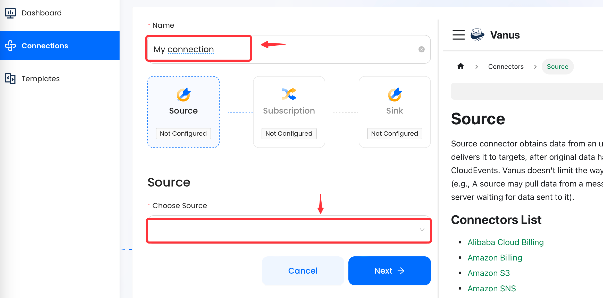

### Create a Custom Connection

The Source connector is a tool to connect Vanus core with other applications and services. It removes the complication of integration by converting the data and sending it to Vanus.

### Setup

Write a name for your connection, and select a Source connector in the menu.

---

### List of Source connectors

- Alibaba Cloud Billing
- AWS Billing
- Amazon EventBridge
- Amazon S3
- Amazon SQS 
- Auth0
- ChatAI
- ChatGPT
- CloudEvents
- GitHub
- Grafana
- Labeling
- MySQL
- PostgresSQL CDC
- Slack
- Schedule
- Shopify App
- Shopify Webhook
- Stripe
- Webhook
- WhatsApp
- More coming soon!

If you cannot find a connector that meets your needs, please feel free to send us an email at `contact@linkall.com` or join our [Slack community](https://join.slack.com/t/vanusworkspace/shared_invite/zt-1irlglugm-CHWGHKd2Nzs7yYhzEMnMlg) to request it.

---

Learn more about Vanus and Vanus Cloud in our [documentation](https://docs.vanus.ai).

