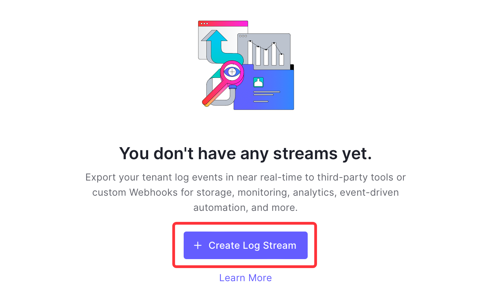

## Prerequisites

Before obtaining Auth0 events, you must have:

- An Auth0 account with administrative privileges

## Getting Started

### Create your connection in Vanus Cloud

1. Write a name for your connection.

2. After you finish creating the connection, there will be more steps. Please click the link to open a new tab with the following instruction.

3. Click **Next** and continue the configuration.

### Configuration Continuation 

#### **Configuring Auth0 to Send Webhook Events**

1. Click the copy icon to copy the webhook url.
   
2. Log in to your Auth0 account.
3. Navigate to the **Streams** menu under **Monitoring**.

4. Click on the **Create Log Stream** button.
   
5. Select the **Webhook** option.
   
6. Write a name for your webhook stream.

7. Provide the payload URL of your Auth0 source connector in Vanus Cloud, and select `Json line` under **Content Format**.

8. Select the event you want to receive notifications for. 

9. Save your settings.

:::caution
At this time you can only select one event.
:::

Learn more about Vanus and Vanus Cloud in our [documentation](https://docs.vanus.ai).
