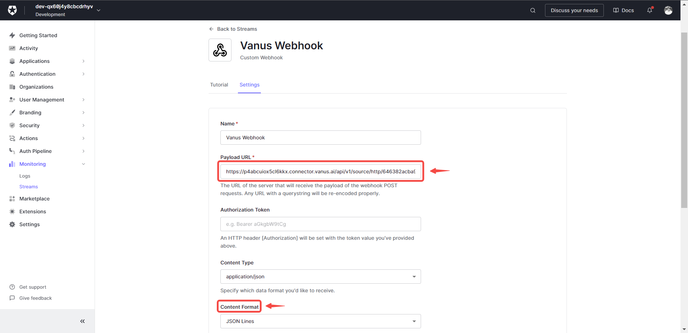

#
# Prerequisites

Before obtaining Auth0 events, you must have:

- An Auth0 account with administrative privileges

---

**Perform the following steps to configure your Auth0 Source:**

# Step 1: Configuring Auth0 to Send Webhook Events

1. Click the copy icon to copy the webhook url.
     

2. Log in to your Auth0 account.  

3. Navigate to the **Streams** menu under **Monitoring**.
  

4. Click on the **Create Log Stream** button.
     

5. Select the **Webhook** option.
     

6. Write a name for your webhook stream.
  

7. Provide the payload URL of your Auth0 source connector in Vanus Cloud, and select `Json line` under **Content Format**.
  

8. Select the event you want to receive notifications for. 
  

9. Save your settings.

---

# Step 2: Complete your connection in Vanus Cloud

1. Write a name for your connection.
   
2. Click **Next** and continue the configuration.

---

Learn more about Vanus and Vanus Cloud in our [documentation](https://docs.vanus.ai).
