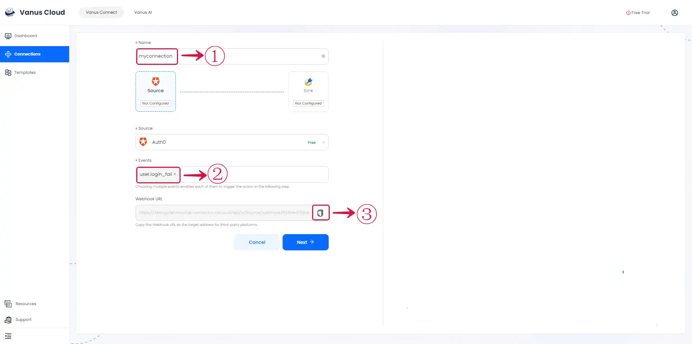
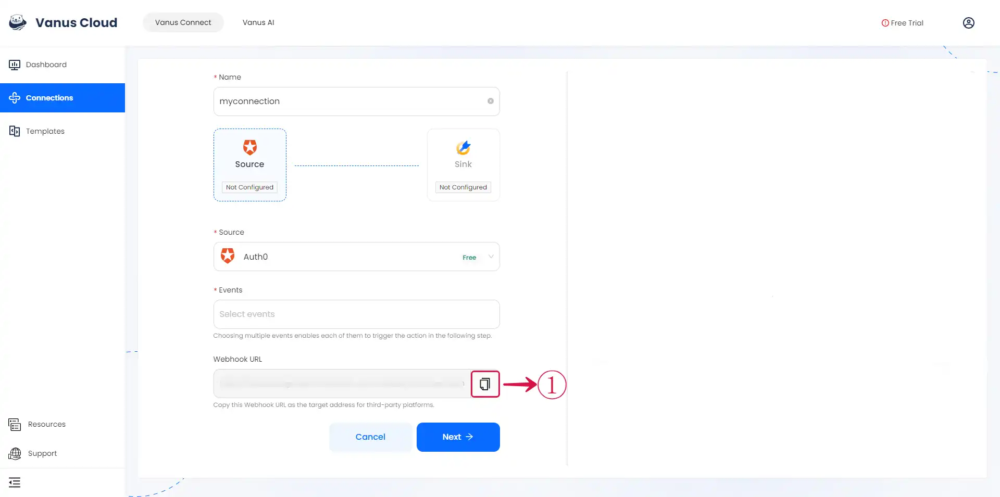
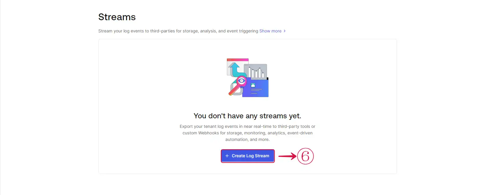
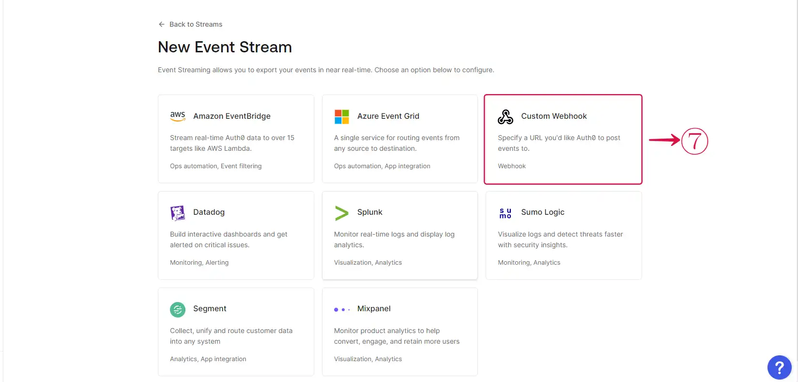
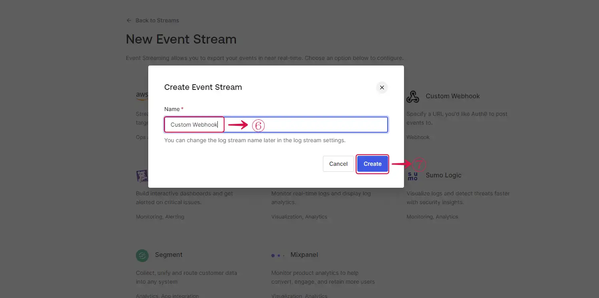
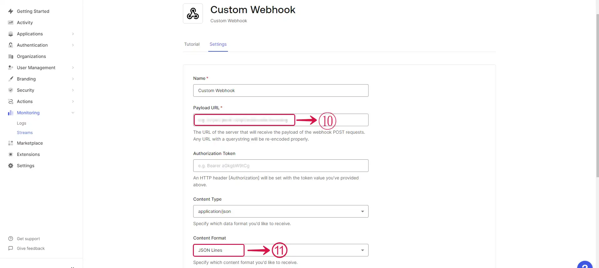
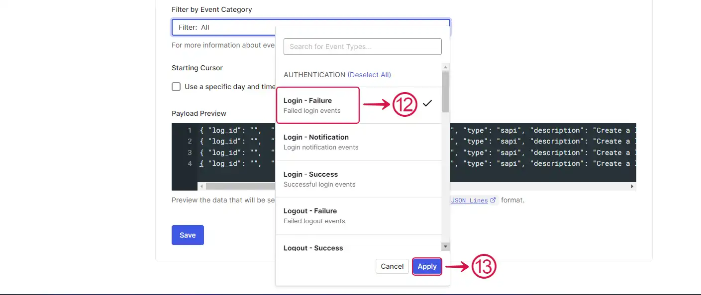

--- 
hide_table_of_contents: true
hide_title: true
---

### Prerequisites

- An Auth0 account with administrative privileges
- A [**Vanus Cloud account**](https://cloud.vanus.ai).
---

**Perform the following steps to configure your Auth0 Source**

### Auth0 Connection Settings

1. Write a **Name**① for your connection.

    Select the **Events**② you want to receive.

    Click on the **copy**③ icon to copy the Webhook URL. Use the Webhook URL to receive events.

2. Log in to your [Auth0 account](https://auth0.com/api/auth/login).

3. Navigate to the **Monitoring**④ menu and select **Streams**⑤.

4. Click on the **Create Log Stream**⑥ button.

5. Select the **Custom Webhook**⑦ option.

6. Write a **Name**⑧ for your webhook stream and click on the **Create**⑨ button.

7. Provide the **Payload URL**⑩ of your Auth0 source connector in Vanus Connect, and select **Json Lines**⑪ under **Content Format**.

8. **Select**⑫ the event you want to receive notifications for and click the **Apply**⑬ button. Save your settings.

**Caution**

At this time you can only select one event. 

9. Go back to Vanus Connect and click **Next**⑭ to continue the configuration.

---

Learn more about Vanus and Vanus Connect in our [documentation](https://docs.vanus.ai).
