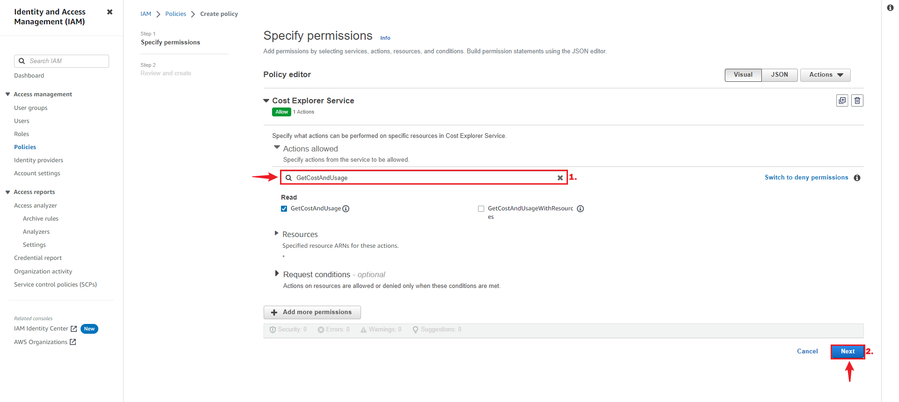
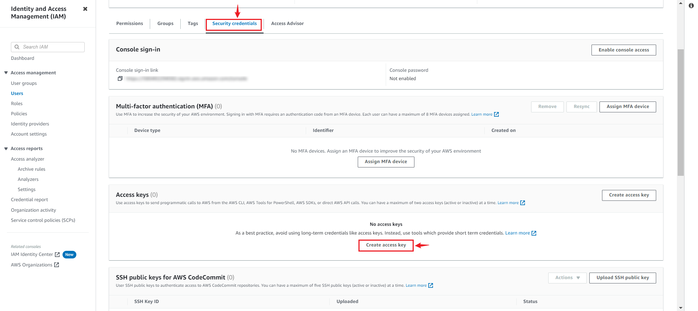

--- 
hide_table_of_contents: true
hide_title: true
---

### Prerequisites

- Have an [AWS Account ](https://aws.amazon.com)

---

**Perform the following steps to configure your Amazon billing Source.**

### Step 1: Create a new User in AWS 

1. Log in to the AWS [Management Console](https://aws.amazon.com) using your root account credentials.
2. Navigate to the [IAM](https://console.aws.amazon.com/iam/) service by searching for IAM and clicking the **IAM service**.
   
3. Click the **Users tab** in the left navigation menu, then click the **Add user** button.

4. Write a name for your user and click **next**.

5. Select **Attach policy directly**, and **Create policy**.

6. Search and select the Service `Cost Explore Service`

7. Next, search for the following policy.
   - "GetCostAndUsage", 

8. Press **Next** and proceed to the next page.
9. Name your policy and click **Create policy**.

10. Return to your previous `TAB`.

11.  Search for your custom policy, add it to your user, and press **Next**.

12. Review and press **Create user**.

---

### Step 2: Create an Access and Secret Key
1. Now click on the user you've just created.

2. Under **Security and credential**, scroll down the page to `Access Key`, and Click **Create access key**.

3. Select Command line interface CLI, and press **Next**.

4. Click **Create access key**.

5. Save your `Access key` and `Secret key` safely. Download the .csv file.
    

---

### Step 3: Amazon Billing Connection Settings

1. Write a name for your connection in Vanus Cloud.
      
2. Provide your Access Key ID and Secret Key, and set the desired hour according to the UTC you want your billing information fetched.

3. Click **Next** and continue the configuration.

---

Learn more about Vanus and Vanus Cloud in our [documentation](https://docs.vanus.ai).