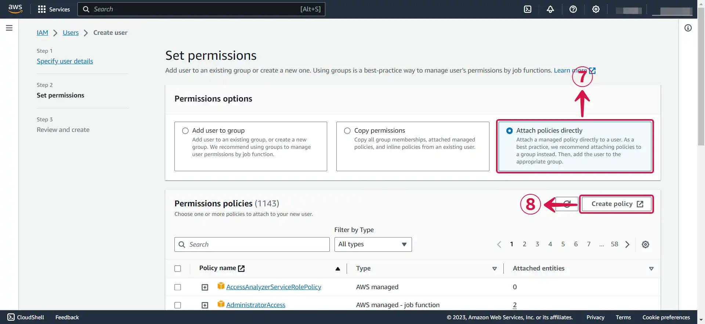
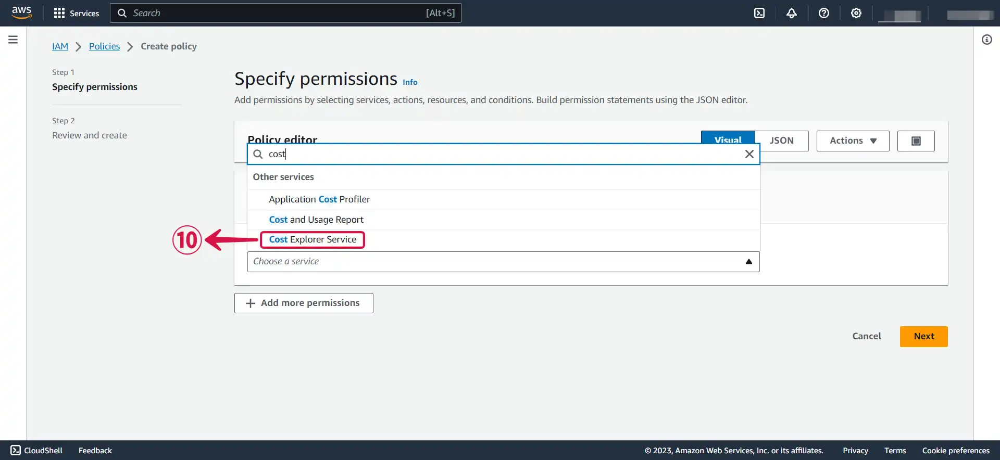
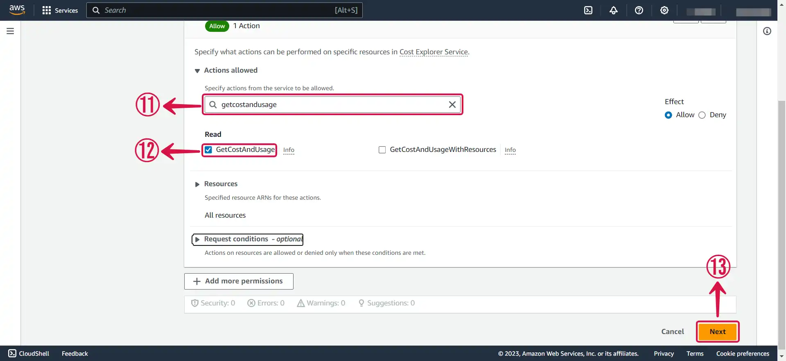
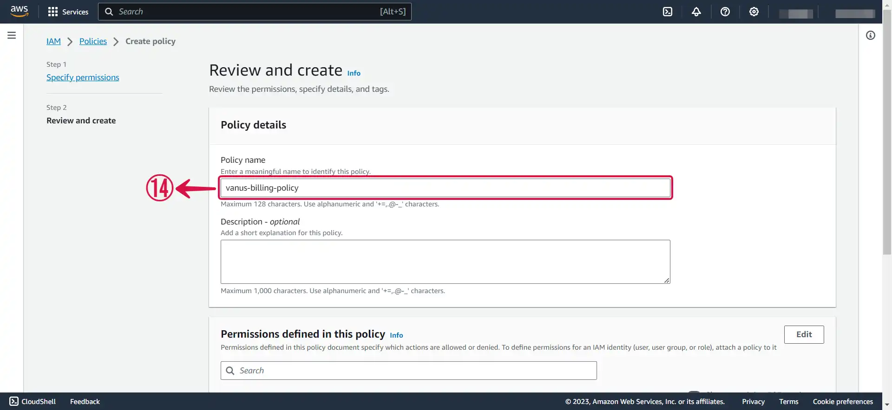
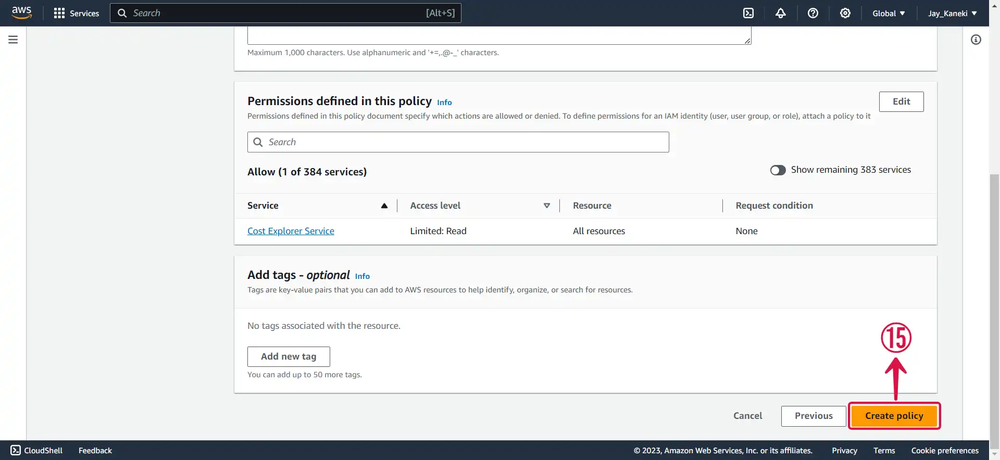
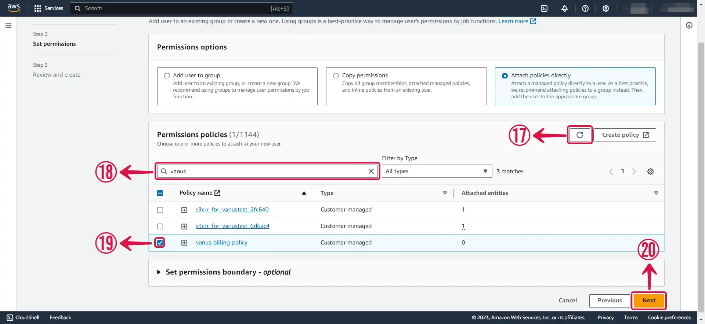
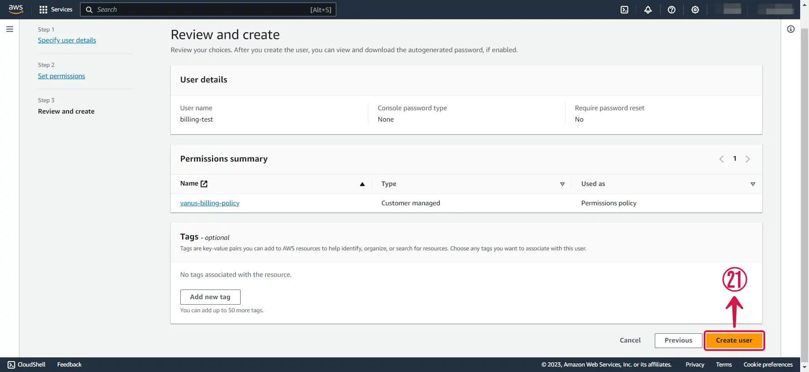
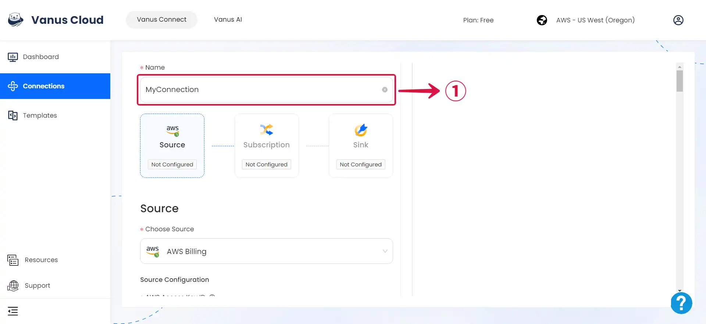
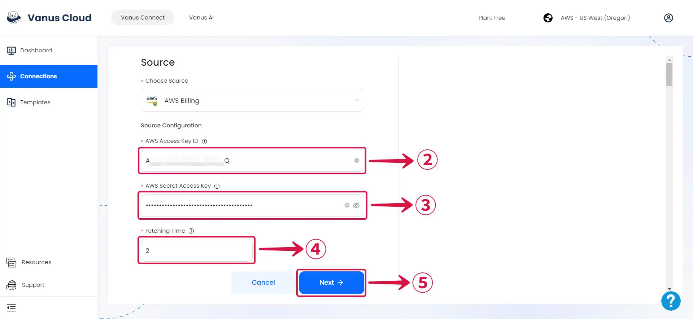

--- 
hide_table_of_contents: true
hide_title: true
---

### Prerequisites

- A [**Vanus Cloud account**](https://cloud.vanus.ai).
- AWS IAM Access Key.
- AWS permissions ce:GetCostAndUsage for the IAM user.

---

**Perform the following steps to configure your Amazon billing Source.**

### Step 1: Create a new User in AWS

1. Log in to the AWS [**Management Console**](https://aws.amazon.com) using your root account credentials.

2. Navigate to the [**IAM**](https://console.aws.amazon.com/iam/) service by searching for **IAM**① and click the **IAM**② service.

3. Click on the **Users**③ tab in the left navigation menu, and then click the **Create user**④ button.

4. Write your **User name**⑤ and click **Next**⑥.

5. Select **Attach policies directly**⑦, and click on **Create policy**⑧.

6. Click on **Choose a service**⑨ to open the dropdown menu.

7. Select **Cost Explorer Service**⑩.

8. Search for the following policy: **GetCostAndUsage**⑪, **tick the box**⑫ to select it, and then press **Next**⑬ to proceed to the next page.

9. **Name**⑭ your policy.

10. Click **Create policy**⑮.

11. Return back to your **previous `TAB`⑯**.

12. **Refresh**⑰ the policy list, **search**⑱ for your custom policy, **check the box**⑲  next to it to add it to your account, and then click on **Next**⑳.

13. Review and press **Create user**㉑.

---

### Step 2: Create an Access key and Secret access Key

1. Now click on the **user**① you just created.

2. Under **Security credentials**② scroll down the page to `Access Keys`, and Click **Create access key**③.

3. Select **Command Line Interface (CLI)④**, tick the **Confirmation box**⑤ and click **Next**⑥.

4. Click **Create access key**⑦.

5. Download your **`Access key`** and **`Secret access key`** by clicking the **Download .csv file**⑧ button, and then click **Done**⑨.

---

### Step 3: Amazon Billing Connection Settings

1. Write a **Name**① for your connection.

2. Enter your **Access Key ID**② and **Secret Access Key**③, specify the preferred event **Fetching Time**④, and then proceed by clicking on **Next**⑤.

---

Learn more about Vanus and Vanus Connect in our [**documentation**](https://docs.vanus.ai).
