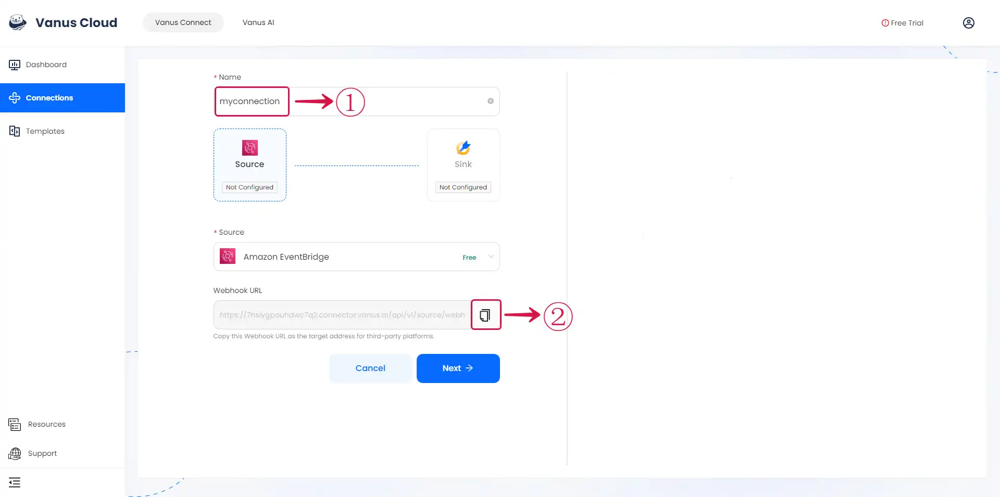
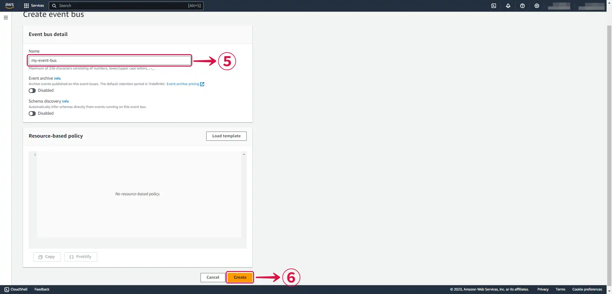
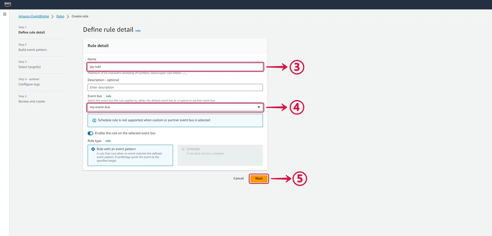
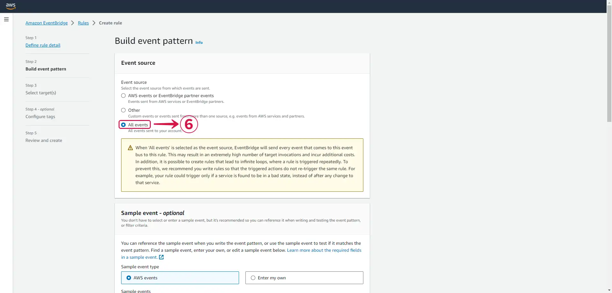
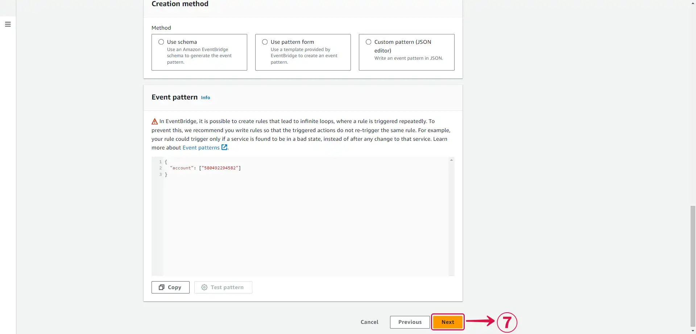
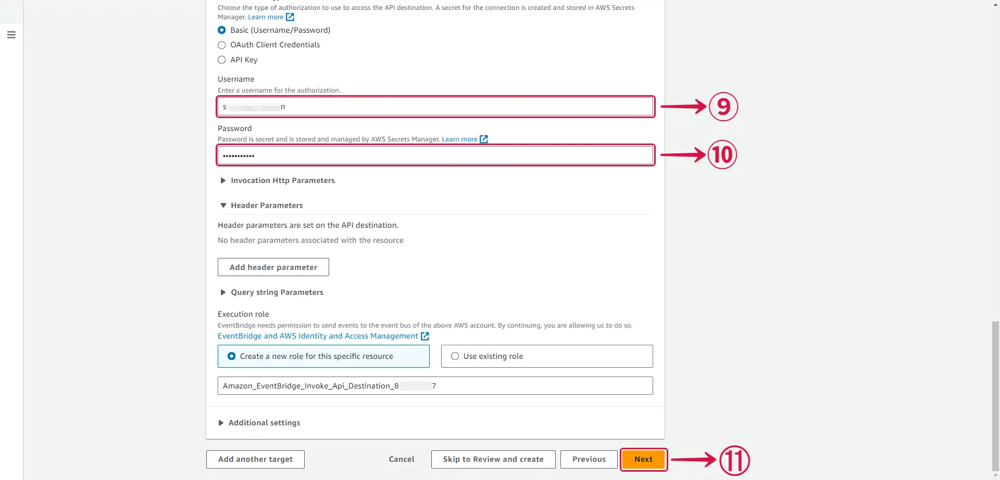
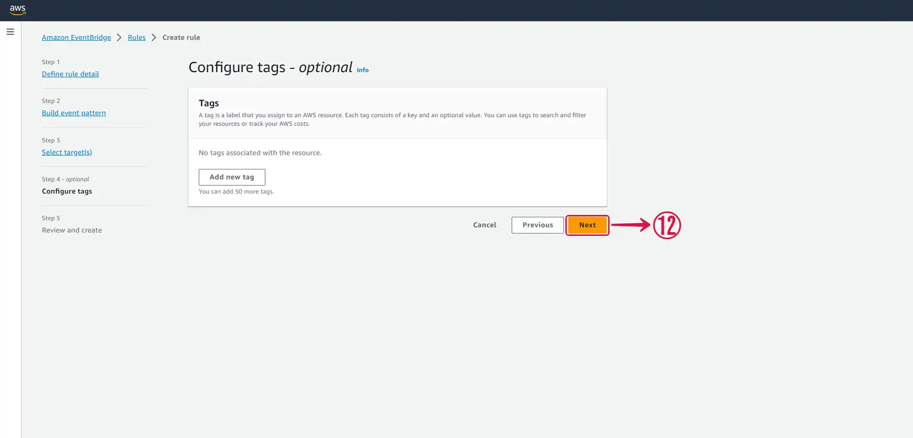

--- 
hide_table_of_contents: true
hide_title: true
---

### Prerequisites

- A [**Vanus Cloud account**](https://cloud.vanus.ai)
- An AWS Account with Administrative Privileges

---

**Perform the following steps to configure your Amazon EventBridge Source.**

### Amazon EventBridge Connection Settings

- Write a **Name**① for your connection in Vanus Connect.

- Click on the **copy**② icon to copy the Webhook URL. Use the Webhook URL to receive events.

### Configure Amazon Eventbridge to receive Events

## Step 1: Create an Event Bus

1. Search for **Eventbridge**① and select **Amazon EventBridge**② from the results.

2. In the side menu click **Event buses**③.

3. Click on **Create event bus**④ to create a new event bus, if you haven't already.

4. Write a **Name**⑤ and press **Create**⑥.

## Step 2: Create a Rule

1. Go to **Rules**① from the side menu and click **Create rule**②.

2. **Name**③ your rule, select your **Event bus**④ and press **Next**⑤.

3. Select **all events**⑥.

4. Press **Next**⑦ to continue.

## Step 3: Create an API Destination and Connection

1. Set your API destination

- Select **EventBridge API destination**①.
- Select **Create a new API destination**② under API destination.
- Write a connection **Name**③.
- Set the **API destination endpoint**④ to the URL from Vanus Connect.
- Set the **HTTP method**⑤ as `POST`.

2. Create a connection

- Select **Create a new connection**⑥.
- Write a **Connection name**⑦.
- Select **Basic (Username/Password)⑧** under Authorization type.

3. Authorization

- Create a **Username**⑨ and a **Password**⑩ of your choice, this won't be needed in this scenario but it is required.
- Press **Next**⑪.

4. Under Configure tags - optional press **Next**⑫.

5. Review and press **Create rule**⑬.

Now every event sent to your Event Bus will be sent to your Vanus connection.

6. Go back to Vanus Connect and click **Next**⑭ to continue the configuration.

---

Learn more about Vanus and Vanus Connect in our [**documentation**](https://docs.vanus.ai).
