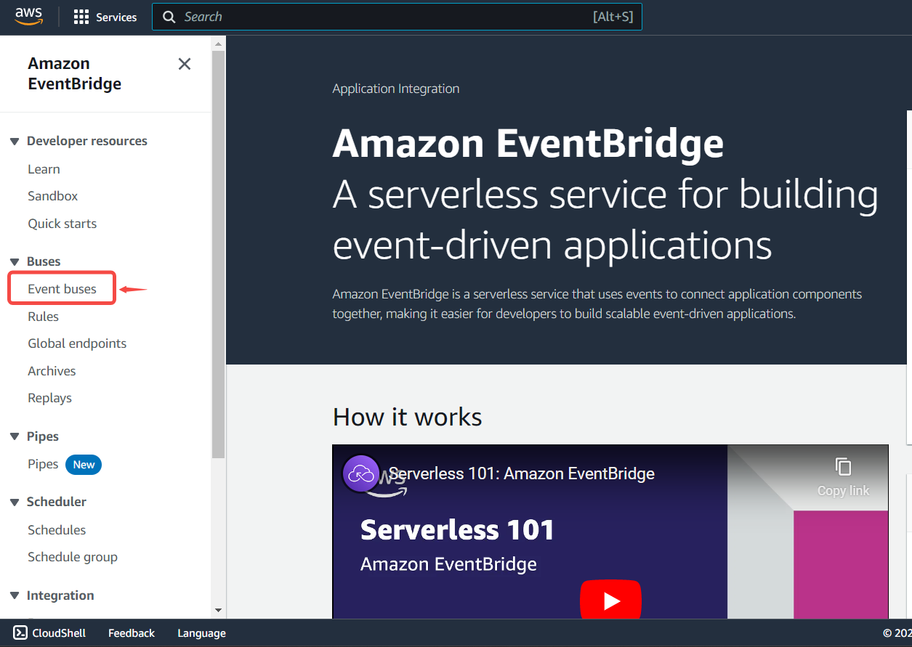
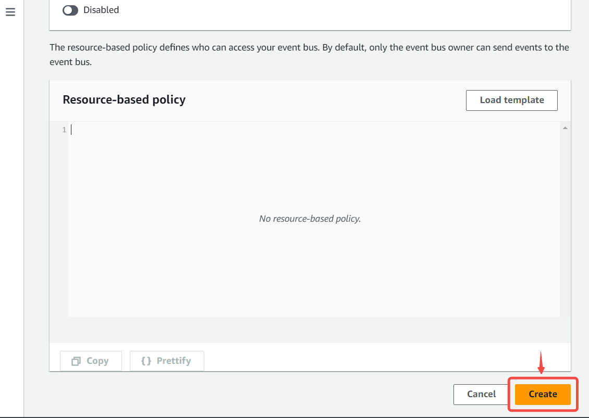
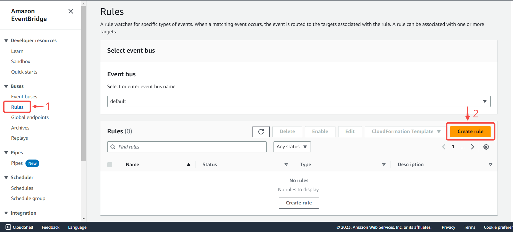
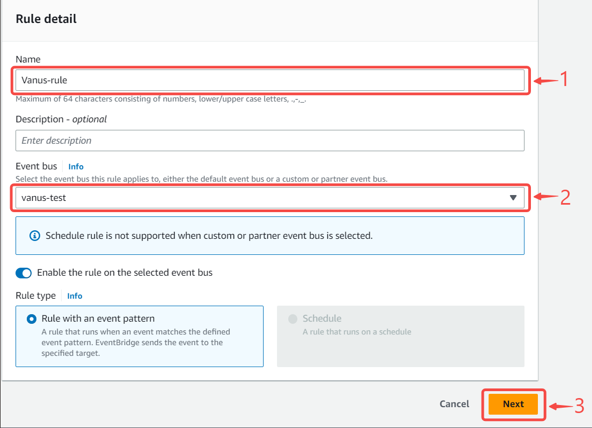
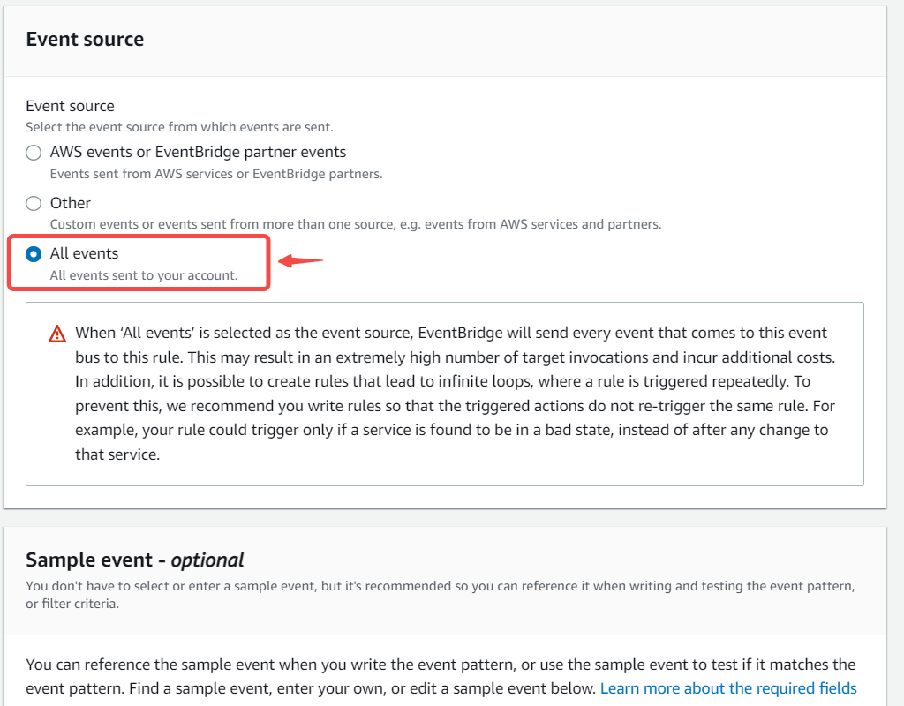
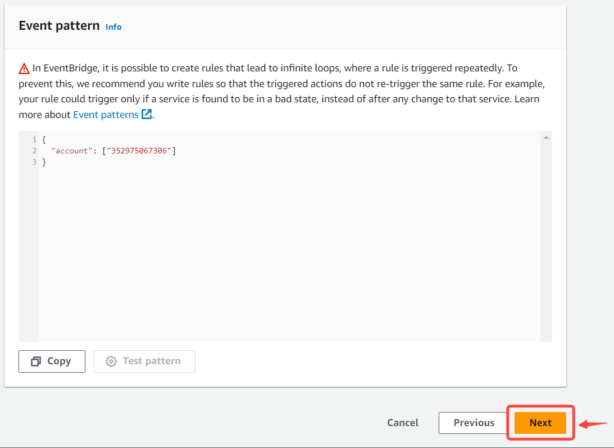
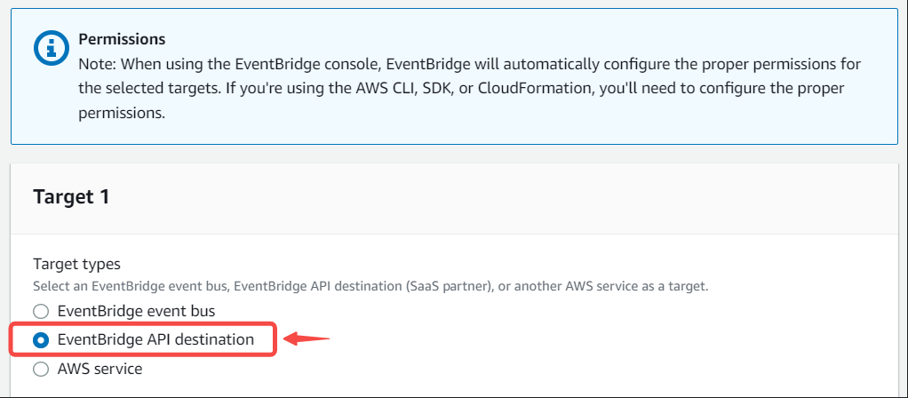
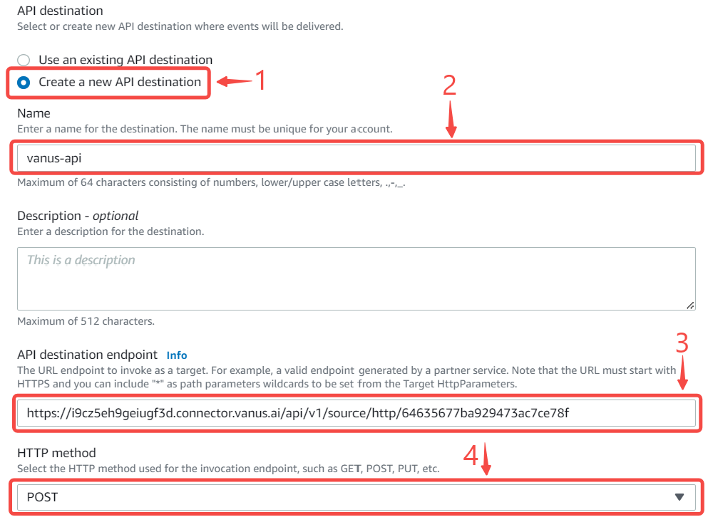
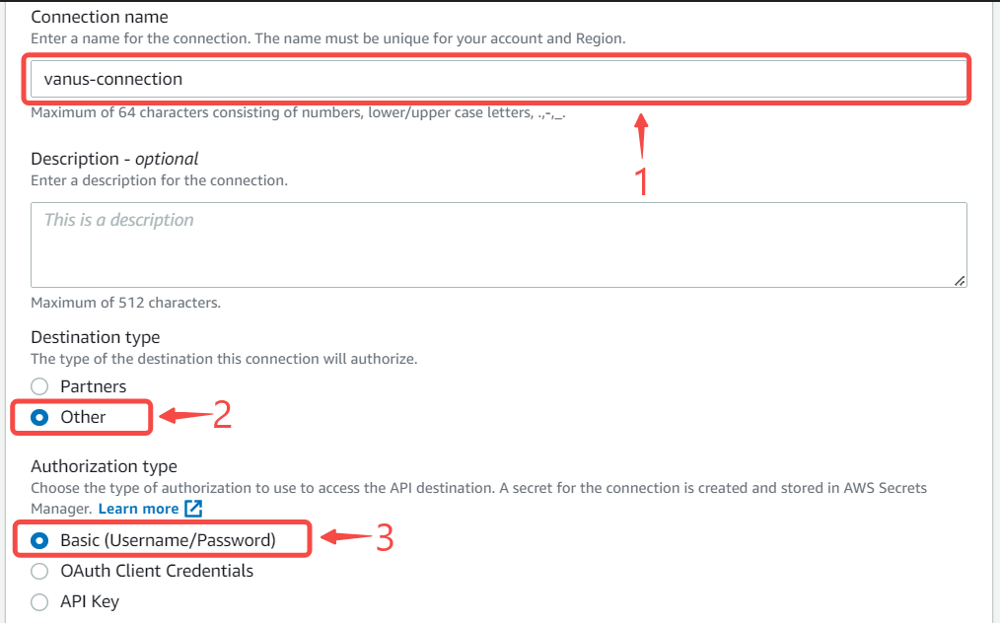
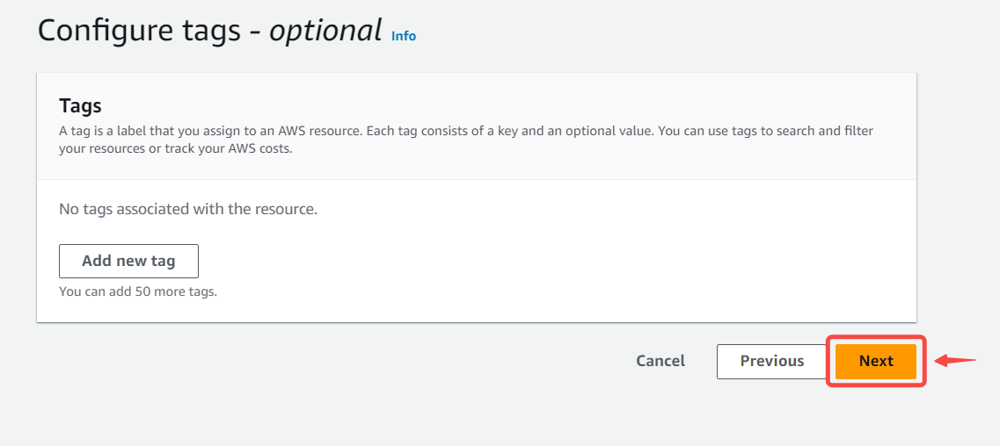

#  
# Prerequisites

- An AWS Account with Administrative Privileges

---

**Perform the following steps to configure your Amazon EventBridge Source:**

# Step 1: Setup EventBridge to Send Events

**Create an Event Bus**  
---
 
1. Navigate to the [EventBridge console](https://console.aws.amazon.com/events/home).

2. In the side menu click **Event buses**.
     

3. Create a **new event bus** if you haven't already.
     

4. Write a name and press **create**.
    

**Create a Rule**  
---

1. Go to **Rules** from the side menu and click **Create rule**. 
     

2. Name your rule, select your **Event bus** and press **Next**. 
     

3. Select **all events**.
     

4. Press **Next** to continue.

**Create an API Destination and Connection**  
---

1. Select EventBridge API destination.
      

2. Now select create new **Create a new API destination** under API destination.  
  
   - Write a connection **Name**.
   - Set the **API destination endpoint** go back to Vanus Cloud and copy paste the Webhook URL.
   - Set the **HTTP method** as `POST`.  
       
3. Next, select **Create a new connection**.
  

4. Write a name for you connection and select **Basic (Username/Password)** under Authorization type.
      

5. Create a **Username** and a **Password** of your choice, this won't be needed in this scenario but it is required and press **Next**.
      

6. Under Configure tags - optional press **Next**.
  

7. Review and press **Create rule**.

*Now every event sent to your Event Bus will be send to your Vanus connection.* 

---

# Step 2: Config your connection

To obtain all Amazon Eventbridge events in Vanus Cloud, follow these steps:

1. Write a name for your connection.
   

2. Click **Next** and continue the configuration.

---

Learn more about Vanus and Vanus Cloud in our [documentation](https://docs.vanus.ai).
