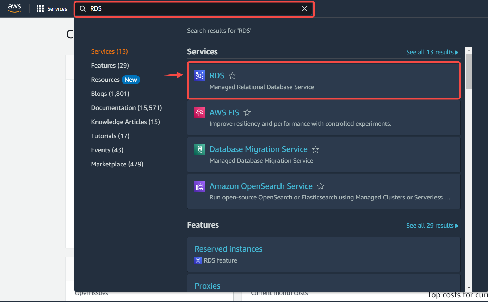

#  
# Prerequisites

- An SQL client
- A running PostgreSQL server
- A database, schema and Table

---

**Perform the following steps to configure your Amazon RDS PostGreSQL Source:**

# Step 1: Setup A PostgreSQL database server in AWS using RDS  

#### Creating an RDS account

1. Log in to the [AWS Management Console](https://aws.amazon.com/)   

2. Click on the left navigation pane called **services** click on database and select **RDS**.   
   

3. Click on Create database in the Create Database section.  
   

#### Create Database

Now you have options to select your engine.  

1. Select standard create and choose the PostgreSQL icon.   
   

2. Select the **Free tier** template.   
   

>**Note** Multi-AZ deployment is not available for the free tier, you will have to pay for it. Using a Multi-AZ deployment automatically provisions and maintains a synchronous standby replica in a different Availability Zone.   

#### Settings

1. 
    - DB Instance Identifier: Type a name unique to the region your DB instance has been set in.  

    - Master Username: This is the username that would be used to log in to your DB instance.  

    - Master Password: Type a password that takes the given constraints into consideration.  

    - Confirm password: Type the password again.   
       

#### Instance configuration and storage

2. 
    - Leave the default Instance configuration.  

    - Select the gp2 storage type, it's efficient and cost effective for our intended use.  

    - Turn off autoscaling to avoid extra cost. Unless your use-case requires it.   
       

#### Connectivity

3. 
    - Leave the default VPC and subnet group.  

    - Enable public access, this allocates an IP to your database instance and allows direct connection to the database from your own device.  
       

4. 
    - Select **Create new VPC security group**. This would create a security group that allows connection from the IP address of the device that you are currently using, to the database you created.

    - Leave Database port on 5432   

    - Select the password method of authentication.
       

5. 
    - Enable or disable performance insight depending on your database needs. We disabled it for this tutorial.  

    - Set a database name. If you do not provide one, Amazon RDS will not create a database on the instance being created.   
       

6. 
    - Set your preferred backup retention period.  

    - Enable or disable backup replication, based on your database needs. We disabled it for this tutorial.  
       

7. Leave Deletion protection unchecked, checking the box prevents you from being able to delete the database.  
   

8. Click on **Create Database**  
   

- Your DB is now being created.  
  

---

# Step 2: Finish Your Connection in Vanus Cloud  

1. Provide the following credentials: 
- Host 
- Port 
- Username 
- Password 
- Database 
- Schemas 
- Tables   

2. Click **Next** and continue the configuration.

---

Learn more about Vanus and Vanus Cloud in our [documentation](https://docs.vanus.ai/getting-started/what-is-vanus)